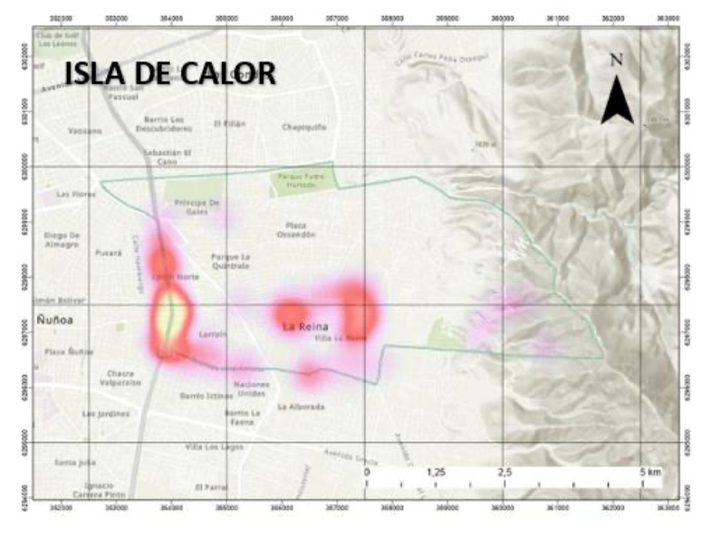
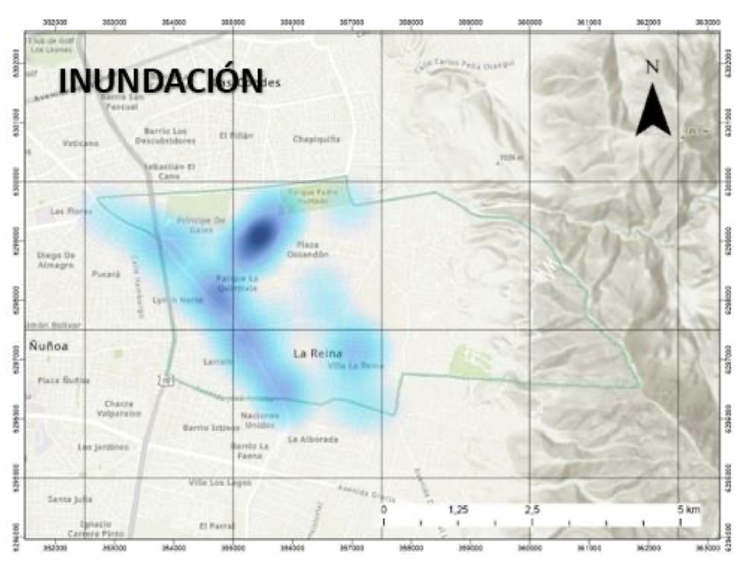
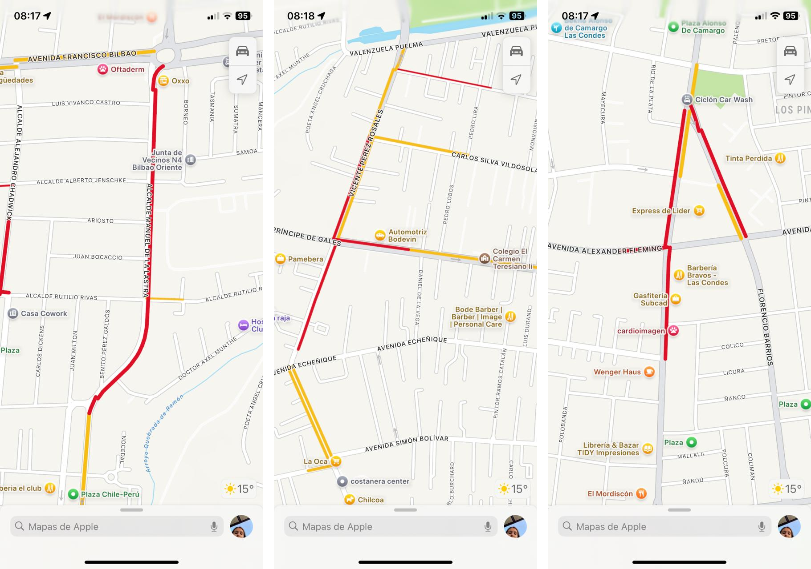
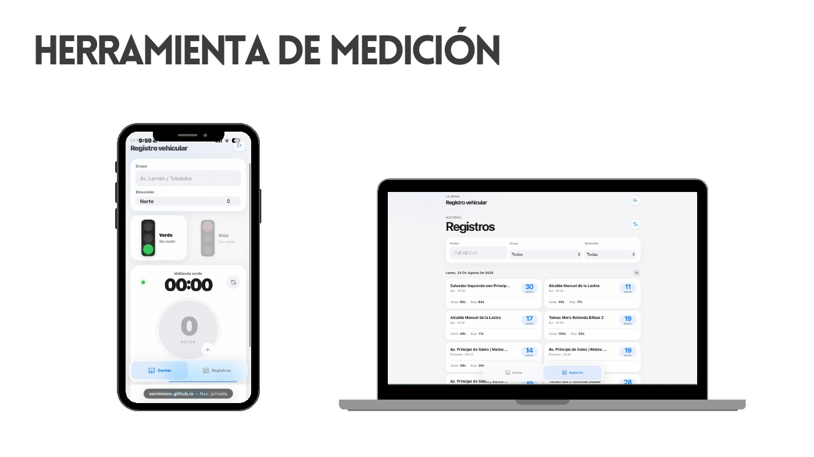
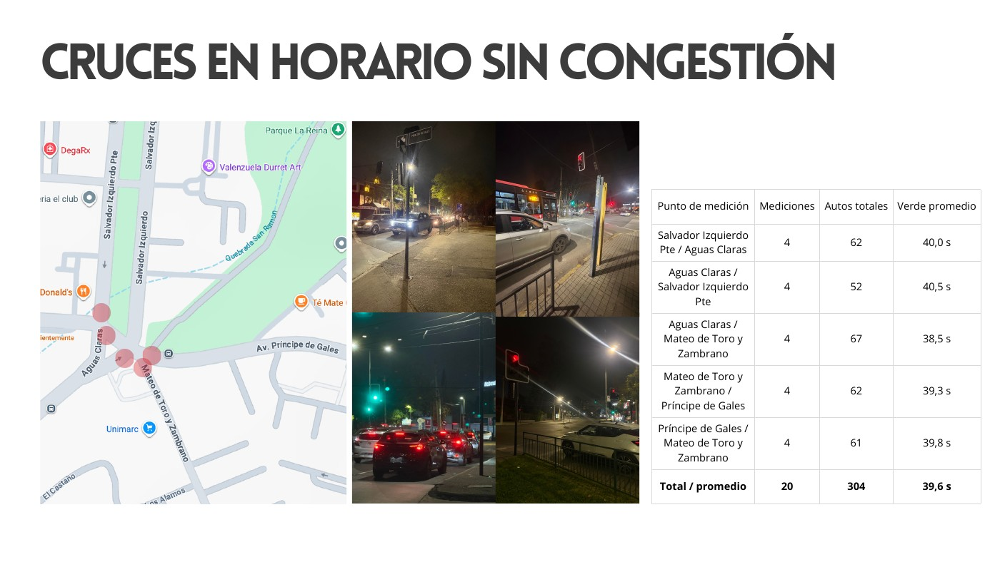
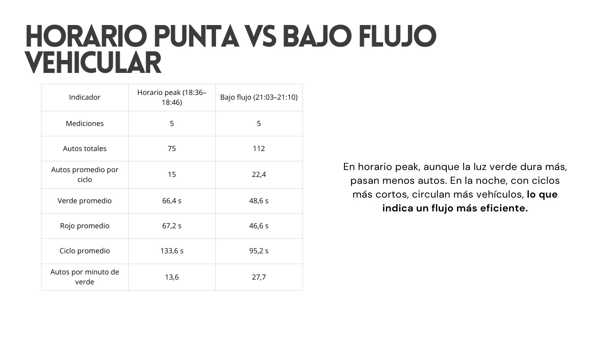
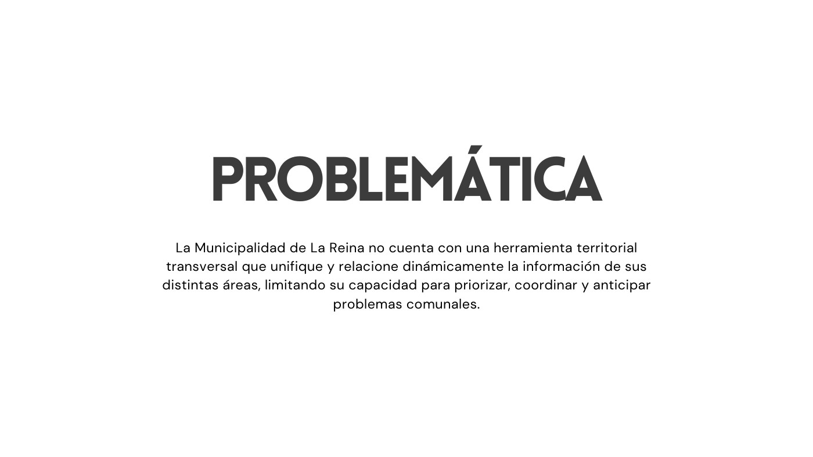
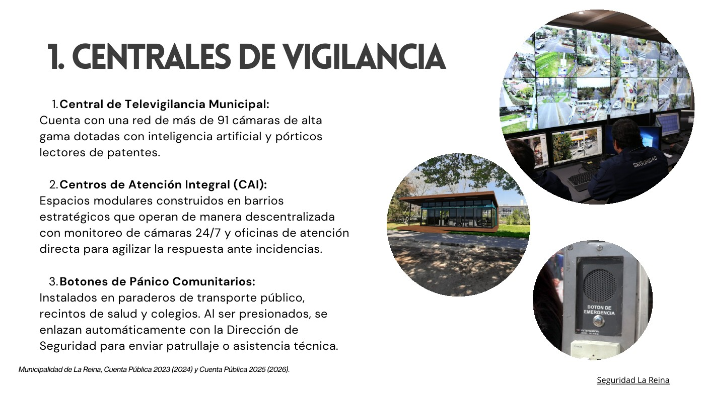

# Bitácora del proyecto - La Reina

**Inicio:** 18 de agosto de 2026 
**Última actualización:** 28 de agosto de 2026 
**Equipo:** Emilio Abarca · Emilia Armstrong · Victoria Aracena

[Volver al README principal](../../README.md)

## En una frase

Partimos investigando problemas urbanos separados y terminamos proponiendo una herramienta territorial que ayude a la Municipalidad de La Reina a observarlos, relacionarlos y priorizarlos desde un mismo lugar.

## Material del proceso

| Documento | Qué muestra |
|:---|:---|
| [Investigación inicial de Emilio](../Documentos/01-investigacion-inicial-emilio.pdf) | Primera exploración de calor, anegamientos y territorio. |
| [Investigación inicial de Emilia](../Documentos/02-investigacion-emilia-armstrong.pdf) | Movilidad, mantenimiento urbano y necesidades de distintos usuarios. |
| [Síntesis de problemáticas](../Documentos/03-sintesis-final-problematicas.pdf) | Selección de los tres temas con los que iniciamos. |
| [Validación de movilidad y entrevistas](../Documentos/04-validacion-movilidad-entrevistas.pdf) | Recorridos, vías críticas y primeras entrevistas. |
| [Presentación del último avance](../Documentos/05-presentacion-avance-plataforma-territorial.pdf) | Mediciones, referentes, cambio de enfoque y objetivos actuales. |

## 18 al 21 de agosto - Abrimos el problema

Al principio aparecieron muchos temas: baches, ciclovías, comunicación municipal, accesibilidad, calor, inundaciones y congestión. Para no quedarnos con una lista infinita, agrupamos lo que tenía más relación con el espacio público y elegimos tres situaciones para investigar en paralelo:

1. recorridos peatonales con poca sombra y mucho calor;
2. anegamientos e inundaciones en puntos críticos;
3. congestión y calles que reciben más flujo del que manejan cómodamente.

La primera decisión fue no elegir una solución todavía. Antes queríamos comprobar que los problemas fueran reales, actuales y observables.

### Calor peatonal

El Plan de Acción Comunal de Cambio Climático reconoce veredas amplias sin sombra y olas de calor más frecuentes e intensas. Esto nos hizo mirar el calor no solo como temperatura, sino como una experiencia que cambia la forma de caminar y permanecer en la comuna.

### Anegamientos

El Plan Comunal de Emergencia identifica 28 puntos críticos. Al revisar los primeros 20 puntos urbanos contamos 15 relacionados con colapso o falta de colectores. Ese conteo fue propio y nos ayudó a entender que preparar el territorio antes de la lluvia puede ser tan importante como responder durante la emergencia.

### Congestión

Vimos que los viajes se concentran en pocos ejes principales y que las calles interiores ofrecen pocas alternativas. Las entrevistas también repetían tacos, recorridos cortos que se alargan mucho y cambios de horario o ruta para evitar la hora punta.

## 24 y 25 de agosto - Medimos la congestión

Decidimos usar la congestión como un caso concreto para aprender a levantar datos territoriales. Medimos tiempos de verde y rojo, cantidad de autos por ciclo, cruce, dirección, fecha y horario.

Para no registrar todo a mano desarrollamos [Registro Vehicular MLR](../../registroVehicularMLR/), una aplicación móvil conectada a Firebase. La herramienta permite cronometrar el semáforo, contar autos y revisar los registros por día, cruce y dirección.

En el cruce de Salvador Izquierdo, Aguas Claras, Mateo de Toro y Zambrano y Príncipe de Gales realizamos 20 mediciones. En total contamos 304 autos y obtuvimos un verde promedio de 39,6 segundos.

También comparamos Padre Hurtado en dos horarios. Entre las 18:36 y 18:46 registramos 75 autos en cinco ciclos, mientras que entre las 21:03 y 21:10 registramos 112. Aunque en hora punta el verde era más largo, pasaban menos vehículos por minuto. Nuestra lectura fue que una fila grande y un verde largo no significan necesariamente un flujo más eficiente.

## 25 de agosto - Entendimos cómo se calculan los semáforos

Investigamos quién toma estas decisiones para no asumir que la municipalidad cambia los tiempos directamente. El Departamento de Ingeniería de Tránsito puede estudiar y solicitar ajustes, pero la programación debe ser revisada por la UOCT.

Los cálculos consideran flujo, capacidad de las pistas, virajes, filas, peatones, ciclistas y segundos perdidos entre fases. Revisamos el método de Akçelik y la forma de repartir el verde según la demanda crítica. También entendimos que el mínimo peatonal depende del ancho de la calzada y la velocidad de caminata.

Miramos tres referentes internacionales: GLIDE en Singapur, SCATS en Australia y las recomendaciones de la FHWA en Estados Unidos. Los tres refuerzan una idea que después fue clave para el proyecto: medir continuamente permite adaptar mejor una decisión que trabajar solo con datos aislados.

## 28 de agosto - Cambiamos el enfoque

Al poner juntos congestión, inundaciones y calor apareció algo más interesante que resolver cada problema por separado. Los tres ocurren en un mismo territorio, cambian durante el día y pueden afectar a varias áreas municipales al mismo tiempo.

Después sumamos otros ejemplos como seguridad, iluminación, caída de árboles, infraestructura dañada o cortes de servicios. Ahí apareció nuestra pregunta central: ¿cómo puede la municipalidad ver todo esto como parte de un mismo territorio si la información llega por plataformas, direcciones y formatos distintos?

### Lo que ya existe

La Reina no parte de cero. Encontramos una Central de Televigilancia, cámaras, pórticos, Centros de Atención Integral, botones de pánico, La Reina Digital, SOSAFE, el 1419, el call center, planes de emergencia, revisión de puntos críticos y Observadores Preventivos Vecinales.

La municipalidad incluso ha avanzado en centralizar solicitudes mediante la Plataforma de Atención al Vecino. Aun así, no encontramos evidencia pública de una herramienta transversal que conecte en una misma vista seguridad, tránsito, clima, infraestructura, emergencias y atención vecinal.

Por eso corregimos una idea importante: no queremos reemplazar todas las plataformas. La propuesta sería una capa común que reciba información de las herramientas existentes, la ubique en el territorio y permita que distintas áreas compartan una misma lectura.

## Situación problemática

La Reina enfrenta congestión, anegamientos, sectores con poca sombra, fallas de iluminación, inseguridad, deterioro del espacio público y riesgos como caída de árboles. Aunque estas situaciones pueden coincidir en un mismo lugar y momento, son observadas y gestionadas por áreas diferentes.

## Problemática

> La Municipalidad de La Reina no cuenta con una herramienta territorial transversal que unifique y relacione dinámicamente la información de sus distintas áreas, limitando su capacidad para priorizar, coordinar y anticipar problemas comunales.

## Objetivo general

> Desarrollar una herramienta colaborativa que centralice información territorial actualizada para apoyar a la Municipalidad de La Reina en el monitoreo, coordinación, priorización y prevención de problemáticas comunales.

## Objetivos específicos

1. **Centralizar y estandarizar la información:** reunir datos que hoy llegan por distintos canales usando criterios comunes de ubicación, horario, categoría, gravedad y estado.
2. **Ampliar la cobertura territorial:** complementar cámaras e inspecciones con reportes vecinales georreferenciados en sectores sin monitoreo constante.
3. **Fortalecer la coordinación:** permitir que Seguridad, Tránsito, DIMAO, Obras y Gestión de Riesgos compartan responsabilidades y seguimiento.
4. **Priorizar y prevenir:** ordenar los casos por gravedad, recurrencia, urgencia y población afectada para reconocer zonas críticas y actuar antes.

## Qué podría integrar

La plataforma podría crecer por capas: movilidad y accesibilidad; agua y condiciones climáticas; calor y medioambiente; infraestructura y espacio público; seguridad y convivencia; riesgos y emergencias; y dimensión social y sanitaria. No buscamos desarrollar todo al mismo tiempo. Estas categorías sirven para demostrar que la estructura puede comenzar con tres casos y sumar otros sin crear una plataforma nueva para cada problema.

## Decisiones que dejamos tomadas

- La congestión sigue siendo un caso de estudio, pero ya no es el único centro del proyecto.
- La herramienta debe integrar sistemas existentes en vez de obligar a reemplazarlos.
- Los reportes vecinales complementan el monitoreo municipal, no lo sustituyen.
- Una misma situación debe poder ser vista por más de una dirección.
- La prioridad no puede depender solo del orden de llegada.
- La parte predictiva es una meta futura y necesita primero datos comparables, históricos y confiables.

## Próximos pasos

- Mapear qué datos tiene realmente cada dirección municipal y con qué frecuencia se actualizan.
- Definir un primer alcance pequeño para el prototipo.
- Diseñar el flujo entre reporte, revisión, asignación, respuesta y cierre.
- Probar la propuesta con funcionarios y vecinos.
- Definir criterios de privacidad, permisos y calidad de datos.

## Referencias principales

- Municipalidad de La Reina. (2022). *[Cuenta Pública 2021](https://www.lareina.cl/wp-content/uploads/2022/04/Cuenta-P%C3%BAblica-2021-Version-Final.pdf)*.
- Municipalidad de La Reina. (2024). *[Cuenta Pública 2023](https://www.lareina.cl/wp-content/uploads/2024/04/CUENTA-PUBLICA-LA-REINA-GESTION-2023.pdf)*.
- Municipalidad de La Reina. (2024). *[La Reina, Municipio Digital](https://lareina.cl/la-reina-municipio-digital/)*.
- Municipalidad de La Reina. (2025). *[Plan de Acción Comunal de Cambio Climático 2025-2030](https://www.lareina.cl/wp-content/uploads/2025/07/DECRETO-ALCALDICIO-N%C2%B0-872-DEL-12.06.2025-1.pdf)*.
- Municipalidad de La Reina. (2025). *[Plan Comunal de Emergencia 2025-2027](https://www.lareina.cl/wp-content/uploads/2025/09/PLAN_COMUNAL_EMERGENCIA_LAREINA_2025-2027.pdf)*.
- Municipalidad de La Reina. (2026). *[Cuenta Pública 2025](https://www.lareina.cl/wp-content/uploads/2026/04/Cuenta-Publica-2025_Final__.pdf)*.
- Land Transport Authority. (s. f.). *[Intelligent transport systems](https://www.lta.gov.sg/content/ltagov/en/getting_around/driving_in_singapore/intelligent_transport_systems.html)*.
- Transport for NSW. (2022). *[SCATS Core](https://www.transport.nsw.gov.au/system/files/media/documents/2022/SCATS-Core-brochure-Final-web-spreads.pdf)*.
- Federal Highway Administration. (2008). *[Traffic Signal Timing Manual](https://ops.fhwa.dot.gov/publications/fhwahop08024/fhwa_hop_08_024.pdf)*.

---

Documentado por Emilio Abarca, Emilia Armstrong y Victoria Aracena, 2026.

[Volver al README principal](../../README.md)
