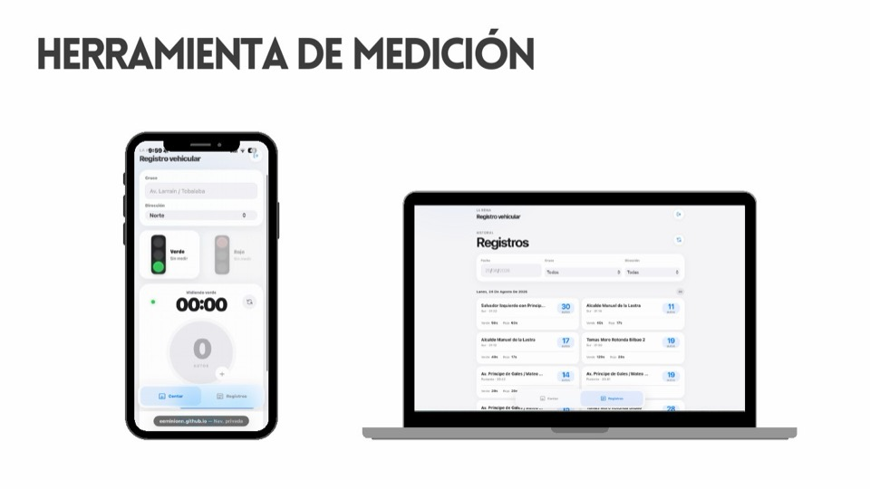
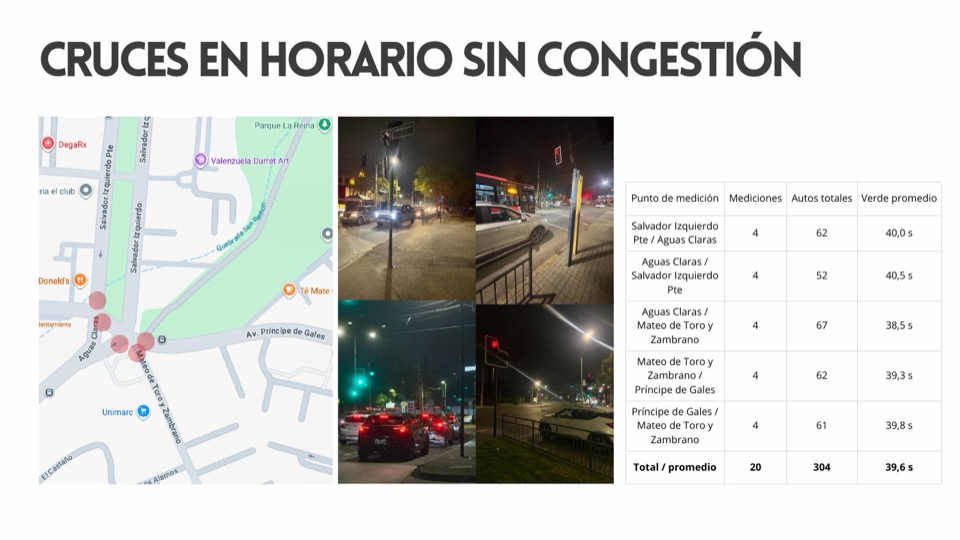
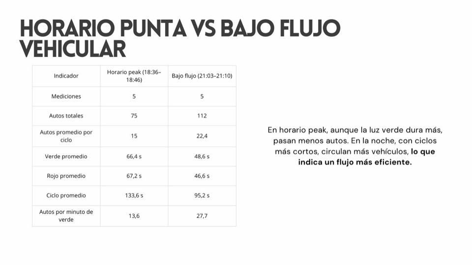
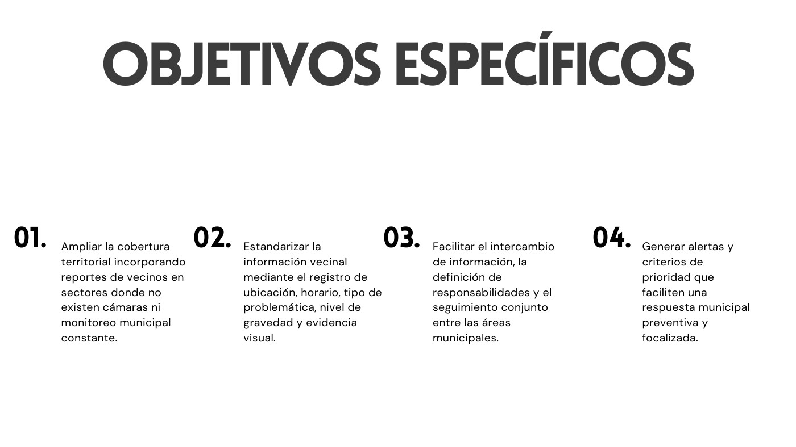

# Bitácora - Etapa 2

**Inicio:** 24 de agosto de 2026 
**Última actualización:** 28 de agosto de 2026 
**Equipo:** Emilio Abarca · Emilia Armstrong · Victoria Aracena

[Volver al README principal](../../README.md) · [Revisar Etapa 1](../../Etapa-1/Bitacora/README.md)

## De dónde veníamos

En la primera etapa investigamos calor peatonal, anegamientos y congestión como problemas separados. Para esta etapa elegimos la congestión como un caso concreto: queríamos comprobar qué tan fácil o difícil era levantar datos actuales del territorio y convertirlos en información útil.

## Material de la etapa

| Documento | Qué muestra |
|:---|:---|
| [Presentación del avance](../Documentos/01-presentacion-avance-plataforma-territorial.pdf) | Mediciones, referentes, herramientas municipales, problemática y objetivos actuales. |
| [Registro Vehicular MLR](../../registroVehicularMLR/) | Aplicación móvil que usamos para levantar datos en terreno. |
| [Página publicada](https://eeminionn.github.io/labTecnologiasEmergentes/registroVehicularMLR/) | Versión funcional del registro vehicular. |

## 24 y 25 de agosto - Levantamiento en terreno

Para no seguir anotando tiempos y conteos en el celular de forma separada, desarrollamos Registro Vehicular MLR. La aplicación permite medir verde y rojo con un cronómetro, contar autos, guardar cruce y dirección, y revisar todo después por fecha.

<table>
  <tr>
    <td align="center">
      
    </td>
  </tr>
  <tr>
    <td><strong>Figura 1.</strong> Vistas del registro en terreno y del historial de mediciones. <strong>Fuente:</strong> elaboración del equipo, <a href="../../registroVehicularMLR/"><em>Registro Vehicular MLR</em></a> (2026).</td>
  </tr>
</table>

La usamos en cruces de Salvador Izquierdo, Aguas Claras, Mateo de Toro y Zambrano, Príncipe de Gales y Padre Hurtado. En una de las series hicimos 20 mediciones, contamos 304 autos y obtuvimos un verde promedio de 39,6 segundos.

<table>
  <tr>
    <td align="center">
      
    </td>
  </tr>
  <tr>
    <td><strong>Figura 2.</strong> Síntesis de veinte mediciones realizadas en cruces del sector de Salvador Izquierdo, Aguas Claras, Mateo de Toro y Zambrano y Príncipe de Gales. <strong>Fuente:</strong> registro del equipo incluido en la <a href="../Documentos/01-presentacion-avance-plataforma-territorial.pdf">presentación de avance</a> (2026).</td>
  </tr>
</table>

También comparamos Padre Hurtado en dos momentos. Entre las 18:36 y 18:46 registramos 75 autos en cinco ciclos. Entre las 21:03 y 21:10 registramos 112. Aunque en hora punta el verde era más largo, pasaban menos autos por minuto.

La conclusión no fue que el semáforo estuviera necesariamente mal programado. Entendimos que la congestión depende de más variables y que un verde largo no garantiza por sí solo un flujo eficiente.

<table>
  <tr>
    <td align="center">
      
    </td>
  </tr>
  <tr>
    <td><strong>Figura 3.</strong> Comparación de cinco ciclos en hora punta y cinco ciclos durante un horario de menor congestión en Padre Hurtado. <strong>Fuente:</strong> elaboración propia a partir de las mediciones guardadas en Registro Vehicular MLR (2026).</td>
  </tr>
</table>

## Cómo se decide el tiempo de un semáforo

Investigamos quién toma estas decisiones para no responsabilizar a una sola institución sin entender el proceso. El Departamento de Ingeniería de Tránsito puede estudiar y solicitar ajustes, mientras que la UOCT revisa y autoriza las programaciones.

Los cálculos consideran el flujo por dirección, capacidad de las pistas, virajes, filas, peatones, ciclistas y segundos perdidos entre fases. Revisamos el método de Akçelik, la distribución proporcional del verde y el tiempo mínimo necesario para que una persona alcance a cruzar.

También vimos GLIDE en Singapur, SCATS en Australia y las recomendaciones de la FHWA en Estados Unidos. Los tres casos trabajan con datos continuos para adaptar o revisar las programaciones según las condiciones reales. Esto nos dejó una idea importante: una decisión territorial mejora cuando puede mirar datos actuales e históricos, no solo mediciones aisladas.

## 28 de agosto - El cambio de enfoque

Al volver a juntar congestión, inundaciones y calor nos dimos cuenta de que los tres problemas cambian según el lugar y el momento. Además, pueden relacionarse: una lluvia puede causar anegamiento, congestión, cortes de luz, caída de árboles y problemas de seguridad en un mismo sector.

Después sumamos iluminación, infraestructura dañada, incivilidades, incendios y población vulnerable. El proyecto dejó de preguntarse cómo resolver tres problemas separados y empezó a preguntarse cómo la municipalidad puede observarlos como parte de un mismo territorio.

## Situación problemática

La Reina enfrenta congestión, anegamientos, sectores con poca sombra, fallas de iluminación, inseguridad, deterioro del espacio público y distintos riesgos urbanos. Aunque varias situaciones pueden coincidir en un mismo lugar y horario, son registradas y abordadas por áreas municipales diferentes.

## Problemática

> La Municipalidad de La Reina no cuenta con una herramienta territorial transversal que unifique y relacione dinámicamente la información de sus distintas áreas, limitando su capacidad para priorizar, coordinar y anticipar problemas comunales.

<table>
  <tr>
    <td align="center">
      
    </td>
  </tr>
  <tr>
    <td><strong>Figura 4.</strong> Reformulación de la problemática hacia la falta de una herramienta territorial transversal. <strong>Fuente:</strong> elaboración del equipo incluida en la <a href="../Documentos/01-presentacion-avance-plataforma-territorial.pdf">presentación de avance</a> (2026).</td>
  </tr>
</table>

## Lo que la municipalidad ya tiene

La Reina no parte de cero. Encontramos una Central de Televigilancia, cámaras, pórticos, Centros de Atención Integral, botones de pánico, La Reina Digital, SOSAFE, el 1419, el call center, planes de emergencia, revisión de puntos críticos y Observadores Preventivos Vecinales.

<table>
  <tr>
    <td align="center">
      
    </td>
  </tr>
  <tr>
    <td><strong>Figura 5.</strong> Central de Televigilancia, Centro de Atención Integral y botón de emergencia como parte de las herramientas actuales de seguridad. <strong>Fuente:</strong> Municipalidad de La Reina, <a href="https://www.lareina.cl/wp-content/uploads/2024/04/CUENTA-PUBLICA-LA-REINA-GESTION-2023.pdf"><em>Cuenta Pública 2023</em></a> (2024) y <a href="https://www.lareina.cl/wp-content/uploads/2026/04/Cuenta-Publica-2025_Final__.pdf"><em>Cuenta Pública 2025</em></a> (2026).</td>
  </tr>
</table>

También existe la Plataforma de Atención al Vecino, que permitió ordenar solicitudes que antes llegaban desde varias fuentes. Aun así, no encontramos evidencia pública de una vista transversal que conecte seguridad, tránsito, clima, infraestructura, emergencias y atención vecinal.

### Decisión de diseño

No queremos crear otra plataforma aislada ni obligar a eliminar lo que ya funciona. La propuesta sería una capa común que reciba información de las herramientas existentes, la ubique en el mapa y permita que distintas direcciones trabajen con una lectura compartida.

## Objetivo general

> Desarrollar una herramienta colaborativa que centralice información territorial actualizada para apoyar a la Municipalidad de La Reina en el monitoreo, coordinación, priorización y prevención de problemáticas comunales.

## Objetivos específicos

1. **Centralizar y estandarizar la información:** reunir datos que hoy llegan por distintos canales usando criterios comunes de ubicación, horario, categoría, gravedad y estado.
2. **Ampliar la cobertura territorial:** complementar cámaras e inspecciones con reportes vecinales georreferenciados en sectores sin monitoreo constante.
3. **Fortalecer la coordinación:** permitir que Seguridad, Tránsito, DIMAO, Obras y Gestión de Riesgos compartan responsabilidades y seguimiento.
4. **Priorizar y prevenir:** ordenar los casos por gravedad, recurrencia, urgencia y población afectada para reconocer zonas críticas y actuar antes.

<table>
  <tr>
    <td align="center">
      
    </td>
  </tr>
  <tr>
    <td><strong>Figura 6.</strong> Síntesis de los cuatro objetivos específicos definidos para la plataforma territorial. <strong>Fuente:</strong> elaboración del equipo incluida en la <a href="../Documentos/01-presentacion-avance-plataforma-territorial.pdf">presentación de avance</a> (2026).</td>
  </tr>
</table>

## Qué podría integrar

La plataforma podría organizarse en capas de movilidad y accesibilidad; agua y condiciones climáticas; calor y medioambiente; infraestructura y espacio público; seguridad y convivencia; riesgos y emergencias; y dimensión social y sanitaria.

No significa desarrollar todo de una vez. Estas categorías muestran que podemos comenzar con pocos casos y sumar otros sin construir una herramienta nueva para cada problema.

## Decisiones que dejamos tomadas

- La congestión continúa como caso de estudio, pero ya no es el único centro del proyecto.
- La herramienta debe integrar sistemas existentes en vez de reemplazarlos.
- Los reportes vecinales complementan el monitoreo municipal.
- Una misma situación debe poder involucrar a más de una dirección.
- La prioridad no puede depender solamente del orden de llegada.
- La parte predictiva necesita primero datos comparables, históricos y confiables.

## Próximos pasos

- Mapear qué información tiene cada dirección y cómo la actualiza.
- Definir un primer alcance pequeño para el prototipo.
- Diseñar el recorrido entre reporte, revisión, asignación, respuesta y cierre.
- Probar la propuesta con funcionarios y vecinos.
- Definir permisos, privacidad y criterios de calidad de los datos.

## Referencias principales

- Municipalidad de La Reina. (2022). *[Cuenta Pública 2021](https://www.lareina.cl/wp-content/uploads/2022/04/Cuenta-P%C3%BAblica-2021-Version-Final.pdf)*.
- Municipalidad de La Reina. (2024). *[Cuenta Pública 2023](https://www.lareina.cl/wp-content/uploads/2024/04/CUENTA-PUBLICA-LA-REINA-GESTION-2023.pdf)*.
- Municipalidad de La Reina. (2024). *[La Reina, Municipio Digital](https://lareina.cl/la-reina-municipio-digital/)*.
- Municipalidad de La Reina. (2025). *[Plan Comunal de Emergencia 2025-2027](https://www.lareina.cl/wp-content/uploads/2025/09/PLAN_COMUNAL_EMERGENCIA_LAREINA_2025-2027.pdf)*.
- Municipalidad de La Reina. (2026). *[Cuenta Pública 2025](https://www.lareina.cl/wp-content/uploads/2026/04/Cuenta-Publica-2025_Final__.pdf)*.
- Land Transport Authority. (s. f.). *[Intelligent transport systems](https://www.lta.gov.sg/content/ltagov/en/getting_around/driving_in_singapore/intelligent_transport_systems.html)*.
- Transport for NSW. (2022). *[SCATS Core](https://www.transport.nsw.gov.au/system/files/media/documents/2022/SCATS-Core-brochure-Final-web-spreads.pdf)*.
- Federal Highway Administration. (2008). *[Traffic Signal Timing Manual](https://ops.fhwa.dot.gov/publications/fhwahop08024/fhwa_hop_08_024.pdf)*.

---

Documentado por Emilio Abarca, Emilia Armstrong y Victoria Aracena, 2026.

[Volver al README principal](../../README.md)
