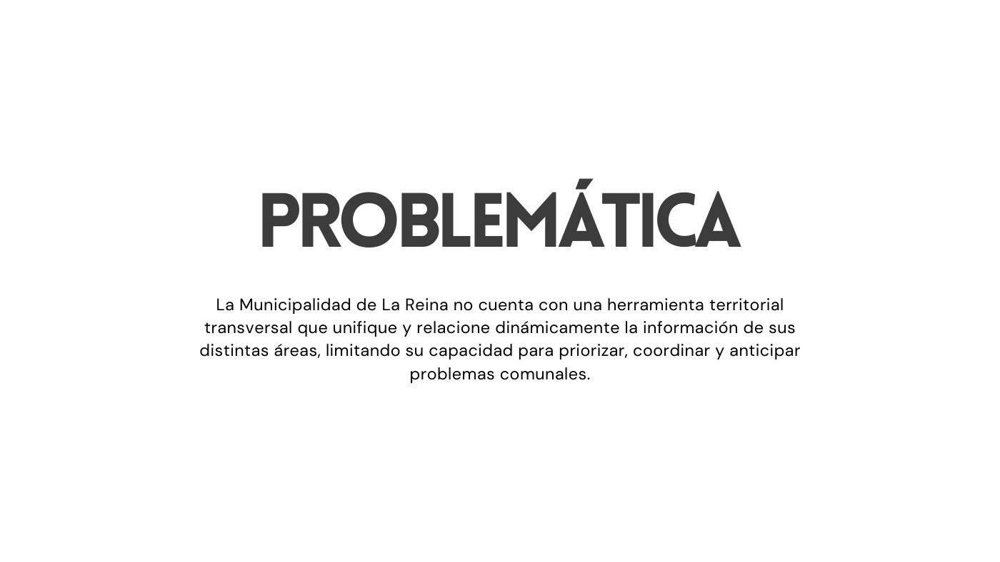

# Investigación MLR: La Reina

Investigación sobre la adaptación del espacio público de La Reina a las necesidades actuales de movilidad, confort climático y gestión de aguas lluvias.

**Equipo:** Emilio Abarca · Emilia Armstrong · Victoria Aracena 
**Estado actual:** Etapa 2 · prototipo de interacción territorial 
**Última actualización:** 10 de octubre de 2026

## Prototipo: Mapa Gestual MLR

Desarrollamos una aplicación de escritorio para recorrer el mapa de La Reina con las manos frente a una cámara frontal. Permite desplazarse, hacer zoom y seleccionar puntos de interés. Por ahora trabajamos con tres puntos demostrativos, antes de incorporar información municipal real.

**[Bitácora del Mapa Gestual MLR: proceso, decisiones e imágenes](./mapaGestualMLR/)**

La bitácora reúne el recorrido del proyecto, las decisiones de interacción y la propuesta espacial de la sala, con referentes, planos y renders.

### Demostración

<table>
  <tr>
    <td align="center">
      
    </td>
  </tr>
  <tr>
    <td><strong>Video demostrativo.</strong> <a href="https://youtu.be/mBsh8tRpk8A">Test software visualización de datos MLR</a>. Hacer clic en la imagen para ver el funcionamiento en YouTube.</td>
  </tr>
</table>

### Referentes y arquitectura

| Documento | Qué aporta |
|:---|:---|
| [Referentes de gestos y UX](./mapaGestualMLR/Documentos/02-gestos-y-ux.md) | Investigación para definir la interacción. |
| [Arquitectura del sistema](./mapaGestualMLR/Documentos/09-arquitectura-del-sistema.md) | Resumen por módulos y diagrama completo. |

## Etapas de la investigación

En la primera etapa revisamos problemas de movilidad, calor y anegamientos. En la segunda pasamos a una oportunidad más amplia: conectar la información territorial que hoy está repartida entre plataformas y áreas municipales.

| Etapa | Registro |
|:---|:---|
| **Etapa 1** | [Exploración y definición de la problemática](./Etapa-1/Bitacora/README.md) |
| **Etapa 2** | [Bitácora del avance](./Etapa-2/Bitacora/README.md) · [Presentación](./Etapa-2/Documentos/01-presentacion-avance-plataforma-territorial.pdf) |

<table>
  <tr>
    <td align="center">
      
    </td>
  </tr>
  <tr>
    <td><strong>Problemática transversal.</strong> Síntesis de la Etapa 2. <strong>Fuente:</strong> elaboración del equipo.</td>
  </tr>
</table>

## Herramienta web

Como parte del levantamiento de datos construimos una aplicación móvil para medir semáforos y contar vehículos en terreno.

**[Abrir Registro Vehicular MLR](https://eeminionn.github.io/labTecnologiasEmergentes/registroVehicularMLR/)**

El código y la documentación de la aplicación están en [registroVehicularMLR](./registroVehicularMLR/).
