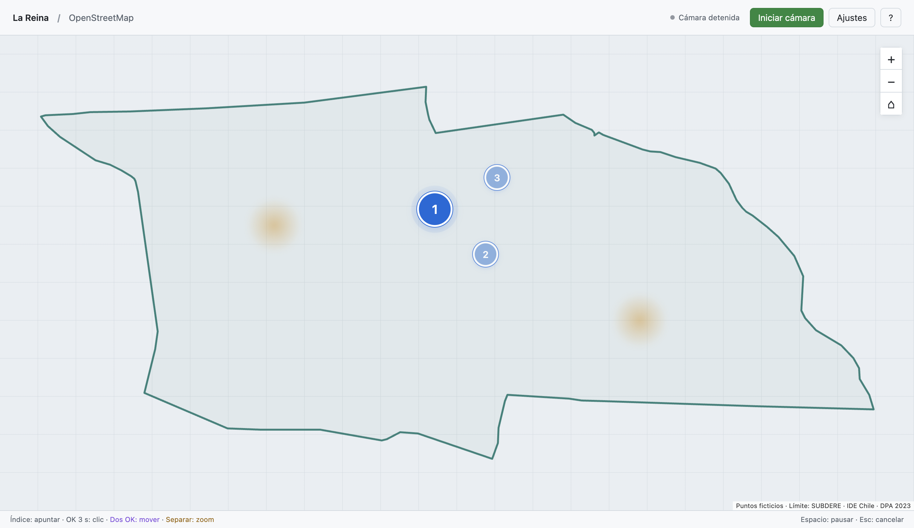
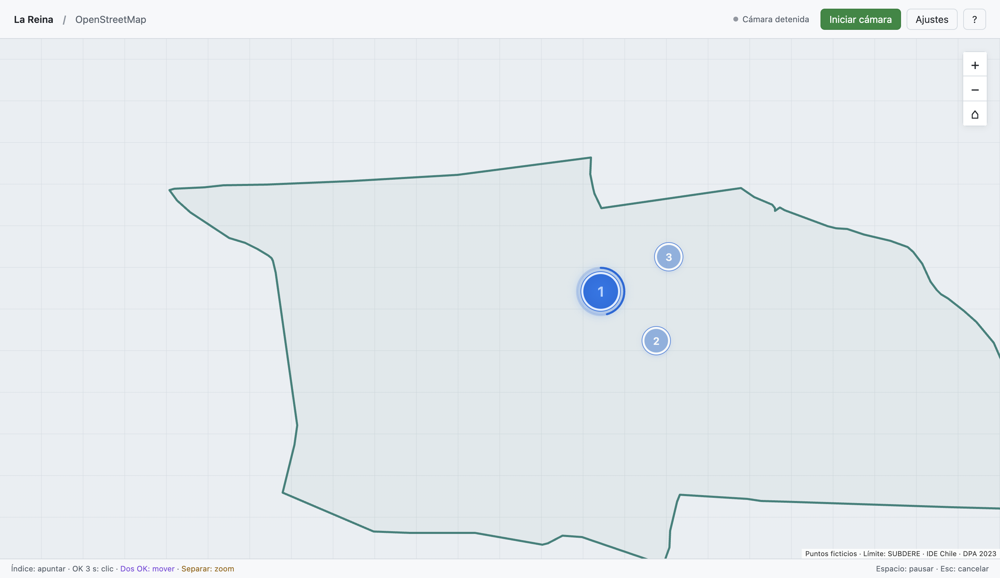

# Entrega técnica - Mapa Gestual MLR 0.1.3

**Fecha:** 6 de octubre de 2026 
**Estado:** paquetes Mac y Windows verificados; validación cenital pendiente

[Volver al prototipo](../README.md)

## Cambios de interacción

Las sombras de ambas manos se mantienen visibles mientras existan detecciones frescas, también en reposo, OK y navegación. Azul indica apuntado/reposo; violeta, navegación preparada/desplazamiento; ámbar, zoom predominante. Durante pausa o bloqueo de imagen se muestran grises. Los colores identifican la intención predominante: desplazamiento y zoom pueden combinarse. No se mantienen posiciones antiguas cuando el tracking se pierde.

Dos manos en OK durante 180 ms habilitan navegación. Moverlas juntas desplaza; separar acerca y juntar aleja. La palma abierta no desplaza. Una sola mano detectada selecciona automáticamente al mantener OK **3 segundos**, con aro de progreso de 96 px y radio 34 px, situado por fuera de los puntos grandes. Mantener la pinza cerrada no repite el clic; abrirla 120 ms rearma la selección.

El objetivo conserva posición al cerrar OK. Soltar antes de tiempo, desplazarse fuera de la tolerancia, perder tracking, recibir frames tardíos/discontinuos, detectar otra mano, perder foco, pausar o pulsar Esc cancela la carga. También se cancela si desaparece o cambia el objetivo. Las áreas de selección propias y controles visibles conservan asistencia local y comprobación de oclusión.

La **imagen completa de cámara cubre el viewport completo del mapa**, con la orientación/espejo elegidos. Se retiró la calibración manual de cuatro esquinas del flujo y se ignoran esquinas antiguas guardadas. Los filtros y transiciones se resuelven para alcanzar los cuatro bordes; no se conserva una región central recortada.

Los tres puntos ficticios son mayores, numerados y ordenados. Sólo el siguiente activo, de 56 px, pulsa; los restantes miden 40 px. El clic del punto activo abre su popup y avanza **1 → 2 → 3**. El botón del popup no avanza dos veces. Ajustes permite reiniciar el recorrido e Inicio conserva su avance. Se eliminó la palabra “prueba” de los textos visibles del mapa.

## Cámara y contorno

El worker analiza una copia pequeña de la imagen y cancela acciones ante frames inválidos o prácticamente totalmente negros/blancos. El bloqueo comienza en el primer frame severo; el aviso necesita 200 ms continuos y la recuperación, 600 ms de calidad no severa. Los avisos de poco contraste o detalle no bloquean automáticamente una mesa lisa. El diagnóstico exporta tiempo de análisis, inferencia y captura a resultado por separado.

Se consultan capacidades del track después de iniciar el vídeo. Ajustes muestra brillo, contraste y compensación de exposición sólo cuando la cámara ofrece rangos válidos; verifica valores devueltos y distingue solicitudes no confirmadas. No se inventan controles USB ni se aplica CLAHE a la entrada del modelo. [Fuentes, decisiones y límites](./06-camara-y-contraste.md).

El contorno verde azulado de La Reina proviene de **SUBDERE / IDE Chile, DPA 2023, CUT_COM 13113**: un polígono local, válido, con 306 vértices y sin simplificación. Inicio encuadra la comuna completa. La procedencia se atribuye dentro del mapa. [Fuente oficial, extracción y condiciones](./07-limite-la-reina.md). La cartografía descargada no equivale a una certificación municipal del software.

Se mantiene MediaPipe Hand Landmarker full con sus pesos originales. Las pautas Meta se adaptan al cursor, hover y selección de una cámara RGB cenital; no se incorpora el tracking propietario del visor. [Investigación Meta](./05-meta-quest-y-seleccion.md).

## Archivos entregados

Código de los binarios: `f5716f0b134ef15d97f2a727990122b3dbf18e54`.

| Archivo | Plataforma | SHA-256 |
| --- | --- | --- |
| `MapaGestualMLR-0.1.3-mac-arm64.zip` | macOS Apple Silicon; contiene `Mapa Gestual MLR.app` | `05ac7b3f4940b59263ef91239946f506f07b9a6bc9e24bf413ff329555586b33` |
| `MapaGestualMLR-0.1.3-windows-x64.exe` | Windows x64; portable | `33aa6352acf5f07ae289ce5d47505f92ccac877f69a9d667304a1d09785e48f5` |

Los ejecutables incluyen modelo full, loaders WASM y contorno. No requieren Node ni Python en el equipo de uso. Las teselas del mapa utilizan Internet. Esta distribución de desarrollo no tiene certificados de firma/notarización.

El portable utiliza un contenedor autoextraíble NSIS de 32 bits que transporta Electron x64. La arquitectura del contenedor no cambia el objetivo x64 del programa.

## Evidencia de 0.1.3

- **86/86 pruebas:** 47 de gestos, 3 del helper histórico de calibración, 9 de selección, 4 de mapeo completo, 15 de calidad/cámara y 8 de secuencia/contorno. El helper de calibración se conserva como antecedente, sin uso en el flujo actual.
- **Mac:** build Vite, ZIP arm64 y [smoke del paquete](./verificacion-paquete-mac-0.1.3.json) aprobados en Apple M5/macOS 26.6.2. La `.app` final abre con contorno, tres puntos y ayuda actualizada.
- **Windows:** [CI 37414071782](https://github.com/eeminionn/labTecnologiasEmergentes/actions/runs/37414071782) aprobó tests, build, smoke del runtime, portable y [smoke del contenido empaquetado](./verificacion-paquete-windows-0.1.3.json). Se ejecutó `release/win-unpacked/Mapa Gestual MLR.exe`; no se ejecutó el envoltorio NSIS directamente.
- Los smoke cargan modelo/WASM locales: frame vacío con cero manos y fixture oficial con una mano/21 puntos, ambos con análisis de calidad válido, más bloqueo CSP de telemetría. El PNG oficial transparente se compone sobre gris `#777` sólo como estímulo fijo del smoke; la cámara no recibe esa transformación.
- `pointerFeedback` comprueba una y dos sombras, colores pan/zoom, sombras grises con bloqueo, ocultación sin manos, extremos del frame y limpieza del ripple. `navigationFeedback` verifica pan, combinación pan/zoom y ambas sombras visibles mediante eventos de prueba.
- Los ocho checks `qualityFeedback` comprueban acción con imagen normal, cancelación inmediata, bloqueo sostenido, recuperación temporal, ausencia de input bloqueado y aviso después de una discontinuidad aunque el estado ya fuese `blocked`, además de visibilidad CSS real de controles dentro del diálogo: ocultos sin capacidades y visibles cuando se habilitan.
- **Selección nativa:** landmarks sintéticos pasan por motor real → renderer → IPC → eventos nativos Electron. Tres mantenimientos seleccionan los puntos 1, 2 y 3; un cuarto selecciona el botón del primer popup sin volver a avanzar. Cada mantenimiento conserva objetivo/aro, tarda al menos 3000 ms y no produce clic temprano ni repetido. Se observan **cuatro eventos `isTrusted` por plataforma** y secuencia completa. Después se reinicia en el punto 1 para dejar el programa preparado.
- `map.info()` confirma contorno cargado con una entidad. Las pruebas de integridad comprueban anillo cerrado, atributos oficiales y los tres puntos dentro de la comuna.

Las capturas muestran el contorno sin teselas externas, con estados/landmarks inyectados. Verifican interfaz y recorrido de eventos propios, pero no precisión física del detector. Las inferencias con imágenes fijas son muestras aisladas, no un benchmark de latencia ni una medida de falsos positivos.

## Antecedentes y validación pendiente

Se conservan reportes de 0.1.0, 0.1.1 y 0.1.2 como antecedentes. El [ensayo aislado de visión](./verificacion-vision-mac.json) comprobó bloqueo CSP del POST real del logger al cerrar el task, sin requests externas observadas; no se repitió como ensayo independiente en esta actualización.

Queda medir acciones accidentales, precisión, falsos bloqueos, comodidad de mantener OK 3 segundos y latencia con la **cámara USB cenital física**, según el [protocolo](./03-protocolo-validacion.md). También falta probar controles del driver real, Google Maps con API key autorizada y picking de POI reales, el arranque del envoltorio portable en Windows y accesibilidad antes de una instalación municipal. La inspección y pruebas automatizadas no acreditan esas condiciones.
