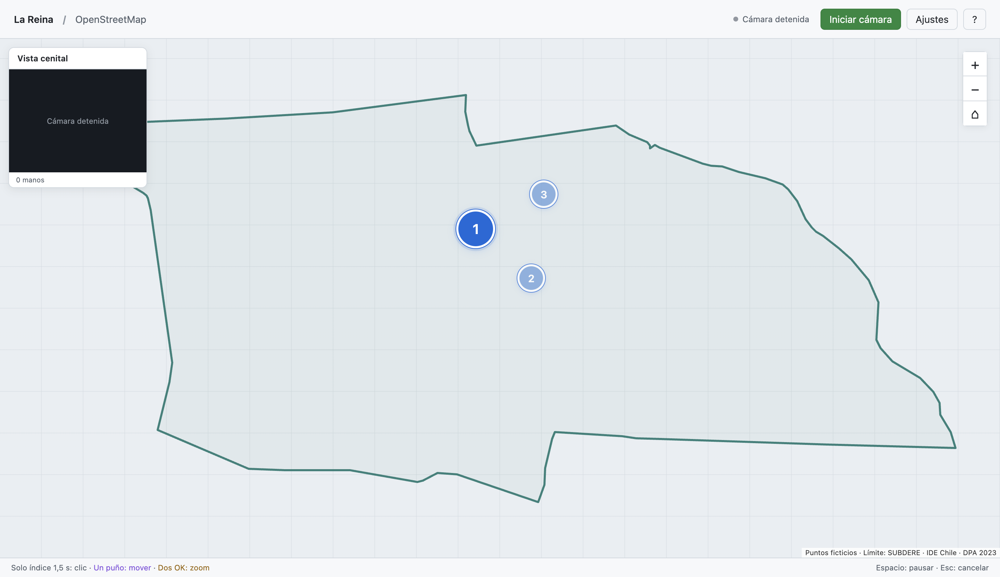

# Entrega técnica - Mapa Gestual MLR 0.1.12

**Fecha:** 9 de octubre de 2026 
**Fuente verificada:** `3bfd3c50bce3abbaafb145096a3d00403b199701` 
**Estado:** 192/192 pruebas, build, runtime y paquetes Mac/Windows aprobados. Aplicación Mac actualizada y abierta.

## Interacción vigente

Colocar la **punta del índice sobre un objetivo visible** durante **1500 ms** selecciona. No se exige que el índice forme una postura específica ni que pulgar, medio, anular y meñique estén retraídos. Abrirlos, cerrarlos o cambiar su estimación world no reinicia el reloj. El landmark 8 de imagen conserva su papel de puntero; el modelo Hand Landmarker y sus pesos permanecen iguales.

La corrección responde al ensayo físico reportado por el usuario en 0.1.11: el esqueleto y la sombra estaban presentes sobre el punto 1, pero no aparecía carga. La condición de postura podía vetar la selección; sin los landmarks de esa captura no se puede demostrar qué condición exacta falló. La captura personal no se incorpora al repositorio.

El mapa entrega al motor un ID de objetivo por cada mano, consultando la punta viva **antes de contar tiempo**. Espacio vacío y ausencia de contexto de objetivos nunca acumulan dwell. Los objetivos iniciales tienen hitarea mínima **44 CSS px**. Una vez adquirido el objetivo, el aro y la sombra de esa mano se anclan al centro y se admite movimiento dentro de un rectángulo fijo ampliado **36 CSS px por lado**. Para un punto activo de 56 px, la retención mide **128 × 128 CSS px**. Además se comprueba deriva física máxima de **0,15 unidades de alto de cámara** desde el índice inicial, corrigiendo aspecto. Se aplica el primero de los límites alcanzado; no se desplaza la región con cada oscilación.

Salir del rango, cambiar objetivo, perder al actor o una interrupción de tracking reinicia el reloj; otro objetivo u otra mano nunca hereda progreso. Tras el clic, se bloquea ese objetivo por esa mano hasta salir de él durante **120 ms**. Cambiar de A a B inicia un mantenimiento nuevo completo; un popup o el siguiente punto apareciendo bajo el índice inmóvil no dispara otro clic. Pausa/foco/calidad conservan el rearme de seguridad, sin exigir retraer dedos.

Prioridad: **dos OK válidos hacen zoom → índice de una mano no-puño sobre objetivo selecciona → uno o dos puños desplazan**. Una mano libre sobre vacío no bloquea el puño acompañante; el propio puño no selecciona. Un actor sobre objetivo puede seleccionar aunque la otra mano sea puño. La entrada/salida o el reorden de un acompañante no cancela al dueño. La geometría world inválida impide navegación de ese participante, pero no veta la selección por índice de imagen válido.

Se mantienen sombras por mano, preview pequeño permanente, colores de modo, mapeo de cámara completa, tres puntos en orden y contorno oficial. [Protocolo de validación](./03-protocolo-validacion.md) · [Referentes Hover & Hold](./05-meta-quest-y-seleccion.md).

## Evidencia de 0.1.12

- **192/192 pruebas automatizadas**, incluidas regresiones independientes de postura, objetivos por mano, entrada/salida/reorden, ausencia de contexto, cambio de objetivo, retención fija y bloqueo por objetivo. Se conservan pruebas de navegación, calidad, mapeo y secuencia.
- **Build y runtime Electron aprobados** para la fuente indicada. Cuatro clics nativos `isTrusted`: punto 1, botón de popup, punto 2 y punto 3; sin clic antes de 1500 ms, repetición ni doble avance.
- Cada mantenimiento varía el índice sintético **42 CSS px en X y 32 CSS px en Y**. Durante la carga pasa de índice con dedos retraídos a pulgar extendido y después a los demás dedos extendidos con world inválido. El objetivo, aro y tiempo continúan.
- El acompañante entra a los 250 ms, se reordena entre 450–650 ms, pasa a puño a los 650 ms, sale entre 900–1200 ms y vuelve. El botón tiene compañero puño desde el inicio y actor secundario.
- **Mac empaquetado aprobado:** [reporte](./verificacion-paquete-mac-0.1.12.json), cuatro clics con intervalos **1513,5 / 1507,8 / 1502,3 / 1541,0 ms**. Instalado en `outputs/Mapa Gestual MLR.app`, con respaldo de 0.1.11, y abierto sin iniciar cámara.
- **Windows empaquetado aprobado:** [CI](https://github.com/eeminionn/labTecnologiasEmergentes/actions/runs/38011189028) sobre la misma fuente, pruebas, build, runtime, portable y smoke de `release/win-unpacked/Mapa Gestual MLR.exe`. [Reporte](./verificacion-paquete-windows-0.1.12.json), cuatro clics con intervalos **1503,0 / 1511,9 / 1505,1 / 1534,0 ms**. El envoltorio portable no se ejecutó como tal.
- Checks por plataforma: pointerFeedback: 8, navigationFeedback: 24, fistViewsFeedback: 9, indexTrackingFeedback: 13, selectionRecoveryFeedback: 7, selectionToleranceFeedback: 7, qualityFeedback: 8, previewFeedback: 7; todos verdaderos.

Estas comprobaciones usan landmarks sintéticos y no prueban precisión física. El worker también carga el modelo/WASM real y devuelve 21 landmarks de imagen y mundo de una fixture fija, con bloqueo de telemetría. La cámara USB, las posturas naturales y los falsos positivos necesitan un ensayo físico; estos resultados no reemplazan el reporte del usuario.

## Archivos de 0.1.12

| Archivo | Plataforma | Bytes | SHA-256 |
|:---|:---|---:|:---|
| `MapaGestualMLR-0.1.12-mac-arm64.zip` | macOS Apple Silicon | 156760547 | `3b5273f1833635e64c4de9d4e34f147970a48aa95bb796625cf11fa0f3b43e12` |
| `MapaGestualMLR-0.1.12-windows-x64.exe` | Windows x64 portable | 109775508 | `a1de69964b63cbb61624147c0bb47fd0d26aa50387614ab17ffb834ff2ffbcac` |

El ZIP del código se crea después del commit de documentación. `outputs/entrega.json` registra su hash y los commits de fuente/documentación por separado.

Capturas de runtime con landmarks sintéticos y fondo de mapa de prueba. Los paquetes incluyen modelo, WASM y contorno; no requieren Node/Python. Distribución de desarrollo sin firma/notarización; teselas requieren Internet y Google una API key propia.

## Validación pendiente

Repetir el caso reportado con la cámara USB y comprobar hover, puños y OK naturales en vistas cenital/frontal/oblicua; medir falsos eventos, confort y latencia física. Siguen pendientes controles físicos del driver, Google con key/POI, accesibilidad y arranque del envoltorio portable Windows.

## Evidencia histórica de 0.1.11

El contenido siguiente registra la selección estricta de la versión anterior; sus restricciones de dedos y rearme por postura ya no son reglas vigentes.

**Fecha:** 9 de octubre de 2026 
**Fuente verificada:** `11c5b049dd76c7575c26a65e7e0dabe93f03b0d5` 
**Estado:** 180/180 pruebas, build, runtime y paquetes Mac/Windows aprobados. La aplicación Mac se abrió y la ayuda de índice exclusivo se revisó; cámara detenida.

### Interacción vigente

Mantener **solo el índice extendido**, con pulgar, medio, anular y meñique retraídos positivamente, selecciona un punto o botón después de **1500 ms**. Cualquier dedo adicional extendido invalida la selección, también cuando una estimación world contradice evidencia positiva de imagen. Se usa el mismo Hand Landmarker con geometría propia XYZ; no cambian pesos ni se añade otro modelo de gestos.

El objetivo y aro permanecen anclados. El índice vivo se verifica contra un rectángulo fijo del objetivo, mínimo **44 CSS px**, ampliado **36 CSS px por lado** para retenerlo. En los puntos activos de 56 px, la zona de retención mide **128 × 128 CSS px**. La ampliación no permite iniciar lejos del objetivo ni saltar a un vecino. El motor admite deriva de hasta **0,15 unidades de alto de cámara** respecto al índice inicial; corrige aspecto al medir distancia. Se aplica el primero de los límites alcanzado. Son parámetros experimentales propios.

Salir del rango o estirar otro dedo reinicia el reloj; no se acumula tiempo sobre vacío. Después de un clic, abandonar la postura durante **120 ms** permite otro. Las pérdidas/discontinuidades del actor, calidad, foco y pausa siguen exigiendo rearme. **Dos OK hacen zoom; un índice exclusivo selecciona; sin índice exclusivo, uno o dos puños desplazan.** La entrada, salida o reorden de una mano acompañante no reinicia el actor. Si ambas apuntan, se conserva el dueño existente, sin transferir progreso.

Se mantienen sombras por mano, preview pequeño permanente, colores de modo, mapeo de cámara completa, tres puntos en orden y contorno oficial. La ayuda de cierre OK anterior se retiró de selección. [Protocolo de geometría y validación](./03-protocolo-validacion.md) · [Referentes Hover & Hold](./05-meta-quest-y-seleccion.md).

### Evidencia de 0.1.11

- **180/180 pruebas:** 95 de motor, 15 de geometría OK, 21 de índice exclusivo, 4 de participantes anónimos, 15 de selección, 3 de calibración histórica, 4 de mapeo, 15 de calidad/cámara y 8 de secuencia/contorno.
- **Build y runtime Electron aprobados** para la fuente indicada. Cuatro clics nativos `isTrusted`: punto 1, botón de popup, punto 2 y punto 3; sin clic antes de 1500 ms, repetición ni doble avance.
- Los mantenimientos usan movimiento sintético del índice de **42 CSS px en X y 32 CSS px en Y**, con excursiones radiales de aproximadamente 46 px. Conservan objetivo, aro y temporizador. Esto supera la hitarea inicial del punto y comprueba la retención amplia.
- El acompañante entra a los 250 ms, se reordena entre 450–650 ms, pasa a puño a los 650 ms, sale entre 900–1200 ms y vuelve. El botón tiene compañero puño desde el inicio y actor secundario.
- **Mac empaquetado aprobado:** [reporte](./verificacion-paquete-mac-0.1.11.json), `ok:true`, cuatro clics con intervalos **1508,9 / 1514,4 / 1501,9 / 1506,4 ms**. Instalado en `outputs/Mapa Gestual MLR.app`, con respaldo 0.1.10, y abierto sin iniciar cámara. Footer y ayuda nuevos comprobados mediante accesibilidad nativa.
- **Windows empaquetado aprobado:** [CI](https://github.com/eeminionn/labTecnologiasEmergentes/actions/runs/38009217606) sobre la misma fuente, incluidas 180 pruebas, build, runtime, portable y smoke de `release/win-unpacked/Mapa Gestual MLR.exe`. [Reporte](./verificacion-paquete-windows-0.1.11.json), `ok:true`, cuatro clics con intervalos **1505,2 / 1521,3 / 1538,5 / 1508,8 ms**. El envoltorio portable no se ejecutó como tal.
- Cada plataforma aprueba **24 checks de navegación, 7 de tolerancia de selección**, 8 de punteros, 9 de puños/vistas, 13 de seguimiento, 6 de recuperación, 8 de calidad y 7 de preview.

Los tests de posturas son landmarks sintéticos interpretados por el motor real. El worker también carga el modelo/WASM real y devuelve 21 landmarks de imagen y mundo de una fixture fija, con bloqueo de telemetría. No es un estudio de usuarios ni una medición de precisión, falsos positivos o latencia física con la USB.

### Archivos de 0.1.11

| Archivo | Plataforma | Bytes | SHA-256 |
|:---|:---|---:|:---|
| `MapaGestualMLR-0.1.11-mac-arm64.zip` | macOS Apple Silicon | 156757560 | `cf45e55d5aab3a95f23dbbc28dc58b25fcee0ecf9788e03b7d819649236e5397` |
| `MapaGestualMLR-0.1.11-windows-x64.exe` | Windows x64 portable | 109776129 | `ba5a39d4e45563710fd19aec87780fd9cd4484cb2a6aacc5a99aab7a9675546d` |

El ZIP del código se crea después del commit de documentos, reportes y capturas. `outputs/entrega.json` registra su hash y el commit de documentación por separado, sin referencias circulares.

Capturas de runtime con landmarks sintéticos y fondo de mapa de prueba. Los paquetes incluyen modelo, WASM y contorno, y no requieren Node/Python. Distribución de desarrollo sin firma/notarización; las teselas requieren Internet y Google una API key propia.

### Validación pendiente

Probar índice/pulgar recogido, puños y OK naturales en vistas cenital, frontal y oblicua con la cámara USB; medir falsos eventos, confort y latencia física. Persisten pendientes driver/controles físicos, Google con key/POI, accesibilidad y arranque del envoltorio portable Windows. Profundidad y dedos ocultos son estimaciones monoculares; estas pruebas no garantizan reconocimiento bajo cualquier oclusión.

### Evidencia histórica de 0.1.10

El contenido siguiente conserva sus reglas, reportes y hashes; el OK individual como selección y su ayuda de cierre pertenecen a esa versión anterior.

**Fecha:** 9 de octubre de 2026 
**Estado:** 177/177 pruebas, build, runtime y paquetes Mac/Windows finales aprobados 
**Código verificado:** `b6184aa9f0ba62cfa6b0e1b39cd7615c4ea0e797`

[Volver al prototipo](../README.md) · [Protocolo vigente](./03-protocolo-validacion.md)

#### Interacción vigente

**Dos OK válidos hacen zoom; un OK válido selecciona; sin OK, uno o dos puños desplazan.** Un OK mantiene selección durante **1500 ms** aunque la acompañante esté abierta, apuntando, en reposo o en puño. OK + puño selecciona. Objetivo, halo y aro corresponden al actor por `selectionHandId`, sin índice 0 ni veto por conteo. Entrada/salida, cambio de postura/identidad y reorden del acompañante no reinician reloj ni destino del actor continuo.

Se valida a cada participante. Un acompañante neutro/inválido no veta al actor válido. Pérdida o invalidez del actor, ambigüedad de identidad, discontinuidad, deriva, cambio/ocultación del objetivo, pausa, foco y calidad global cancelan la acción. Un segundo OK válido da prioridad a zoom y descarta selección sin transferir progreso. Rearme de **120 ms** y cooldown de **400 ms** son por mano: B puede empezar **1500 ms** propios, sin heredar estado de A; tras zoom o pérdida/reaparición se exige apertura.

La guarda incluye al **puño participante de pan**: si A pierde geometría y luego vuelve en OK, debe abrir para seleccionar, con o sin acompañante. B válido conserva su selección. Si A recupera un puño válido, readquiere pan durante **180 ms** sin necesitar apertura, con base nueva y sin salto.

Pan usa sólo puños válidos: uno desde su media MCP 5/9/13/17 y dos desde el punto medio de ambas referencias. El acompañante libre no aporta movimiento ni reinicia pan. Cambiar puños participantes requiere base nueva y **180 ms**. Dos OK adquieren zoom durante **180 ms**, por separación de índices 8; la traslación común no hace pan. La transición visual de **300 ms** no altera los deltas físicos incrementales enviados al mapa.

Sombras frescas independientes: violeta para puños participantes adquiridos, ámbar para dos OK en zoom, azul para apuntado/reposo o mano libre, gris si acciones están bloqueadas. Se mantienen modelo, pesos, SDK, inferencia, mapeo completo, preview pequeño permanente, controles condicionales de cámara, recorrido **1 → 2 → 3** y límite SUBDERE DPA 2023.

#### OK en perspectiva e intención de cierre

OK evalúa proximidad pulgar 4–índice 8 en una única fuente XYZ: world válido de la misma mano, o fallback normalizado con aspecto corregido cuando world falta. El mundo es una estimación monocular local, sin contacto físico verificable ni distancia global entre manos. Cursor, navegación y skeleton usan la imagen. [Contrato oficial de MediaPipe](https://developers.google.com/edge/mediapipe/solutions/vision/hand_landmarker/web_js#handle_and_display_results).

Exige razón `0,28/0,40`, segmentos plausibles, al menos dos dedos restantes con evidencia positiva semiextendida y cierre del índice **o** oposición compacta del pulgar. No necesita dos dedos perfectamente rectos, flexión obligatoria del pulgar ni círculo perfecto. Solapamiento XY con separación Z no sustituye la cercanía XYZ. Los [umbrales del protocolo](./03-protocolo-validacion.md) son experimentales, sin precisión física medida ni valores atribuibles a Meta.

La ayuda previa es opcional y no cuenta dentro del clic. Cada mano libre puede conservar intención privada reciente mientras otra panea. Con compañero puño puede no aparecer `click-preparing` público; sólo OK validado interrumpe pan y empieza el mantenimiento completo. Verificar destino retenido al primer OK y ningún clic previo. Durante el hold, cursor/aro/clic comparten el objetivo; cerrado o liberado después no repite.

Diagnóstico en la métrica existente de Ajustes: abrir pinza o geometría inválida del actor; segunda mano ya no es motivo de veto. Pan/zoom tienen estado propio. Exportación local agrega estados/conteos sin imágenes ni coordenadas de manos.

#### Evidencia de 0.1.10

- **177/177 pruebas:** 117 de motor, 14 de geometría OK, 4 de participantes anónimos, 12 de selección, 3 de calibración histórica, 4 de mapeo, 15 de calidad/cámara y 8 de secuencia/contorno. La calibración histórica no participa en el flujo actual.
- Las tres regresiones de rearme comprueban A afectado con/sin compañero, B válido sin bloqueo heredado y A en puño con readquisición de **180 ms** sin salto.
- **Build y runtime Electron aprobados** para `b6184aa9f0ba62cfa6b0e1b39cd7615c4ea0e797`.
- Cuatro clics `isTrusted`: punto 1, botón de popup, punto 2 y punto 3; intervalos **1540,5 / 1500,3 / 1534,3 / 1541,0 ms**, sin clic temprano ni repetición.
- En el primer punto, compañero entra a los **250 ms**, array se invierte entre **450–650 ms**, compañero pasa a puño a los **650 ms**, sale entre **900–1200 ms** y vuelve. Actor mantiene objetivo/aro/progreso.
- El botón tiene acompañante puño desde el inicio y actor secundario. Conserva destino al primer OK; no requiere preparación pública mientras el puño panea.
- **Mac final aprobado:** [reporte](./verificacion-paquete-mac-0.1.10.json), `ok:true`, cuatro clics nativos e intervalos **1503,7 / 1500,6 / 1500,5 / 1541,0 ms**. Acompañante cambiante, reorden y salida conservan continuidad; botón con **63 frames** de compañero puño. El ZIP se instaló en la entrega y la `.app` final abrió sin iniciar cámara. Capturas actualizadas desde esta fuente e inspeccionadas.
- **Windows final aprobado:** [CI 38006516067](https://github.com/eeminionn/labTecnologiasEmergentes/actions/runs/38006516067) terminó con éxito para la misma fuente: 177 pruebas, build, runtime, portable, smoke de `release/win-unpacked/Mapa Gestual MLR.exe` y publicación del artefacto. El [reporte final](./verificacion-paquete-windows-0.1.10.json) confirma `ok:true`, cuatro clics `isTrusted` e intervalos **1526,5 / 1516,7 / 1524,2 / 1509,2 ms**. Acompañante/orden/salida conservan continuidad; botón con **62 frames** de compañero puño. Ejecutable descargado y copiado a la entrega; el envoltorio NSIS no se ejecutó como tal.
- Ambos reportes aprueban **24 `navigationFeedback`**, incluido `okWithFistSelects`, y todos los grupos de punteros, vistas de puño, seguimiento, recuperación, calidad y preview.

Los casos de postura/navegación son landmarks sintéticos con **GestureEngine real** y los clics se envían a la ventana propia. Modelo/WASM se cargan con fixtures fijos reales; no es un estudio de usuarios ni benchmark USB. No se han medido falsos positivos/minuto, latencia física ni precisión OK de cámara cenital/frontal. Los reportes enlazados corresponden a la fuente final; la historia 0.1.9 se conserva por separado.

#### Archivos de 0.1.10

| Archivo | Plataforma | Tamaño en bytes | SHA-256 y estado |
|:---|:---|---:|:---|
| `MapaGestualMLR-0.1.10-mac-arm64.zip` | macOS Apple Silicon; contiene `.app` | 156757949 | `7f9371e9ce4c2b08f6449a16be2fbd50ca315a35c0bfdcf22e734d7e11b7d1a9`; smoke final aprobado. |
| `MapaGestualMLR-0.1.10-windows-x64.exe` | Windows x64; portable | 109773483 | `cd93bad32e5007b6497e8f43ae59e814a50490fda8d60aad19ea6aae162abf9d`; CI y smoke `win-unpacked` aprobados. |

Los [reportes finales Mac](./verificacion-paquete-mac-0.1.10.json) y [Windows](./verificacion-paquete-windows-0.1.10.json), junto con las capturas, identifican la verificación de esta fuente. El ZIP final del código se crea tras el commit de documentación, reportes y capturas.

Capturas del smoke con landmarks sintéticos/fixture y fondo de mapa de test; no son gestos físicos capturados con USB ni verificación Google con key.

Los paquetes incluyen modelo full, loaders WASM y contorno; no necesitan Node/Python al ejecutarse y las teselas requieren Internet. Distribución de desarrollo sin firma/notarización. Mac usa `.app`; `.exe` corresponde a Windows x64. El arranque del envoltorio NSIS se comprueba por separado del smoke `win-unpacked`.

#### Validación pendiente

Comprobar OK/puños naturales cenitales, frontales y oblicuos, oclusiones, cruces, iluminación y periodos sin intención con USB de instalación; medir confort, falsos eventos y latencia física. Siguen pendientes driver/controles reales, Google con key/POI, arranque del envoltorio portable y accesibilidad antes de uso municipal. Inferencia monocular y prueba sintética aprobada no garantizan pocos falsos positivos.

#### Evidencia histórica de 0.1.9

La sección siguiente conserva las reglas, archivos, hashes, reportes y capturas de **0.1.9**. Su selección con exactamente una mano, el veto de una mano extra inválida y la prioridad de puño + OK son antecedentes; no rigen 0.1.10 ni certifican sus paquetes.

##### Interacción histórica de 0.1.9

Una sola mano detectada selecciona al mantener **OK durante 1,5 segundos**, conservando el objetivo desde el comienzo del cierre. El aro y el clic comparten el objetivo anclado, sin salto al centro. Mantener cerrado no repite; abrir 120 ms rearma. Pérdida de tracking, discontinuidad, movimiento excesivo, otra mano, cambio/ocultación del objetivo, pausa o pérdida de foco cancelan la selección como antes.

**Al menos un puño completamente cerrado desplaza** el mapa. Con un puño utiliza sus nudillos; con dos, el punto medio de los nudillos de ambos. Una mano libre visible, abierta o en OK, conserva su sombra y no contribuye al movimiento. **Dos OK controlan sólo zoom** por separación de las puntas de los índices, separando para acercar y juntando para alejar. El ancla de zoom es el punto medio de esos índices; la pinza pulgar/índice sólo valida el gesto y la deriva. Mover ambos OK juntos no desplaza el mapa. Las parejas sin puños sólo hacen zoom si ambas son OK. Abrir el último puño termina el desplazamiento; cambiar entre puños y OK, o cambiar el número/identidad de puños contribuyentes, necesita 180 ms de adquisición nueva sin arrastrar movimiento anterior.

Las sombras permanecen independientes y frescas. Violeta identifica sólo los puños que contribuyen al pan y ámbar las dos manos en zoom con OK, también al estar quietos dentro del modo adquirido. Azul representa apuntado/reposo y gris acciones bloqueadas. El mapeo completo, tres puntos en orden 1 → 2 → 3, contorno SUBDERE/IDE Chile DPA 2023 y controles condicionales de exposición se conservan.

En 0.1.4, una rotación del puño hacia la cámara acortaba los segmentos proyectados en XY, rechazando el gesto pese a conservar sus ángulos. El usuario confirmó que el skeleton de ambas manos seguía presente. **0.1.9 usa XYZ consistente para reconocer el puño**, con world landmarks ya estimados por Hand Landmarker; no aplica aspectRatio a esas coordenadas métricas. Cuando world está ausente utiliza XYZ normalizado con corrección de aspecto. Cursor, pan, separación para zoom y skeleton siguen en coordenadas de imagen. [Contrato oficial de MediaPipe](https://developers.google.com/edge/mediapipe/solutions/vision/hand_landmarker/web_js#handle_and_display_results).

Se requiere curvatura y retracción positiva de los cuatro dedos, puntas compactas y pulgar aducido. DIP flexionado o cierre macro fuerte descartan una garra con segmentos distales rectos; no se exige observar un DIP doblado ni doblar el pulgar de una manera fija. El plano de palma tolera más espesor si la retracción/compactación son fuertes. Mundo explícito inválido o contradictorio cancela acciones y conserva punteros. Una mano incompleta no activa pan. No se utiliza visibility como indicador de articulación observada. Los valores son hipótesis de ingeniería; world es estimación monocular, no profundidad medida ni certeza sobre dedos ocultos.

##### Seguimiento de índice y nudillos

En 0.1.5, reposo/palma usaban el centro, OK usaba la pinza y el offset entre poses sólo se agotaba moviendo la palma. **0.1.9 usa la punta del índice (landmark8) para cada mano** en reposo, palma, apuntado y dos OK. Un puño confirmado cambia a la media de los nudillos MCP5/9/13/17, excluyendo la muñeca y los dedos ocultos. Es una referencia estimada estable; el detector no certifica su visibilidad individual. El fallback del renderer comparte esa elección; si la geometría no permite clasificar una pose usa el índice sólo como feedback, sin armar acciones.

Al cerrar o abrir puño, una transición smoothstep de **300 ms** parte del punto mostrado y converge a la referencia nueva incluso sin mover la palma. No queda un offset permanente. Se conservan filtro por mano, identidad y orientación/alcance completo. Dos OK no heredan un ancla cancelada de selección individual. Durante un clic individual activo, objetivo, aro y sombra siguen fijos durante 1500 ms; cancelar o soltar inicia una transición hacia el índice desde ese punto mostrado.

Pan y zoom usan estas mismas referencias, con filtros de navegación separados. El adaptador aplica los deltas físicos incrementales del motor; la transición visual de 300 ms del halo no arrastra el mapa. Cambiar pose requiere 180 ms de adquisición nueva. Un cierre legítimo puede retraer mucho el índice sin reemplazar identidad; un salto incoherente del índice durante el mismo OK cancela, usando la misma histéresis de pinza al comparar candidatos y tracks.

##### Objetivo conservado antes de cerrar OK

En 0.1.6, el objetivo se fijaba al reconocer el OK completo: durante un cierre gradual el índice ya se había retraído y podía salir del punto o botón. El promedio índice/pulgar también se desplaza durante el cierre, por lo que sustituir la referencia normal por ese promedio no resuelve la intención inicial.

La asistencia introducida en **0.1.7 conserva la intención antes de completar el gesto** y continúa en 0.1.9. Una posición de índice reciente y quieta, junto con evidencia positiva de acercamiento de pulgar/índice y palma estable, adquiere `click-preparing`. La sombra y el objetivo quedan anclados; no comienza el aro, no avanza el temporizador y no se emite un clic. Sólo el OK válido inicia los **1500 ms**. La preparación expira, se cancela al abrir/retroceder, mover la palma, perder tracking, cambiar identidad, entrar otra mano o invalidar el objetivo/viewport. Descartar sólo la preparación no exige abrir la pinza: un OK válido puede iniciar un mantenimiento nuevo. Cancelar una selección ya activa, perder tracking o una cancelación explícita de seguridad sí exige apertura estable para rearmar.

Si el pulgar permanece quieto, curvar el índice mientras disminuye la separación conserva una intención privada reciente, sin detener el seguimiento normal. El movimiento lateral anatómico hacia el pulgar permite mostrar preparación antes de que terminen de extenderse los otros dedos; si aún es ambiguo, esa copia acotada sólo se utiliza al validar OK. La intención no sobrevive a apertura, deriva de palma, discontinuidad ni 1200 ms desde su captura.

La postura puede terminar de asentarse tras el primer OK. Durante una ventana inicial de **300 ms**, sólo se admite deriva acotada del punto medio de pinza mientras la palma permanece estable respecto al inicio del mantenimiento y la pinza no se abre. Fuera de esa ventana vuelve el límite habitual de deriva. Mover la mano completa sigue cancelando, incluida una traslación lenta acumulada; el temporizador no cuenta el cierre previo. Índice 8 para apuntado y dos OK/zoom, nudillos para puños/pan, colores y preview permanecen iguales.

[Meta describe el desplazamiento producido por el pinch y recomienda asistencia de apuntado](https://developers.meta.com/vr/design/indirect_interactions_bp/). [Ultraleap explica que el punto de pinza también deriva y separa apuntado estable de contacto](https://docs.ultraleap.com/ultralab/far-field-ray-blog.html). Nuestra preparación acotada es una adaptación propia a imagen 2D; no utiliza el raycast de Quest ni añade otra inferencia a MediaPipe.

##### Corrección del OK individual en 0.1.8

El usuario observó que nunca aparecía el aro al seleccionar con una mano, aunque dos OK seguían haciendo zoom. Se reprodujo con una variación aislada de MCP5 de +0,02/+0,03/+0,04: el clasificador mantenía OK válido, pero la guarda de preparación abortaba y dejaba un bloqueo que no afectaba al zoom. Las 125 pruebas de 0.1.7 no cubrían esa deformación. Sus informes aprobados son evidencia histórica, no confirmación del comportamiento físico corregido.

Ahora un **OK válido tiene prioridad** sobre la asistencia opcional. Si la asistencia es reciente y la palma no se ha trasladado, conserva el objetivo; si vence o se descarta, elimina el ancla y el historial visual obsoletos y permite empezar un mantenimiento nuevo desde el índice. Descartar una preparación sin clic activo no deja un bloqueo permanente. Una variación aislada de nudillos se distingue de traslación real con el máximo entre la mediana del desplazamiento de cinco anclas y el desplazamiento de su centroide, medidos desde una base fija. No se modifican el clasificador OK, el modelo, los pesos, los 1500 ms ni la navegación.

Pérdida de tracking, world inválido, cambios de identidad, discontinuidad, deriva excesiva durante el mantenimiento, pausa/enfoque/calidad y retorno de dos manos a una conservan cancelación y rearme mediante apertura. Mantener OK tras zoom no puede convertirse directamente en clic. **Diagnóstico de seguimiento** utiliza la métrica existente para mostrar «Abre la pinza para habilitar la selección», «Usa una sola mano para seleccionar» o «Postura no válida para seleccionar». Al abrir Ajustes conserva el último motivo anterior a la pausa. El estado de pan/zoom adquirido tiene prioridad visual sobre el motivo de selección. La exportación local añade estados/conteos de motivos sin imágenes ni coordenadas de manos.

##### Desplazamiento con al menos un puño en 0.1.9

La petición nueva permite mover con una sola mano sin esconder la otra. Con un puño, sólo sus nudillos aportan el desplazamiento; con dos puños se utiliza su punto medio. Un puño con otra mano abierta o en OK activa pan, sin clic ni zoom. La mano libre sigue azul y visible. El modo se adquiere durante 180 ms y toma una base nueva al cambiar cantidad o identidad de puños. Los cambios del número total o identidad de manos detectadas, incluida la libre, también reestabilizan el tracking durante 180 ms sin exigir apertura para pan. Abrir el último puño termina el modo. Los datos inválidos de una mano observada conservan el bloqueo de acciones.

La sombra puede seguir asentándose entre índice y nudillos durante 300 ms. Los deltas de navegación se calculan separadamente y el adaptador los transforma directamente al mapa; ese ajuste visual no se convierte en movimiento. La navegación individual no muestra el aro de selección ni adquiere objetivos. Dos OK siguen haciendo zoom, una sola OK sigue seleccionando tras 1500 ms y la corrección de asistencia de 0.1.8 se conserva.

##### Cámara pequeña permanente

El panel **Vista cenital** permanece arriba a la izquierda, de 200 px de ancho (160 px en ventanas pequeñas), con vídeo, skeleton de manos y conteo. No existe casilla de preview ni botón para ocultarlo. Con cámara detenida muestra un estado claro y limpia landmarks; con vídeo activo siempre dibuja las detecciones frescas, también durante pausa. Una pérdida de datos frescos limpia el skeleton anterior.

Se mantienen Iniciar/Detener cámara y la elección de USB en Ajustes; no se solicita acceso automáticamente al abrir. La imagen del preview respeta la proporción real del vídeo. Inferencia/FPS, calidad, exportación de sesión y marcado de falso clic quedan en **Diagnóstico de seguimiento**, desplegable en Ajustes.

##### Archivos entregados

Código de los binarios: `cb7d88071af0388d146d3719ae5c77744d3a8661`.

| Archivo | Plataforma | SHA-256 |
| --- | --- | --- |
| `MapaGestualMLR-0.1.9-mac-arm64.zip` | macOS Apple Silicon; contiene `Mapa Gestual MLR.app` | `be2949642a79678cdc85769188912db95b52bfea5efacd412b389e6d4979a42f` |
| `MapaGestualMLR-0.1.9-windows-x64.exe` | Windows x64; portable | `eb63f6c3645ea4bab6986a45a0db992ff4bb169b36f12e23c576145e99e29996` |

Los paquetes incluyen modelo full, loaders WASM y contorno. No requieren Node ni Python al usar el programa. Las teselas necesitan Internet. Esta distribución de desarrollo no tiene firma/notarización. El portable NSIS es un contenedor autoextraíble de 32 bits que transporta Electron x64; el programa objetivo sigue siendo x64.

##### Evidencia de 0.1.9

- **145/145 pruebas:** 103 de gestos, 3 del helper histórico de calibración, 12 de selección, 4 de mapeo, 15 de calidad/cámara y 8 de secuencia/contorno. La calibración histórica no participa en el flujo actual.
- La versión 0.1.9 añade trece pruebas respecto a 0.1.8: puño único/vistas, adquisición exacta, referencia al mover durante entrada, apertura, cambios 1↔2/identidad, pan↔zoom, tracking/geometría inválida, cancelación de clic, transición visual, tasas de muestreo y mano libre/contribuyentes. Las siete regresiones heredadas de 0.1.8 comprueban OK con variación MCP, prioridad sobre asistencia estricta, caducidad simultánea, eliminación de ancla obsoleta, cancelación suave/forzada, jitter durante mantenimiento y diagnóstico/rearme tras zoom. El motor comprueba cierres graduales de 200/600/1000 ms desde apuntado/palma, pulgar quieto con retracción lateral/vertical y rotaciones/aspectos, cancelaciones de preparación/intención privada y límites de asentamiento/deriva acumulada. También comprueba 1499 ms sin clic y 1500 ms con un único clic, exclusión pan/zoom, poses mixtas y parciales, cambios de modo, quietud, geometría bajo rotación/aspecto y continuidad. Los filtros de navegación se vinculan a identidad; invertir el orden de manos inmóviles no genera zoom accidental.
- **Mac:** Vite, ZIP arm64 y [smoke del paquete](./verificacion-paquete-mac-0.1.9.json) aprobados. La `.app` 0.1.9 abrió correctamente, se comprobó la ayuda de un puño con mano libre y se observó Cámara activa. La corrección de selección y el desplazamiento con personas aún requieren confirmación física.
- **Windows aprobado:** [CI 37466845521](https://github.com/eeminionn/labTecnologiasEmergentes/actions/runs/37466845521), runtime, portable y [smoke de win-unpacked](./verificacion-paquete-windows-0.1.9.json). El arranque mediante envoltorio NSIS se valida por separado.
- El smoke carga modelo/WASM reales, frame vacío/positivo, calidad y bloqueo CSP. El PNG positivo oficial con alpha se compone sobre gris #777 sólo como estímulo fijo; no se transforma así la cámara real.
- Los 23 `navigationFeedback` utilizan poses sintéticas y **GestureEngine real** antes del adaptador: pan funciona sin zoom, zoom funciona sin pan, traslación de dos OK no actúa y el cambio requiere nueva adquisición. Además verifica pan con un puño, color violeta sin aro/hover, apertura, 1↔2 sin salto, pan con mano libre azul que no aporta movimiento, descarte de segunda mano inválida e independencia respecto a la transición visual del halo. Esta última comprueba los deltas recibidos por el adaptador antes del redondeo de píxeles del mapa (tolerancia de 0,000001 px), sin exigir coincidencia geográfica subpíxel tras fitBounds. También verifica ambas sombras y descarte de eventos del modo incorrecto en el renderer.
- Los nueve `fistViewsFeedback` verifican world21 del fixture positivo real y uso de la fuente world, más pan con uno y dos puños en vistas XYZ sintéticas cenital-dorso, frontal-nudillos y frontal-palma, y dos puños con distinta orientación. Cada mano conserva su origen world local: mover sólo sus coordenadas de imagen desplaza el mapa sin zoom.
- Los trece `indexTrackingFeedback` comprueban referencias sobre índices en apuntado/palma/reposo/OK y el fixture positivo real, nudillos en puño, transición sin salto al cerrar/abrir, convergencia con manos quietas y fallback índice/nudillos/índice ante geometría desconocida. Las expectativas se calculan directamente de landmark8 y media MCP, independientes del helper de producción.
- Los seis `selectionRecoveryFeedback` verifican etiqueta Zoom durante navegación, aviso de abrir pinza tras dos→una, ausencia de clic sin apertura, conservación del motivo al pausar por Ajustes, rearme por apertura y diagnóstico de geometría inválida.
- Los siete `previewFeedback` comprueban panel visible detenido/activo/pausado, tamaño/posición, dibujo de landmarks del fixture, limpieza del dibujo obsoleto y ausencia de casilla/botón de ocultación.
- Los ocho `qualityFeedback` y ocho `pointerFeedback` mantienen controles de cámara condicionales, bloqueo/recuperación, colores, ambas sombras y bordes.
- **Cuatro clics nativos isTrusted por plataforma**: puntos 1, 2, 3 y botón del primer popup. Cada caso incluye apuntado estable y cierre gradual sintético de 15 pasos durante unos 600 ms; comprueba preparación sin progreso/aro/clic y objetivo conservado al primer OK. El primer punto fuerza además MCP5.y +0,03 desde el primer OK y durante el mantenimiento, reproduciendo el fallo corregido; el botón del popup usa pulgar quieto e índice que se acerca. Cada mantenimiento dura al menos 1500 ms, con cursor/aro anclados, sin clic temprano ni repetido. El botón no avanza dos veces y el recorrido se completa. El programa queda reiniciado en punto 1 después del smoke.

Las imágenes y navegación del smoke usan geometría/landmarks de prueba sin teselas externas. Las tres vistas de puño son rotaciones XYZ sintéticas: comprueban el intérprete, no constituyen imágenes reales detectadas por el modelo. No representan un ensayo de gestos físicos. El preview se prueba con landmarks del fixture real del detector; sus estados activo/pausado se simulan sin abrir hardware. La inspección del preview con una cámara física en versiones previas confirma vídeo y dibujo de landmarks; no es un ensayo de gestos con USB cenital. Una inferencia aislada no es un benchmark de latencia física.

##### Antecedentes y validación pendiente

Los informes 0.1.0–0.1.8 conservan la evidencia anterior; [Mac 0.1.8](./verificacion-paquete-mac-0.1.8.json) y [Windows 0.1.8](./verificacion-paquete-windows-0.1.8.json) verificaron la corrección de OK, pero no este pan con un puño. Además, [Mac 0.1.7](./verificacion-paquete-mac-0.1.7.json) y [Windows 0.1.7](./verificacion-paquete-windows-0.1.7.json) no cubrían el fallo de asistencia descrito. Además, [Mac 0.1.5](./verificacion-paquete-mac-0.1.5.json) y [Windows 0.1.5](./verificacion-paquete-windows-0.1.5.json) no certifican los cambios nuevos. Se mantienen Hand Landmarker full y sus pesos; sólo se modifica interpretación/UI.

Falta medir puños naturales desde cenital/frontal/dorso/palma, manos parciales, descanso, oclusión, cruces, luz y acciones accidentales con USB cenital real, además de comodidad y latencia física. También quedan driver/controles reales, Google con API key y POI reales, arranque del portable en Windows y accesibilidad antes del uso municipal. [Protocolo vigente](./03-protocolo-validacion.md) · [Investigación de cámara](./06-camara-y-contraste.md).
