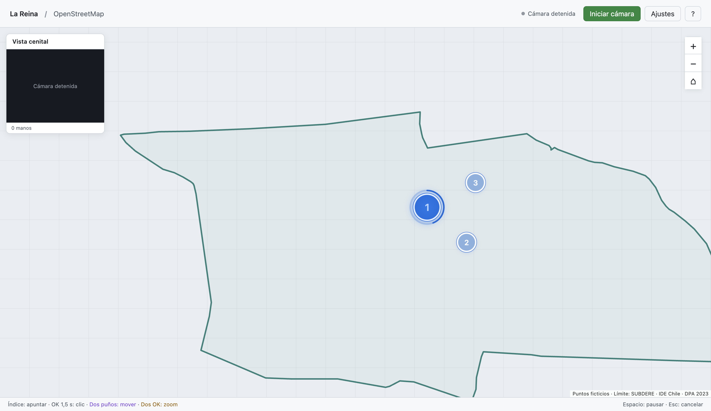

# Entrega técnica - Mapa Gestual MLR 0.1.6

**Fecha:** 6 de octubre de 2026 
**Estado:** 113 pruebas y paquetes Mac/Windows aprobados

[Volver al prototipo](../README.md)

## Interacción vigente

Una sola mano detectada selecciona al mantener **OK durante 1,5 segundos**. El aro y el clic comparten el objetivo anclado, sin salto al centro. Mantener cerrado no repite; abrir 120 ms rearma. Pérdida de tracking, discontinuidad, movimiento excesivo, otra mano, cambio/ocultación del objetivo, pausa o pérdida de foco cancelan la selección como antes.

**Dos puños completamente cerrados desplazan** el mapa mediante el movimiento del punto medio de los nudillos de ambas manos. **Dos OK controlan sólo zoom** por separación de las puntas de los índices, separando para acercar y juntando para alejar. El ancla de zoom es el punto medio de esos índices; la pinza pulgar/índice sólo valida el gesto y la deriva. Mover ambos OK juntos no desplaza el mapa. Las parejas mixtas o una sola mano no navegan. Abrir cualquiera de las manos termina el modo; cambiar entre puños y OK necesita 180 ms de adquisición nueva, sin arrastrar movimiento anterior.

Las sombras permanecen independientes y frescas. Violeta identifica pan con puños y ámbar zoom con OK, también al estar quietos dentro del modo adquirido. Azul representa apuntado/reposo y gris acciones bloqueadas. El mapeo completo, tres puntos en orden 1 → 2 → 3, contorno SUBDERE/IDE Chile DPA 2023 y controles condicionales de exposición se conservan.

En 0.1.4, una rotación del puño hacia la cámara acortaba los segmentos proyectados en XY, rechazando el gesto pese a conservar sus ángulos. El usuario confirmó que el skeleton de ambas manos seguía presente. **0.1.6 usa XYZ consistente para reconocer el puño**, con world landmarks ya estimados por Hand Landmarker; no aplica aspectRatio a esas coordenadas métricas. Cuando world está ausente utiliza XYZ normalizado con corrección de aspecto. Cursor, pan, separación para zoom y skeleton siguen en coordenadas de imagen. [Contrato oficial de MediaPipe](https://developers.google.com/edge/mediapipe/solutions/vision/hand_landmarker/web_js#handle_and_display_results).

Se requiere curvatura y retracción positiva de los cuatro dedos, puntas compactas y pulgar aducido. DIP flexionado o cierre macro fuerte descartan una garra con segmentos distales rectos; no se exige observar un DIP doblado ni doblar el pulgar de una manera fija. El plano de palma tolera más espesor si la retracción/compactación son fuertes. Mundo explícito inválido o contradictorio cancela acciones y conserva punteros. Una mano incompleta no activa pan. No se utiliza visibility como indicador de articulación observada. Los valores son hipótesis de ingeniería; world es estimación monocular, no profundidad medida ni certeza sobre dedos ocultos.

## Seguimiento de índice y nudillos

En 0.1.5, reposo/palma usaban el centro, OK usaba la pinza y el offset entre poses sólo se agotaba moviendo la palma. **0.1.6 usa la punta del índice (landmark8) para cada mano** en reposo, palma, apuntado y dos OK. Un puño confirmado cambia a la media de los nudillos MCP5/9/13/17, excluyendo la muñeca y los dedos ocultos. Es una referencia estimada estable; el detector no certifica su visibilidad individual. El fallback del renderer comparte esa elección; si la geometría no permite clasificar una pose usa el índice sólo como feedback, sin armar acciones.

Al cerrar o abrir puño, una transición smoothstep de **300 ms** parte del punto mostrado y converge a la referencia nueva incluso sin mover la palma. No queda un offset permanente. Se conservan filtro por mano, identidad y orientación/alcance completo. Dos OK no heredan un ancla cancelada de selección individual. Durante un clic individual activo, objetivo, aro y sombra siguen fijos durante 1500 ms; cancelar o soltar inicia una transición hacia el índice desde ese punto mostrado.

Pan y zoom usan estas mismas referencias, con filtros de navegación separados. Cambiar pose requiere 180 ms de adquisición nueva. Un cierre legítimo puede retraer mucho el índice sin reemplazar identidad; un salto incoherente del índice durante el mismo OK cancela, usando la misma histéresis de pinza al comparar candidatos y tracks.

## Cámara pequeña permanente

El panel **Vista cenital** permanece arriba a la izquierda, de 200 px de ancho (160 px en ventanas pequeñas), con vídeo, skeleton de manos y conteo. No existe casilla de preview ni botón para ocultarlo. Con cámara detenida muestra un estado claro y limpia landmarks; con vídeo activo siempre dibuja las detecciones frescas, también durante pausa. Una pérdida de datos frescos limpia el skeleton anterior.

Se mantienen Iniciar/Detener cámara y la elección de USB en Ajustes; no se solicita acceso automáticamente al abrir. La imagen del preview respeta la proporción real del vídeo. Inferencia/FPS, calidad, exportación de sesión y marcado de falso clic quedan en **Diagnóstico de seguimiento**, desplegable en Ajustes.

## Archivos entregados

Código de los binarios: `0c79d38b4aa65486553011495d9695acc6dec9b7`.

| Archivo | Plataforma | SHA-256 |
| --- | --- | --- |
| `MapaGestualMLR-0.1.6-mac-arm64.zip` | macOS Apple Silicon; contiene `Mapa Gestual MLR.app` | `b0f934fc455e40d6c35a9f9b01b3964ef0aa7c67e1f81c199023cbccd2f9ae5b` |
| `MapaGestualMLR-0.1.6-windows-x64.exe` | Windows x64; portable | `90d88aba417dba0ce6cd0d43b705e84a4d69cf2df3d5c3aee00bdc0c23f9681a` |

Los paquetes incluyen modelo full, loaders WASM y contorno. No requieren Node ni Python al usar el programa. Las teselas necesitan Internet. Esta distribución de desarrollo no tiene firma/notarización. El portable NSIS es un contenedor autoextraíble de 32 bits que transporta Electron x64; el programa objetivo sigue siendo x64.

## Evidencia de 0.1.6

- **113/113 pruebas:** 74 de gestos, 3 del helper histórico de calibración, 9 de selección, 4 de mapeo, 15 de calidad/cámara y 8 de secuencia/contorno. La calibración histórica no participa en el flujo actual.
- El motor comprueba 1499 ms sin clic y 1500 ms con un único clic, exclusión pan/zoom, poses mixtas y parciales, cambios de modo, quietud, geometría bajo rotación/aspecto y continuidad. Los filtros de navegación se vinculan a identidad; invertir el orden de manos inmóviles no genera zoom accidental.
- **Mac:** Vite, ZIP arm64 y [smoke del paquete](./verificacion-paquete-mac-0.1.6.json) aprobados. La `.app` 0.1.6 se abrió y se comprobó la ayuda nueva de seguimiento en índice/nudillos. La cámara arrancó. Los ajustes y el preview conservan los controles verificados anteriormente.
- **Windows aprobado:** [CI 37418725259](https://github.com/eeminionn/labTecnologiasEmergentes/actions/runs/37418725259), runtime, portable y [smoke de win-unpacked](./verificacion-paquete-windows-0.1.6.json). El arranque mediante envoltorio NSIS se valida por separado.
- El smoke carga modelo/WASM reales, frame vacío/positivo, calidad y bloqueo CSP. El PNG positivo oficial con alpha se compone sobre gris #777 sólo como estímulo fijo; no se transforma así la cámara real.
- `navigationFeedback` utiliza poses sintéticas y **GestureEngine real** antes del adaptador: pan funciona sin zoom, zoom funciona sin pan, traslación de dos OK no actúa, cambio requiere nueva adquisición y mezcla no navega. También verifica ambas sombras y descarte de eventos del modo incorrecto en el renderer.
- Los seis `fistViewsFeedback` verifican world21 del fixture positivo real y uso de la fuente world, más pan con vistas XYZ sintéticas cenital-dorso, frontal-nudillos y frontal-palma, y dos puños con distinta orientación. Cada mano conserva su origen world local: mover sólo sus coordenadas de imagen desplaza el mapa sin zoom.
- Los trece `indexTrackingFeedback` comprueban referencias sobre índices en apuntado/palma/reposo/OK y el fixture positivo real, nudillos en puño, transición sin salto al cerrar/abrir, convergencia con manos quietas y fallback índice/nudillos/índice ante geometría desconocida. Las expectativas se calculan directamente de landmark8 y media MCP, independientes del helper de producción.
- Los siete `previewFeedback` comprueban panel visible detenido/activo/pausado, tamaño/posición, dibujo de landmarks del fixture, limpieza del dibujo obsoleto y ausencia de casilla/botón de ocultación.
- Los ocho `qualityFeedback` y ocho `pointerFeedback` mantienen controles de cámara condicionales, bloqueo/recuperación, colores, ambas sombras y bordes.
- **Cuatro clics nativos isTrusted por plataforma**: puntos 1, 2, 3 y botón del primer popup. Cada mantenimiento dura al menos 1500 ms, con cursor/aro anclados, sin clic temprano ni repetido. El botón no avanza dos veces y el recorrido se completa. El programa queda reiniciado en punto 1 después del smoke.

Las imágenes y navegación del smoke usan geometría/landmarks de prueba sin teselas externas. Las tres vistas de puño son rotaciones XYZ sintéticas: comprueban el intérprete, no constituyen imágenes reales detectadas por el modelo. No representan un ensayo de gestos físicos. El preview se prueba con landmarks del fixture real del detector; sus estados activo/pausado se simulan sin abrir hardware. La inspección adicional del preview con una cámara física confirma vídeo y dibujo de landmarks; no es un ensayo de gestos con USB cenital. Una inferencia aislada no es un benchmark de latencia física.

## Antecedentes y validación pendiente

Los informes 0.1.0–0.1.5 conservan la evidencia anterior; [Mac 0.1.5](./verificacion-paquete-mac-0.1.5.json) y [Windows 0.1.5](./verificacion-paquete-windows-0.1.5.json) no certifican los cambios nuevos. Se mantienen Hand Landmarker full y sus pesos; sólo se modifica interpretación/UI.

Falta medir puños naturales desde cenital/frontal/dorso/palma, manos parciales, descanso, oclusión, cruces, luz y acciones accidentales con USB cenital real, además de comodidad y latencia física. También quedan driver/controles reales, Google con API key y POI reales, arranque del portable en Windows y accesibilidad antes del uso municipal. [Protocolo vigente](./03-protocolo-validacion.md) · [Investigación de cámara](./06-camara-y-contraste.md).
