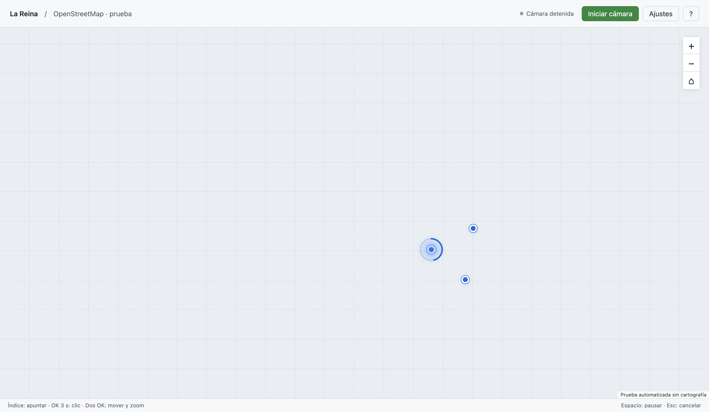

# Entrega técnica - Mapa Gestual MLR 0.1.2

**Fecha:** 5 de octubre de 2026 
**Estado:** distribuciones Mac y Windows verificadas; validación cenital pendiente

[Volver al prototipo](../README.md)

## Selección estable de 3 segundos

Una mano en OK selecciona automáticamente al mantenerse durante 3 segundos. El motor emite un clic en el primer resultado válido que alcanza ese umbral. El aro azul representa el progreso y se completa en verde al confirmar. Mantener o soltar OK después no repite la acción; abrir la pinza durante 120 ms rearma la selección.

La transición desde índice o palma a OK conserva la posición del cursor para evitar el salto observado al cerrar los dedos. Si se inicia directamente con OK, se utiliza su posición válida actual. Sobre un punto propio o botón visible, la selección fija su centro y mantiene esa misma coordenada para sombra, aro y clic. La asistencia resuelve objetivos cercanos con prioridad de controles y un área mínima de 44 × 44 píxeles CSS, sin cambiar la disposición visual.

Soltar antes de tiempo, mover la mano fuera de la tolerancia, perder tracking, recibir datos tardíos/discontinuos, detectar otra mano, perder foco, pausar o pulsar Esc cancela la carga. Si el objetivo desaparece, cambia de posición, se oculta o la ventana cambia de tamaño antes de confirmar, también se cancela. Las posturas intermedias breves mantienen continuidad del cursor.

El mapa se desplaza y amplía con **dos manos en OK**, tras 180 ms de confirmación. La sombra, el aro y el ripple aparecen sólo con una mano detectada. La palma abierta no desplaza. Los resultados tardíos se descartan y el watchdog de cámara se activa después del primer resultado fresco, evitando bloquear una selección inicial durante la carga del modelo.

Las decisiones de adquisición, estabilidad, hover y cancelación se adaptan de la [investigación oficial Meta Quest](./05-meta-quest-y-seleccion.md). Se conserva MediaPipe Hand Landmarker full: esta versión modifica el motor y la interacción, no los pesos del detector Quest o MediaPipe.

## Archivos entregados

Código de los binarios: `eb23ff4de28d6a1cea8fe12de576dce7737bec85`.

| Archivo | Plataforma | SHA-256 |
| --- | --- | --- |
| `MapaGestualMLR-0.1.2-mac-arm64.zip` | macOS Apple Silicon; contiene `Mapa Gestual MLR.app` | `d8970d822c745f39fd28563ea8ce76a66a1ddeea59bf68159a5f9f55f982c5d4` |
| `MapaGestualMLR-0.1.2-windows-x64.exe` | Windows x64; portable | `c6190951c663bbc412580df6fe5b05a4e3757c35c6626626634ad19725a12a0e` |

Los ejecutables incluyen el modelo full y los loaders WASM. No requieren Node ni Python en el equipo de uso. Los mapas utilizan Internet. Esta distribución de desarrollo no tiene certificados de firma/notarización.

El portable utiliza un contenedor autoextraíble NSIS de 32 bits que transporta Electron x64. La arquitectura del contenedor no cambia el objetivo x64 del programa.

## Evidencia de 0.1.2

- **49/49 pruebas:** 37 de gestos, 3 de calibración y 9 de selección. Cubren anclaje entre posturas, clic al completar 3 segundos, ausencia de clic temprano o repetido, cancelación/rearme, navegación con dos OK, pérdida/discontinuidad de tracking, objetivos ocultos o retirados, hitareas, geometría y cambios de viewport.
- **Mac:** build Vite, ZIP arm64 y [smoke del paquete](./verificacion-paquete-mac-0.1.2.json) aprobados en Apple M5/macOS 26.6.2. La `.app` final abrió correctamente; footer y ayuda muestran selección automática de 3 segundos.
- **Windows:** [CI 37267138909](https://github.com/eeminionn/labTecnologiasEmergentes/actions/runs/37267138909) aprobó 49 pruebas, build, smoke del runtime, portable y [smoke del contenido empaquetado](./verificacion-paquete-windows-0.1.2.json). Se ejecutó `release/win-unpacked/Mapa Gestual MLR.exe`; no se ejecutó el envoltorio NSIS directamente.
- Los smoke cargan modelo y WASM locales: frame vacío con cero manos, fixture oficial PNG con una mano y 21 puntos, bloqueo CSP de telemetría, zoom y selección.
- `pointerFeedback` verifica sombra con una mano, ocultación con dos o ninguna, dos detecciones con sólo una mano elegible y cancelación del ripple. `navigationFeedback` verifica pan, pan con zoom y sombra oculta en el adaptador mediante eventos de prueba.
- **Selección nativa:** landmarks sintéticos pasan por el motor real, renderer, IPC y eventos nativos Electron hasta un punto propio fuera del centro y su botón de popup. Ambos recorridos comprueban objetivo fijo, aro visible a mitad de tiempo, cero clics anteriores al umbral, un único clic mientras OK permanece cerrado y dos eventos `isTrusted` en total. Mac confirmó a los 3018,2 ms y 3018,6 ms; Windows, a los 3040,1 ms y 3021 ms. Los tiempos son de reloj real, no un temporizador de animación ni timestamps acelerados.

La captura muestra cartografía de prueba sin teselas externas. Los landmarks sintéticos verifican el recorrido gesto → input nativo → punto/popup propio, pero no miden precisión de detección en cámara física ni picking de POI Google. Las dos inferencias con imágenes de referencia son muestras aisladas, no un benchmark de latencia física.

## Evidencia histórica y validación pendiente

Se conservan la investigación y reportes de 0.1.0 y 0.1.1 como antecedentes. El [ensayo aislado de visión](./verificacion-vision-mac.json) comprobó bloqueo CSP del POST real del logger al cerrar el task, sin requests externas observadas; no se repitió como ensayo independiente en esta actualización.

Queda medir precisión, acciones accidentales, comodidad de mantener OK 3 segundos y latencia con la cámara USB cenital según el [protocolo](./03-protocolo-validacion.md). También falta probar Google Maps con API key autorizada, el arranque del envoltorio portable con cámara física en Windows y accesibilidad antes de una instalación municipal.
