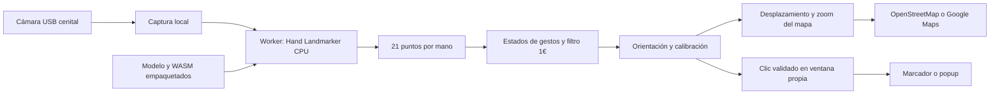

# Mapa Gestual MLR

Prototipo de escritorio para recorrer un mapa de La Reina con las manos, usando una cámara USB fija sobre una mesa. En esta etapa probamos la detección, la selección y el movimiento; la interfaz y la integración municipal se ajustarán después.

**Inicio:** 5 de octubre de 2026<br>
**Última actualización:** 5 de octubre de 2026<br>
**Equipo del proyecto:** Emilio Abarca · Emilia Armstrong · Victoria Aracena<br>
**Versión vigente:** 0.1.1<br>
**Estado:** 37 pruebas y paquetes Mac/Windows 0.1.1 aprobados; cámara cenital pendiente<br>
**Documentación:** preparada con asistencia técnica de Codex. No se atribuyen al equipo ensayos que todavía no se han realizado.

[Volver al README principal](../README.md) · [Revisar la bitácora](./Bitacora/README.md)

## Qué hace

- Detecta hasta dos manos con MediaPipe Hand Landmarker y procesa las imágenes en este equipo.
- Permite apuntar, abrir información, desplazar el mapa y acercar o alejar la vista.
- Muestra una sombra azul transparente y confirmación visual del clic cuando el detector reporta exactamente una mano. Con dos manos no muestra sombra ni animación de clic.
- Permite elegir cámara, reflejar o rotar la imagen, calibrar el área de la mesa y mostrar diagnóstico.
- Mantiene controles de mouse y teclado para configurar, pausar y recuperar la interacción.
- Usa OpenStreetMap sin clave para las primeras pruebas. Google Maps se puede configurar con una API key propia.

Los puntos de prueba son **datos ficticios**. No corresponden a reportes municipales ni conectan con sistemas de la Municipalidad de La Reina. OpenStreetMap y Google Maps son proveedores distintos; seleccionar uno no convierte los datos del otro en información municipal.

## Software propio

La aplicación tiene su propia ventana de escritorio, cámara, motor de gestos y controles. Electron incorpora un renderer Chromium para dibujar la interfaz y el mapa; el programa no controla Google Maps en Chrome ni automatiza un navegador externo.



La interfaz se sirve dentro de la aplicación desde `http://127.0.0.1:47831`. Los mapas requieren Internet. La inferencia se ejecuta con modelo y runtime locales. Una prueba aislada comprobó que CSP bloquea el intento de telemetría del worker al cerrar el task; esto no significa que la aplicación completa, que carga mapas, esté desconectada.

## Abrir el programa empaquetado

La versión 0.1.1 construyó el ZIP y la `.app` Mac y aprobó el smoke del paquete final, incluida la protección de continuidad de landmarks. La aplicación abrió correctamente y se verificaron visualmente la ayuda y el pie de la interfaz. Windows CI construyó el `.exe` portable y aprobó el smoke del contenido empaquetado. Los resultados 0.1.0 se conservan como antecedentes históricos.

**macOS Apple Silicon:** descomprimir el ZIP para obtener `Mapa Gestual MLR.app` y abrirla. Elegir la cámara USB y conceder el acceso a cámara cuando macOS lo solicite. Esta versión de desarrollo no tiene firma ni notarización. Si Gatekeeper bloquea su apertura, usar el menú contextual de la aplicación → **Abrir** y seguir la indicación de macOS; no desactivar la protección global del equipo.

**Windows x64:** abrir el `.exe` portable de la entrega 0.1.1. No necesita instalar Node ni abrir una terminal. El `.exe` es para Windows; en Mac se utiliza la `.app`. La CI probó el contenido desde `release/win-unpacked/Mapa Gestual MLR.exe`; queda pendiente comprobar el arranque mediante el envoltorio portable y una cámara USB física en Windows.

La carpeta de artefactos se genera en `release/`. Registrar el nombre, hash y plataforma de cada entrega junto con los resultados de verificación. Construir un archivo no demuestra por sí solo que la detección funcione con la cámara de la instalación.

## Gestos

| Acción | Cómo se realiza |
|:---|:---|
| Apuntar | Extender solamente el índice y mover la mano sobre el área calibrada. |
| Clic | Formar OK con pulgar e índice y otros dedos extendidos. Mantener hasta completar la confirmación azul y soltar. El clic ocurre al soltar. |
| Mover y hacer zoom | Formar OK con ambas manos y mantener durante `180 ms`. Moverlas juntas en la misma dirección desplaza el mapa; separarlas acerca y juntarlas aleja. Soltar cualquiera termina la navegación. |

**Pausa:** pulsar Espacio. La pérdida de foco detiene la interacción. Esc cancela la acción en curso.

La versión 0.1.1 elimina el desplazamiento con una palma abierta: el usuario observó movimientos accidentales durante el uso. Una mano abierta o en reposo no navega. El desplazamiento y el zoom requieren dos OK; el movimiento de su punto medio controla el desplazamiento y el cambio de separación controla el zoom.

Un OK de una mano sostenido produce como máximo un clic y no repite mientras permanece cerrado. Se requiere apertura o postura neutral previa para armar la selección. Si se pierde una mano o aparece la segunda, se cancela la selección pendiente; la navegación con dos OK tiene prioridad sobre los clics individuales.

La sombra azul sólo se permite con exactamente una mano reportada por el detector, antes de descartar posturas por geometría. Si el detector reporta dos, se ocultan tanto el halo como cualquier ripple de clic, aunque sólo una postura sea válida para el motor.

Los tiempos y umbrales son decisiones iniciales del prototipo. No representan una tasa de falsos positivos demostrada. La cámara reconoce proximidad proyectada entre los dedos, no contacto físico verificable.

## Preparar la mesa

1. Fijar la cámara USB sobre la zona de trabajo, con iluminación difusa y fondo mate.
2. Abrir Ajustes y elegir la cámara. Revisar la orientación y el reflejo con el diagnóstico.
3. Calibrar las cuatro esquinas en el orden indicado: superior izquierda, superior derecha, inferior derecha e inferior izquierda. Mantener el índice en cada esquina y pulsar Espacio.
4. Comprobar el puntero en las cuatro esquinas y el centro antes de probar clics.
5. Probar los marcadores ficticios y pausar antes de cambiar cámara, orientación o montaje.

La calibración usa una homografía para llevar un área de la mesa al mapa. Es una transformación de un plano; variar mucho la altura de la mano introduce error. Volver a calibrar si se mueve la cámara o cambia la instalación. Mantener los brazos cómodos y permitir descansos.

## Google Maps

No se incluye una API key de Google. Sin una clave configurada, las pruebas usan OpenStreetMap.

Para habilitar el proveedor Google, crear una key propia con **Maps JavaScript API** habilitada y facturación configurada. Restringirla a esa API y al referrer `http://127.0.0.1:47831/*`. Guardarla en Ajustes y verificar que el mapa carga correctamente. Las políticas, restricciones y precios del proveedor deben revisarse antes del uso municipal. [Configuración oficial de Google](https://developers.google.com/maps/documentation/javascript/get-api-key).

La key se guarda en `localStorage` de esta aplicación. Es una credencial cliente visible y recuperable del equipo o renderer; no se convierte en un secreto por estar dentro de una `.app` o `.exe`. No guardarla en Git ni compartir capturas donde aparezca. [Guía de seguridad de Google](https://developers.google.com/maps/api-security-best-practices).

La atribución del mapa permanece visible. OpenStreetMap requiere atribución y uso moderado de sus tiles; su servicio comunitario no garantiza disponibilidad ni permite descargar regiones para funcionamiento offline. [Política de tiles OSM](https://operations.osmfoundation.org/policies/tiles/).

## Abrir en local

Desde esta carpeta, con Node y npm disponibles:

```bash
npm ci
npm start
```

`npm start` prepara los assets, construye la interfaz y abre la ventana Electron. El modelo y el WASM se incluyen en el build. Las descargas necesarias para preparar los assets requieren conexión; la distribución empaquetada no necesita instalar estas herramientas.

## Revisar antes de entregar

```bash
npm test
npm run build
npm run test:app
```

La versión **0.1.1** aprobó **37/37 casos automatizados: 34 del motor de gestos y 3 de calibración**, además del build Vite y el ZIP Mac arm64. La cobertura incluye la eliminación de pan con palma, navegación con dos OK, cancelación sin clic residual, saltos anómalos de landmarks de la pinza y separación filtrada cercana a cero.

`test:app` y el smoke de la `.app` empaquetada aprobaron carga WASM, una mano con 21 puntos en el fixture positivo, cero manos en frame vacío, CSP y controles de zoom, popup y selección. Los cinco checks de `pointerFeedback` (`oneHand`, `twoHands`, `twoDetectedOneEligible`, `noHands`, `clearedRipple`) devolvieron `true`. Los tres de `navigationFeedback` (`panWorks`, `combinedZoomWorks`, `hiddenDuringNavigation`) también aprobaron: comprueban desplazamiento, zoom combinado y ocultación del feedback durante navegación. El [reporte Mac 0.1.1](./Documentos/verificacion-paquete-mac-0.1.1.json) conserva el resultado `ok:true`.

La [CI Windows 0.1.1](https://github.com/eeminionn/labTecnologiasEmergentes/actions/runs/37264864301), commit `451509904cb8406eba84de961d5c4b9f69a46fb4`, aprobó **37/37 pruebas**, build, smoke de runtime, construcción del `.exe` portable y smoke del contenido empaquetado. Este último arrancó `release/win-unpacked/Mapa Gestual MLR.exe`; el [reporte Windows 0.1.1](./Documentos/verificacion-paquete-windows-0.1.1.json) conserva los resultados. No se probó el arranque mediante el envoltorio portable ni una cámara Windows física. Estas comprobaciones automatizadas no miden una tasa de falsos clics ni latencia de cámara cenital.

### Evidencia histórica: versión 0.1.0

La versión 0.1.0 aprobó **26/26 casos automatizados: 23 del motor de gestos y 3 de calibración**. El smoke de Electron `44.5.1` en Apple M5 con macOS `26.6.2` confirmó cero manos en un frame vacío, una mano con 21 puntos en un PNG oficial y funcionamiento de zoom, popup y botón de selección. Confirmó también una violación CSP al intentar la conexión de telemetría desde el worker. Una comprobación aislada del cierre real del task registró el POST bloqueado por `connect-src` en modo `enforce`, sin solicitudes externas del worker observadas en ese ensayo.

El build ZIP de Mac arm64 terminó correctamente. La `.app` final abrió correctamente y su smoke empaquetado devolvió `ok:true`, con carga del WASM, frame vacío, fixture positivo y controles de UI aprobados. El [reporte del paquete Mac](./Documentos/verificacion-paquete-mac.json) conserva esos resultados.

En Windows CI aprobaron build, **26/26 tests**, smoke de runtime y smoke de la aplicación empaquetada. La [ejecución 37263075039](https://github.com/eeminionn/labTecnologiasEmergentes/actions/runs/37263075039) corresponde al commit `d2a4e1948611012c24356dde2d2acbec927224f8`. El smoke del paquete ejecutó `release/win-unpacked/Mapa Gestual MLR.exe`; el `.exe` portable se generó, pero su envoltorio no fue ejecutado en esa comprobación.

Estas son comprobaciones de integración; no miden precisión cenital, latencia con cámara USB ni detección de dos manos reales. Los fixtures son imágenes de prueba y no corresponden al montaje municipal.

Los reportes anteriores pertenecen a **0.1.0**. No certifican el nuevo motor ni los paquetes 0.1.1.

Estas pruebas no sustituyen el ensayo con cámara USB cenital. Google Maps todavía no está probado con una key del usuario. Consultar el [protocolo de validación](./Documentos/03-protocolo-validacion.md) para medir falsos clics, estabilidad y latencia en condiciones reales.

## Generar las distribuciones

```bash
npm run dist:mac
npm run dist:win
```

`dist:mac` genera el ZIP de la `.app` arm64. `dist:win` genera el `.exe` portable x64. La ruta recomendada para Windows es el flujo de CI en Windows; un intento de compilación cruzada depende de las herramientas del host y no constituye una prueba de ejecución.

## Material del prototipo

| Documento | Qué muestra |
|:---|:---|
| [Bitácora](./Bitacora/README.md) | Punto de partida, alcance, decisiones y verificación pendiente. |
| [Investigación de visión](./Documentos/01-investigacion-vision.md) | Comparación de modelos, elección inicial y ruta de mejora. |
| [Gestos y UX](./Documentos/02-gestos-y-ux.md) | Referentes de interacción, diseño y requisitos de mapas. |
| [Protocolo de validación](./Documentos/03-protocolo-validacion.md) | Configuración implementada, métricas y criterios para un piloto. |
| [Entrega y verificación](./Documentos/04-entrega-y-verificacion.md) | Archivos, hashes, resultados disponibles y límites de las pruebas. |

## Configuración técnica inicial

MediaPipe Tasks Vision `1.0.1`, Hand Landmarker full, modo video, hasta dos manos y delegate CPU en worker local. Umbrales iniciales de detección, presencia y tracking: `0,70`.

El motor usa histéresis del pinch `0,28/0,40`, confirmación de OK de una mano de `220 ms`, rearme de `120 ms`, cooldown de `400 ms` y entrada a navegación con dos OK de `180 ms`. Filtro 1€ para reducir temblor. El cambio 0.1.1 conserva el modelo, runtime y umbrales de detección. La configuración completa y la definición de cada medida están en el protocolo; los ejemplos históricos de la investigación no sustituyen estos defaults.

El diagnóstico muestra tiempos de inferencia y captura→resultado del worker. **No incluye toda la demora física de cámara USB ni de presentación de pantalla.** Exportar la sesión permite conservar un resumen agregado de hasta 10.000 muestras recientes. El botón **Marcar falso clic** suma una anotación manual; no detecta errores ni calcula una tasa de falsos positivos automáticamente. Para medir esa tasa se requiere tiempo negativo e intención anotados.

---

Documentación técnica del prototipo, preparada con asistencia de Codex, 2026.

[Volver al README principal](../README.md)
