# Bitácora - Mapa Gestual MLR

**Inicio:** 5 de octubre de 2026 
**Última actualización:** 10 de octubre de 2026 
**Equipo:** Emilio Abarca · Emilia Armstrong · Victoria Aracena

[Volver al README principal](../README.md) · [Revisar Etapa 2](../Etapa-2/Bitacora/README.md)

## PROTOTIPO MESA INTERACTIVA

En la etapa anterior planteamos reunir información municipal en un mismo mapa. Ahora nos concentramos en cómo recorrerlo con las manos frente a una cámara frontal que apunta hacia la persona. Elegimos MediaPipe para obtener los puntos de las manos y dedicar este avance a probar la interacción.

<table>
  <tr>
    <td align="center">
      
    </td>
  </tr>
  <tr>
    <td><strong>Figura 1.</strong> Mapa del prototipo, contorno comunal y tres puntos ficticios. <strong>Fuente:</strong> captura de la aplicación; base OpenStreetMap y límite SUBDERE DPA 2023.</td>
  </tr>
</table>

## Demostración

<table>
  <tr>
    <td align="center">
      
    </td>
  </tr>
  <tr>
    <td><strong>Video demostrativo.</strong> <a href="https://youtu.be/mBsh8tRpk8A">Test software visualización de datos MLR</a>. Hacer clic en la imagen para ver el funcionamiento en YouTube.</td>
  </tr>
</table>

## Lo que fuimos cambiando

La palma abierta a veces movía el mapa sin querer. Por eso cambiamos el desplazamiento a un puño cerrado y permitimos hacerlo con una sola mano. Mantuvimos dos OK para el zoom: separar las manos acerca el mapa y juntarlas lo aleja.

El OK fallaba para seleccionar en algunos ángulos. Probamos señalar con el índice, pero exigir los demás dedos retraídos también bloqueaba la selección. Finalmente dejamos que baste con mantener la punta del índice sobre el punto durante **1,5 segundos**, sin importar los otros dedos. Acortamos la espera para que sea más ágil y dejamos un margen amplio para el pulso. El aro muestra cuánto falta y una segunda mano puede acompañar la selección; dos OK cambian al zoom.

<table>
  <tr>
    <td align="center">
      
    </td>
  </tr>
  <tr>
    <td><strong>Figura 2.</strong> Aro de carga y sombras durante la selección. <strong>Fuente:</strong> captura de una prueba automatizada del prototipo, con posiciones de manos simuladas.</td>
  </tr>
</table>

Dejamos una sombra por mano y colores distintos para desplazamiento y zoom, para entender el modo sin agregar iconos. La cámara pequeña permite revisar el seguimiento, y todo su encuadre corresponde al mapa para alcanzar los bordes. Los tres puntos se activan en orden para guiar la prueba; el contorno de La Reina ayuda a ubicarla en la comuna.

<table>
  <tr>
    <td align="center">
      
    </td>
  </tr>
  <tr>
    <td><strong>Figura 3.</strong> Información del primer punto y avance al segundo. <strong>Fuente:</strong> captura de la aplicación, abierta con clic para registrar la interfaz.</td>
  </tr>
</table>

## Propuesta espacial de la sala

Ordenar la información municipal fue nuestro punto de partida, pero también nos preguntamos cómo se presenta durante las reuniones. Propusimos transformar la sala del Concejo Municipal en un espacio compartido para relacionar los datos con los lugares, las personas y las consecuencias de cada decisión. Este avance recoge la propuesta espacial de nuestra presentación.

### Reconfiguración y referentes de mesa

Buscamos organizar los puestos alrededor de un centro común. La mesa curva del programa *¡Hay que decirlo!* nos sirvió como referente para pensar en el contacto visual, el diálogo y una superficie compartida. Frente a la distribución en U que describe la presentación, nuestra intención es acercar a los participantes y dar menos protagonismo a la cabecera.

<table>
  <tr>
    <td align="center"></td>
    <td align="center"><a href="./Imagenes/propuesta-espacial/referente-mesa-02.png">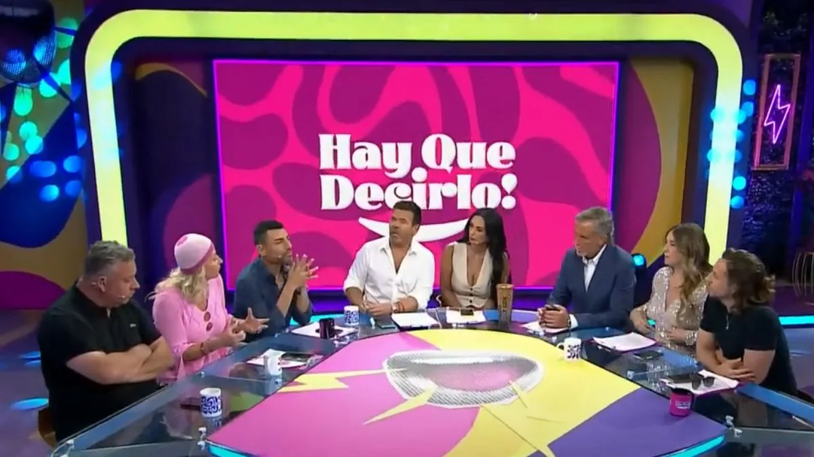</a></td>
  </tr>
  <tr>
    <td>Mesa curva que orienta los puestos hacia un centro común.</td>
    <td>Vista de la cercanía entre los participantes y la superficie compartida.</td>
  </tr>
  <tr>
    <td colspan="2"><strong>Figura 4.</strong> Referente de distribución de la mesa. <strong>Fuente:</strong> imágenes de <em>¡Hay que decirlo!</em> incluidas en la presentación del equipo, diapositiva 10.</td>
  </tr>
</table>

El croquis y la vista conceptual exploran esa idea de reunión. Son pasos de la búsqueda: la mesa circular de estas imágenes y la geometría de los planos posteriores muestran distintas formas de resolver el espacio.

<table>
  <tr>
    <td align="center"></td>
  </tr>
  <tr>
    <td><strong>Figura 5.</strong> Croquis para explorar el contacto visual, la conversación y el trabajo alrededor de una mesa. <strong>Fuente:</strong> presentación del equipo, diapositiva 11.</td>
  </tr>
</table>

<table>
  <tr>
    <td align="center"><a href="./Imagenes/propuesta-espacial/concepto-mesa-territorial.png">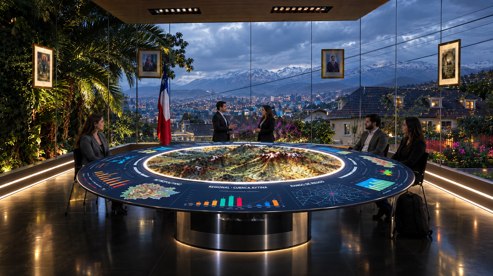</a></td>
  </tr>
  <tr>
    <td><strong>Figura 6.</strong> Vista conceptual de una mesa que reúne el mapa y la información territorial en una superficie común. <strong>Fuente:</strong> presentación del equipo, diapositiva 12.</td>
  </tr>
</table>

### Información clara para la reunión

La mesa de información interactiva conecta esta propuesta con el mapa gestual que mostramos más arriba. También buscamos una gráfica fácil de leer, con lenguaje claro, colores e íconos que ayuden a comprender los temas municipales. Estas imágenes son referentes de visualización, no resultados de datos de La Reina.

<table>
  <tr>
    <td align="center"></td>
    <td align="center"></td>
  </tr>
  <tr>
    <td>Diagrama radial que agrupa categorías y las distingue por color.</td>
    <td>Diagrama de niveles concéntricos para mostrar relaciones y jerarquías.</td>
  </tr>
  <tr>
    <td colspan="2" align="center"></td>
  </tr>
  <tr>
    <td colspan="2">Mapa con zonas circulares superpuestas para vincular la información con el territorio.</td>
  </tr>
  <tr>
    <td colspan="2"><strong>Figura 7.</strong> Referentes para la visualización de información. <strong>Fuente:</strong> imágenes incluidas en la presentación del equipo, diapositiva 17.</td>
  </tr>
</table>

### Dos experiencias coordinadas

Planteamos dos experiencias que pueden funcionar por separado y comunicarse durante una misma sesión. El núcleo central presenta una síntesis de mapas, presupuestos e indicadores; las paredes forman un entorno inmersivo y reactivo que aporta el contexto territorial, social y temporal. Para el centro, la presentación propone una pirámide escalonada y un esquema de respaldo con un iPad, un computador, dos proyectores e iluminación LED.

<table>
  <tr>
    <td align="center"><a href="./Imagenes/propuesta-espacial/esquema-nucleo-central.png">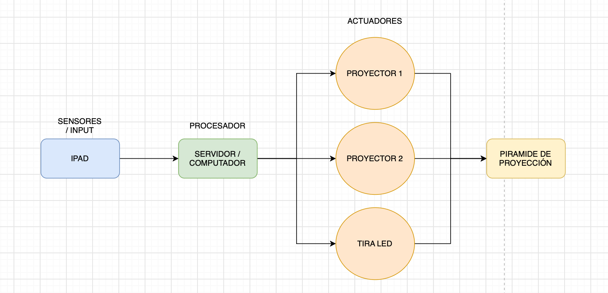</a></td>
  </tr>
  <tr>
    <td><strong>Figura 8.</strong> Sistema de respaldo propuesto para el núcleo central: entrada desde el iPad y salida mediante proyectores e iluminación. <strong>Fuente:</strong> presentación del equipo, diapositiva 18.</td>
  </tr>
</table>

Para las paredes, el esquema incorpora una cámara conectada al computador, proyectores e iluminación LED. La idea es acompañar lo que se discute en el centro con información del territorio alrededor de la sala. Estos esquemas describen el montaje propuesto; todavía tenemos que probar su integración con el software.

<table>
  <tr>
    <td align="center"><a href="./Imagenes/propuesta-espacial/esquema-paredes.png">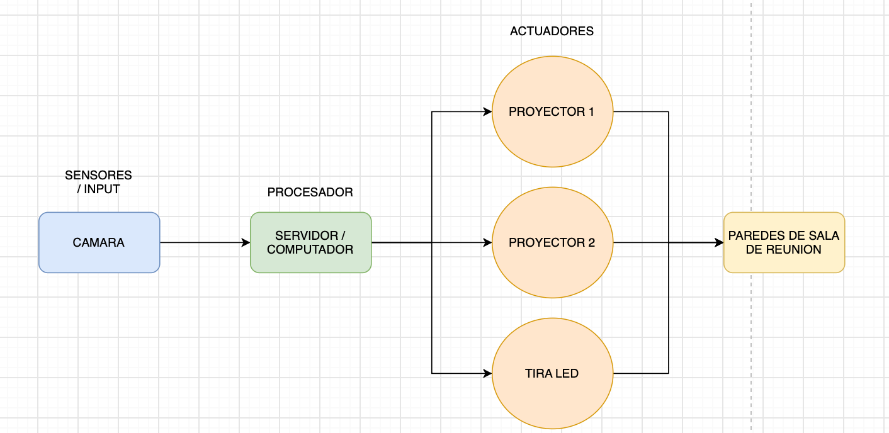</a></td>
  </tr>
  <tr>
    <td><strong>Figura 9.</strong> Sistema de respaldo propuesto para las paredes, con cámara, computador, proyectores e iluminación. <strong>Fuente:</strong> presentación del equipo, diapositiva 19.</td>
  </tr>
</table>

### Ambiente, planta y cortes

Para el ambiente reinterpretamos la estética cyberpunk con superficies metálicas, iluminación fucsia y azul y geometrías en el cielo. La mesa central y los paneles del perímetro organizan la información compartida. La planta y los cortes nos permiten revisar la distribución, los puestos y el recorrido antes de construir el montaje.

<table>
  <tr>
    <td align="center"><a href="./Imagenes/propuesta-espacial/referente-ambiente.png">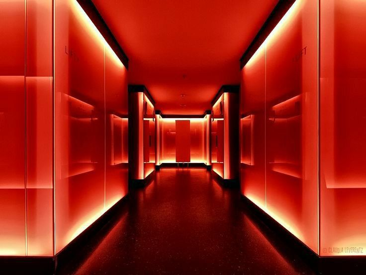</a></td>
  </tr>
  <tr>
    <td><strong>Figura 10.</strong> Referente de ambiente para explorar materiales, iluminación de color y una atmósfera tecnológica. <strong>Fuente:</strong> imagen incluida en la presentación del equipo, diapositiva 33.</td>
  </tr>
</table>

<table>
  <tr>
    <td align="center"><a href="./Imagenes/propuesta-espacial/planta-sala.png">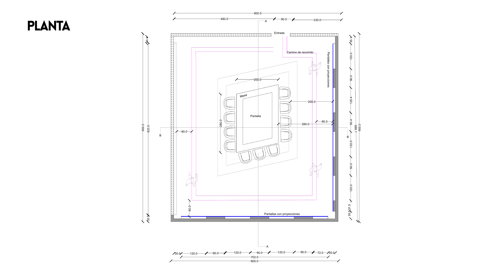</a></td>
  </tr>
  <tr>
    <td><strong>Figura 11.</strong> Planta de la sala: distribución de la mesa, los puestos, el acceso y el recorrido. Abrir la imagen para revisar las cotas. <strong>Fuente:</strong> presentación del equipo, diapositiva 34.</td>
  </tr>
</table>

<table>
  <tr>
    <td align="center"></td>
  </tr>
  <tr>
    <td><strong>Figura 12.</strong> Corte AA para revisar la relación entre la mesa, las personas y los elementos superiores de la sala. <strong>Fuente:</strong> presentación del equipo, diapositiva 35.</td>
  </tr>
</table>

<table>
  <tr>
    <td align="center"></td>
  </tr>
  <tr>
    <td><strong>Figura 13.</strong> Corte BB para revisar la relación entre los puestos y los paneles del perímetro. <strong>Fuente:</strong> presentación del equipo, diapositiva 36.</td>
  </tr>
</table>

### Vistas de la propuesta

Los renders muestran cómo se relacionan la mesa, los asientos, los paneles, el cielo y la iluminación. Nos sirven para conversar sobre el ambiente y la distribución; representan la propuesta de sala, que aún no está construida.

<table>
  <tr>
    <td align="center"></td>
  </tr>
  <tr>
    <td><strong>Figura 14.</strong> Vista general de la sala propuesta, con mesa central, paneles y elementos del cielo. <strong>Fuente:</strong> presentación del equipo, diapositiva 37.</td>
  </tr>
</table>

<table>
  <tr>
    <td align="center"></td>
    <td align="center"><a href="./Imagenes/propuesta-espacial/render-mesa-frontal.png">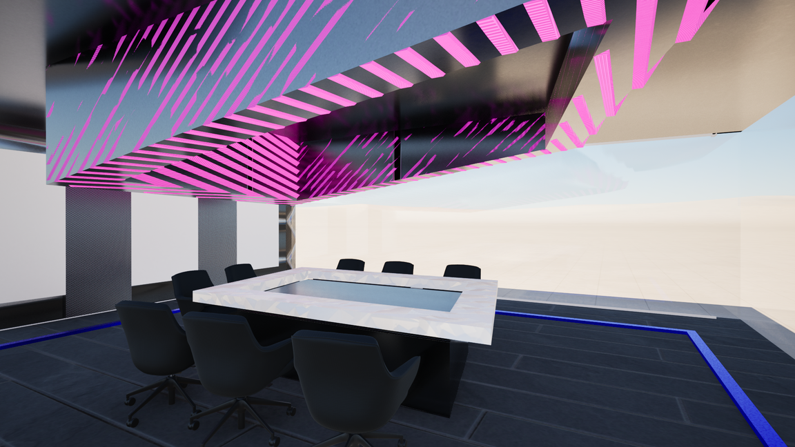</a></td>
  </tr>
  <tr>
    <td>Vista desde los asientos hacia las geometrías del cielo.</td>
    <td>Relación entre la mesa central y la iluminación azul del piso.</td>
  </tr>
  <tr>
    <td align="center"><a href="./Imagenes/propuesta-espacial/render-mesa-lateral.png">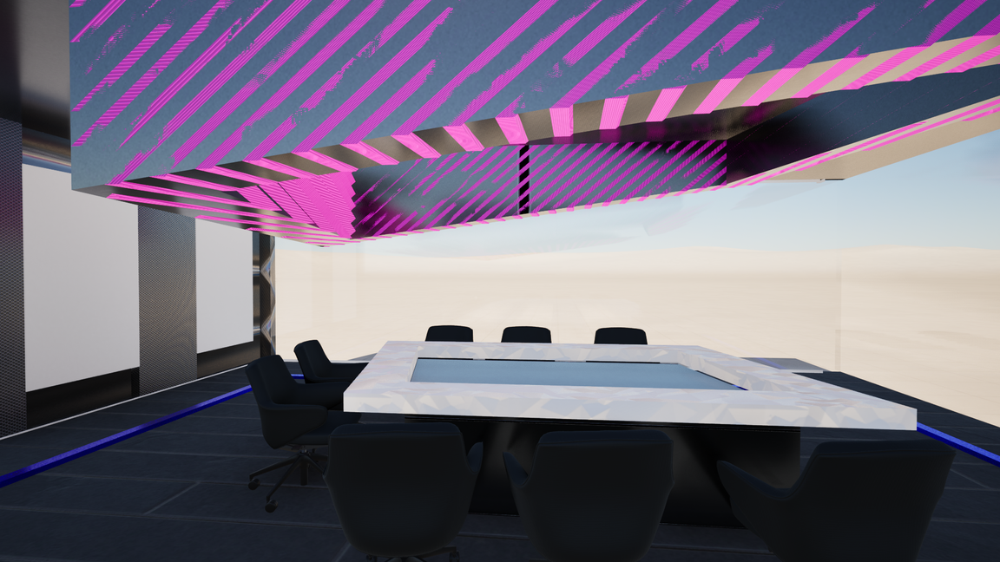</a></td>
    <td align="center"><a href="./Imagenes/propuesta-espacial/render-mesa-oblicua.png">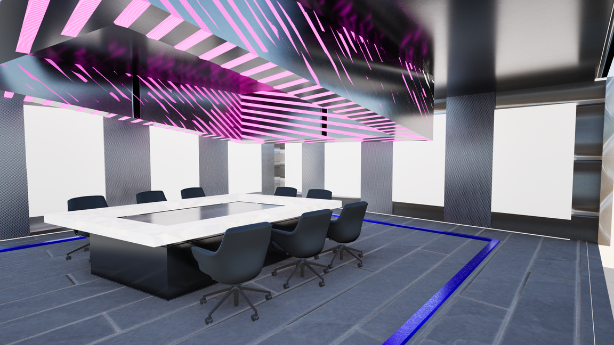</a></td>
  </tr>
  <tr>
    <td>Superficie de la mesa y su relación con los elementos superiores.</td>
    <td>Vista amplia del centro de la sala y del recorrido alrededor.</td>
  </tr>
  <tr>
    <td colspan="2"><strong>Figura 15.</strong> Vistas del cielo y de la mesa desde distintos ángulos. <strong>Fuente:</strong> presentación del equipo, diapositiva 38.</td>
  </tr>
</table>

<table>
  <tr>
    <td align="center"><a href="./Imagenes/propuesta-espacial/render-paneles-01.png">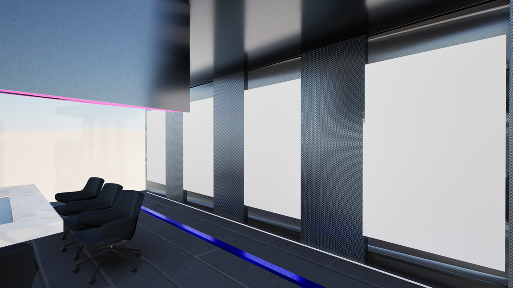</a></td>
    <td align="center"><a href="./Imagenes/propuesta-espacial/render-paneles-02.png">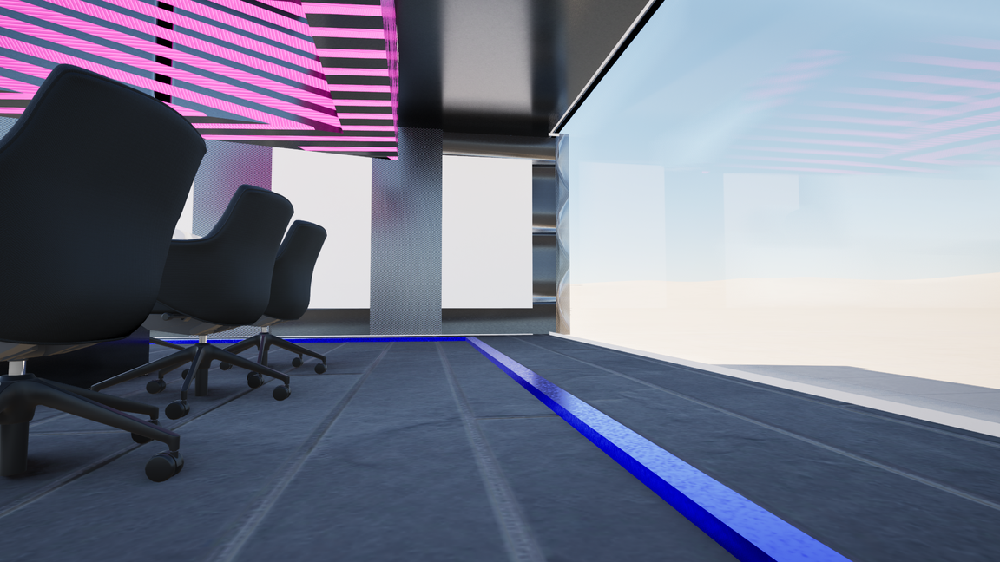</a></td>
  </tr>
  <tr>
    <td>Paneles laterales y su relación con los elementos del perímetro.</td>
    <td>Vista junto a los asientos, las pantallas y el recorrido iluminado.</td>
  </tr>
  <tr>
    <td align="center"></td>
    <td align="center"></td>
  </tr>
  <tr>
    <td>Recorrido entre los puestos y las superficies de información.</td>
    <td>Vista desde una esquina para revisar la sala en conjunto.</td>
  </tr>
  <tr>
    <td colspan="2"><strong>Figura 16.</strong> Vistas de los paneles, los asientos y la circulación. <strong>Fuente:</strong> presentación del equipo, diapositiva 39.</td>
  </tr>
</table>

## Arquitectura por módulos

Ordenamos el recorrido de la imagen en nueve módulos, con la misma numeración del diagrama completo. Esto nos ayudó a separar la detección de las manos de las reglas que deciden qué hacer en el mapa.

| Módulo | Qué hace |
|:---|:---|
| **1. Inicio y mapa** | Abre la aplicación y carga el mapa y las preferencias. |
| **2. Cámara frontal** | Pide permiso y captura una imagen por vez. |
| **3. Detección de manos** | MediaPipe estima los 21 puntos de cada mano en el equipo. |
| **4. Validación** | Revisa calidad, datos recientes y pausa antes de permitir acciones. |
| **5. Interpretación** | Sigue cada mano y aplica nuestras reglas de gestos. |
| **6. Selección** | Mantener el índice sobre un objetivo durante 1,5 segundos confirma el clic. |
| **7. Navegación** | Uno o dos puños desplazan; dos OK hacen zoom. |
| **8. Salida al mapa** | Ejecuta las acciones y muestra sombras, colores, aro e información. |
| **9. Ajustes y cierre** | Configura la cámara, registra métricas y limpia el seguimiento al detenerse. |

El módulo 5 decide entre selección y navegación: dos OK tienen prioridad de zoom. Los ajustes y controles de seguridad se aplican durante toda la sesión.

<table>
  <tr>
    <td align="center">
      
    </td>
  </tr>
  <tr>
    <td><strong>Figura 17.</strong> Flujo general de los módulos. La <a href="./Documentos/09-arquitectura-del-sistema.md">arquitectura del sistema</a> reúne el resumen y el detalle completo. <strong>Fuente:</strong> diagrama propio en draw.io, basado en el código del prototipo.</td>
  </tr>
</table>

## Cómo seguimos

Después de estos ajustes, el usuario confirmó que el control funciona bien. Ahora queremos evaluar el montaje frontal, medir errores y comodidad e incorporar información municipal real. En paralelo, tenemos que probar la distribución de la sala y cómo se conectan la mesa, las paredes y las proyecciones.

[Referentes de gestos y UX](./Documentos/02-gestos-y-ux.md) · [Arquitectura del sistema](./Documentos/09-arquitectura-del-sistema.md)

## Vista de la arquitectura completa

<table>
  <tr>
    <td align="center">
      
    </td>
  </tr>
  <tr>
    <td><strong>Figura 18.</strong> Arquitectura completa del sistema. <a href="./Documentos/arquitectura-sistema-0.1.13.jpg">Abrir en grande</a> para leer cada módulo. <strong>Fuente:</strong> diagrama propio en draw.io, basado en el prototipo 0.1.13.</td>
  </tr>
</table>
