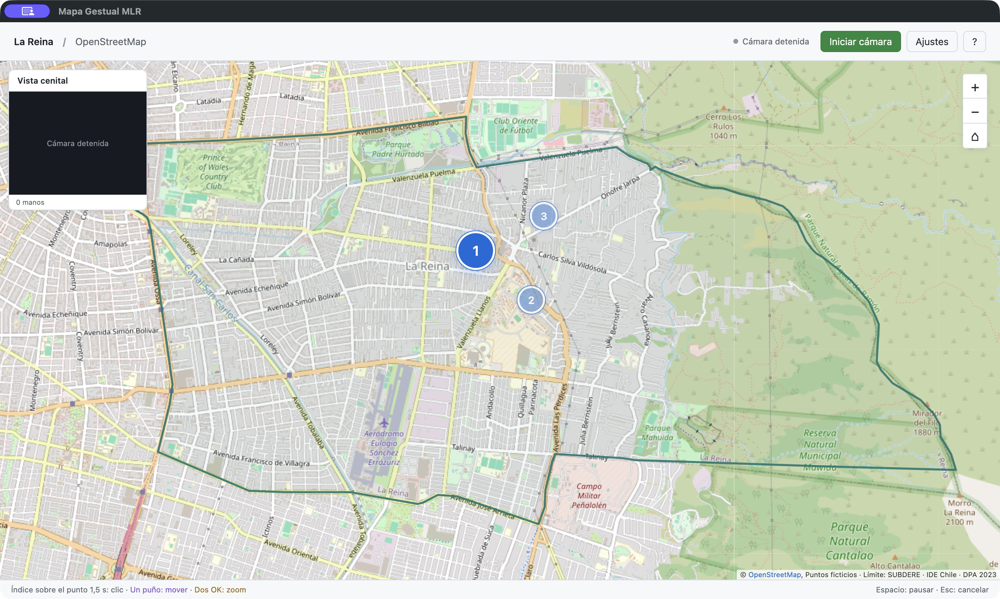
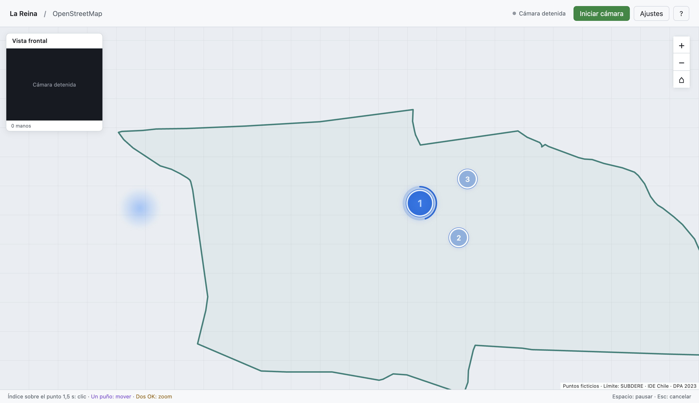
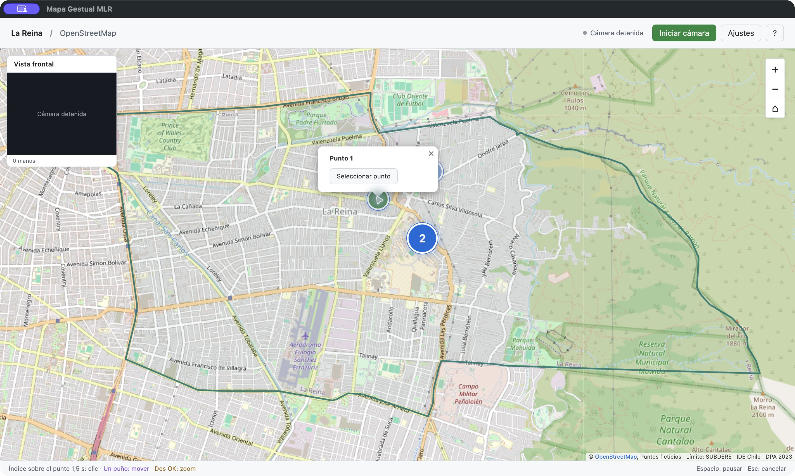
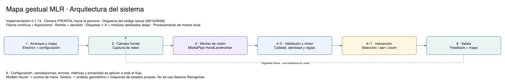
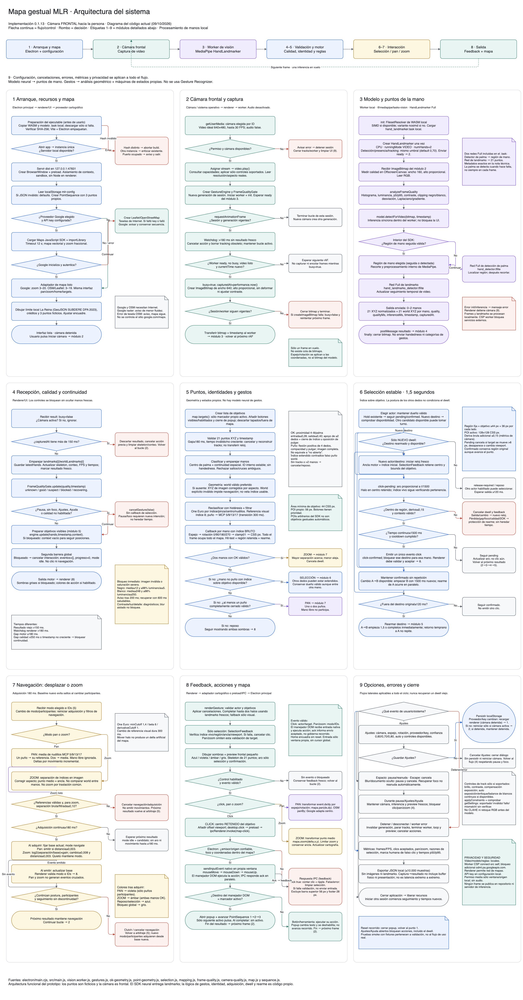

# Bitácora - Mapa Gestual MLR

**Inicio:** 5 de octubre de 2026 
**Última actualización:** 10 de octubre de 2026 
**Equipo:** Emilio Abarca · Emilia Armstrong · Victoria Aracena

[Volver al README principal](../README.md) · [Revisar Etapa 2](../Etapa-2/Bitacora/README.md)

## PROTOTIPO MESA INTERACTIVA

En la etapa anterior planteamos reunir información municipal en un mismo mapa. Ahora nos concentramos en cómo recorrerlo con las manos frente a una cámara frontal que apunta hacia la persona. Elegimos MediaPipe para obtener los puntos de las manos y dedicar este avance a probar la interacción.

<table>
  <tr>
    <td align="center">
      
    </td>
  </tr>
  <tr>
    <td><strong>Figura 1.</strong> Mapa del prototipo, contorno comunal y tres puntos ficticios. <strong>Fuente:</strong> captura de la aplicación; base OpenStreetMap y límite SUBDERE DPA 2023.</td>
  </tr>
</table>

## Demostración

<table>
  <tr>
    <td align="center">
      
    </td>
  </tr>
  <tr>
    <td><strong>Video demostrativo.</strong> <a href="https://youtu.be/mBsh8tRpk8A">Test software visualización de datos MLR</a>. Hacer clic en la imagen para ver el funcionamiento en YouTube.</td>
  </tr>
</table>

## Lo que fuimos cambiando

La palma abierta a veces movía el mapa sin querer. Por eso cambiamos el desplazamiento a un puño cerrado y permitimos hacerlo con una sola mano. Mantuvimos dos OK para el zoom: separar las manos acerca el mapa y juntarlas lo aleja.

El OK fallaba para seleccionar en algunos ángulos. Probamos señalar con el índice, pero exigir los demás dedos retraídos también bloqueaba la selección. Finalmente dejamos que baste con mantener la punta del índice sobre el punto durante **1,5 segundos**, sin importar los otros dedos. Acortamos la espera para que sea más ágil y dejamos un margen amplio para el pulso. El aro muestra cuánto falta y una segunda mano puede acompañar la selección; dos OK cambian al zoom.

<table>
  <tr>
    <td align="center">
      
    </td>
  </tr>
  <tr>
    <td><strong>Figura 2.</strong> Aro de carga y sombras durante la selección. <strong>Fuente:</strong> captura de una prueba automatizada del prototipo, con posiciones de manos simuladas.</td>
  </tr>
</table>

Dejamos una sombra por mano y colores distintos para desplazamiento y zoom, para entender el modo sin agregar iconos. La cámara pequeña permite revisar el seguimiento, y todo su encuadre corresponde al mapa para alcanzar los bordes. Los tres puntos se activan en orden para guiar la prueba; el contorno de La Reina ayuda a ubicarla en la comuna.

<table>
  <tr>
    <td align="center">
      
    </td>
  </tr>
  <tr>
    <td><strong>Figura 3.</strong> Información del primer punto y avance al segundo. <strong>Fuente:</strong> captura de la aplicación, abierta con clic para registrar la interfaz.</td>
  </tr>
</table>

## Arquitectura por módulos

Ordenamos el recorrido de la imagen en nueve módulos, con la misma numeración del diagrama completo. Esto nos ayudó a separar la detección de las manos de las reglas que deciden qué hacer en el mapa.

| Módulo | Qué hace |
|:---|:---|
| **1. Inicio y mapa** | Abre la aplicación y carga el mapa y las preferencias. |
| **2. Cámara frontal** | Pide permiso y captura una imagen por vez. |
| **3. Detección de manos** | MediaPipe estima los 21 puntos de cada mano en el equipo. |
| **4. Validación** | Revisa calidad, datos recientes y pausa antes de permitir acciones. |
| **5. Interpretación** | Sigue cada mano y aplica nuestras reglas de gestos. |
| **6. Selección** | Mantener el índice sobre un objetivo durante 1,5 segundos confirma el clic. |
| **7. Navegación** | Uno o dos puños desplazan; dos OK hacen zoom. |
| **8. Salida al mapa** | Ejecuta las acciones y muestra sombras, colores, aro e información. |
| **9. Ajustes y cierre** | Configura la cámara, registra métricas y limpia el seguimiento al detenerse. |

El módulo 5 decide entre selección y navegación: dos OK tienen prioridad de zoom. Los ajustes y controles de seguridad se aplican durante toda la sesión.

<table>
  <tr>
    <td align="center">
      
    </td>
  </tr>
  <tr>
    <td><strong>Figura 4.</strong> Flujo general de los módulos. La <a href="./Documentos/09-arquitectura-del-sistema.md">arquitectura del sistema</a> reúne el resumen y el detalle completo. <strong>Fuente:</strong> diagrama propio en draw.io, basado en el código del prototipo.</td>
  </tr>
</table>

## Cómo seguimos

Después de estos ajustes, el usuario confirmó que el control funciona bien. Ahora queremos evaluar el montaje frontal, medir errores y comodidad e incorporar información municipal real.

[Referentes de gestos y UX](./Documentos/02-gestos-y-ux.md) · [Arquitectura del sistema](./Documentos/09-arquitectura-del-sistema.md)

## Vista de la arquitectura completa

<table>
  <tr>
    <td align="center">
      
    </td>
  </tr>
  <tr>
    <td><strong>Figura 5.</strong> Arquitectura completa del sistema. <a href="./Documentos/arquitectura-sistema-0.1.13.jpg">Abrir en grande</a> para leer cada módulo. <strong>Fuente:</strong> diagrama propio en draw.io, basado en el prototipo 0.1.13.</td>
  </tr>
</table>
