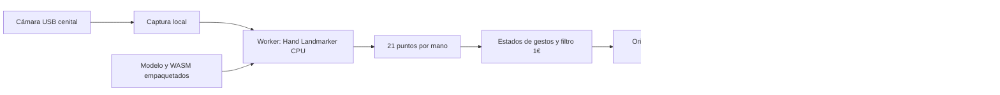

# Mapa Gestual MLR

Prototipo de escritorio para recorrer un mapa de La Reina con las manos, usando una cámara USB fija sobre una mesa. En esta etapa probamos la detección, la selección y el movimiento; la interfaz y la integración municipal se ajustarán después.

**Inicio:** 5 de octubre de 2026<br>
**Última actualización:** 6 de octubre de 2026<br>
**Equipo del proyecto:** Emilio Abarca · Emilia Armstrong · Victoria Aracena<br>
**Versión vigente:** 0.1.3<br>
**Estado:** 86/86 pruebas y paquetes Mac/Windows 0.1.3 aprobados; cámara física, driver real, Google con key y envoltorio portable pendientes<br>
**Documentación:** preparada con asistencia técnica de Codex. No se atribuyen al equipo ensayos que todavía no se han realizado.

[Volver al README principal](../README.md) · [Revisar la bitácora](./Bitacora/README.md)

## Qué hace

- Detecta hasta dos manos con MediaPipe Hand Landmarker y procesa las imágenes en este equipo.
- Permite apuntar, abrir información, desplazar el mapa y acercar o alejar la vista.
- Muestra una sombra por cada mano detectada con datos frescos: azul al apuntar o reposar, violeta al navegar y ámbar cuando domina el zoom. Durante pausa o bloqueo aparecen grises.
- Mantiene el aro de selección de una mano: se completa en 3 segundos sobre un objetivo anclado y confirma en verde. Dos manos cancelan el clic individual y conservan sus dos sombras.
- Lleva todo el encuadre de cámara a todo el mapa; permite elegir cámara, reflejar o rotar la imagen y mostrar diagnóstico.
- Ofrece brillo, contraste y compensación de exposición sólo si la cámara declara esas capacidades; solicita modos automáticos continuos cuando están disponibles.
- Incluye un recorrido de tres puntos ficticios numerados y el límite oficial de La Reina procedente de SUBDERE, DPA 2023.
- Mantiene controles de mouse y teclado para configurar, pausar y recuperar la interacción.
- Usa OpenStreetMap sin clave para las primeras pruebas. Google Maps se puede configurar con una API key propia.

Los puntos de prueba son **datos ficticios**. No corresponden a reportes municipales ni conectan con sistemas de la Municipalidad de La Reina. OpenStreetMap y Google Maps son proveedores distintos; seleccionar uno no convierte los datos del otro en información municipal.

## Software propio

La aplicación tiene su propia ventana de escritorio, cámara, motor de gestos y controles. Electron incorpora un renderer Chromium para dibujar la interfaz y el mapa; el programa no controla Google Maps en Chrome ni automatiza un navegador externo.



La interfaz se sirve dentro de la aplicación desde `http://127.0.0.1:47831`. Los mapas requieren Internet. La inferencia se ejecuta con modelo y runtime locales. Una prueba aislada comprobó que CSP bloquea el intento de telemetría del worker al cerrar el task; esto no significa que la aplicación completa, que carga mapas, esté desconectada.

## Abrir el programa empaquetado

La `.app` Mac **0.1.3** aprobó el smoke del paquete y su apertura real, Ajustes y ayuda se revisaron en la aplicación. Windows **0.1.3** aprobó pruebas, build, runtime, construcción del portable y smoke del contenido empaquetado. La [guía de entrega](./Documentos/04-entrega-y-verificacion.md) identifica archivos, hashes y resultados por plataforma.

**macOS Apple Silicon:** descomprimir el ZIP para obtener `Mapa Gestual MLR.app` y abrirla. Elegir la cámara USB y conceder el acceso a cámara cuando macOS lo solicite. Esta versión de desarrollo no tiene firma ni notarización. Si Gatekeeper bloquea su apertura, usar el menú contextual de la aplicación → **Abrir** y seguir la indicación de macOS; no desactivar la protección global del equipo.

**Windows x64:** abrir el `.exe` portable de la versión indicada en la entrega. No necesita instalar Node ni abrir una terminal. El `.exe` es para Windows; en Mac se utiliza la `.app`. La [CI 0.1.3](https://github.com/eeminionn/labTecnologiasEmergentes/actions/runs/37414071782) aprobó el smoke del contenido ejecutando `release/win-unpacked/Mapa Gestual MLR.exe`. El arranque mediante el envoltorio portable y la cámara USB/driver físicos siguen pendientes.

La carpeta de artefactos se genera en `release/`. Registrar el nombre, hash y plataforma de cada entrega junto con los resultados de verificación. Construir un archivo no demuestra por sí solo que la detección funcione con la cámara de la instalación.

## Gestos

| Acción | Cómo se realiza |
|:---|:---|
| Apuntar | Extender solamente el índice y mover la mano dentro del encuadre de cámara. La sombra también permanece visible en reposo y con palma abierta. |
| Clic | Formar OK con pulgar e índice y otros dedos extendidos sobre el objetivo y mantenerlo durante **3 segundos**. El clic ocurre automáticamente al completar el aro; no hay que soltar para confirmar. También se puede apuntar con el índice antes de cerrar OK. |
| Mover y hacer zoom | Formar OK con ambas manos y mantener durante `180 ms`. Moverlas juntas en la misma dirección desplaza el mapa; separarlas acerca y juntarlas aleja. Soltar cualquiera termina la navegación. |

**Pausa:** pulsar Espacio. La pérdida de foco detiene la interacción. Esc cancela la acción en curso.

La versión 0.1.1 elimina el desplazamiento con una palma abierta: el usuario observó movimientos accidentales durante el uso. Una mano abierta o en reposo no navega. El desplazamiento y el zoom requieren dos OK; el movimiento de su punto medio controla el desplazamiento y el cambio de separación controla el zoom.

El objetivo se conserva entre la postura de apuntado y OK para que el cursor no vuelva al centro al cerrar los dedos. **Se puede comenzar directamente con OK**: se ancla la posición válida actual, sin exigir una postura previa de apuntado. El hover indica un solo candidato visible. El destino y el aro permanecen fijos durante los 3 segundos; fuera del mantenimiento, la corrección breve de postura se consume al mover la mano para recuperar la posición absoluta y alcanzar los bordes.

El aro azul avanza de `0` a `1` durante los 3 segundos y confirma en verde al ejecutar el clic. Un OK sostenido produce **un solo clic hasta volver a abrir durante `120 ms`**; mantenerlo cerrado o soltar después no repite. Abrir antes del umbral cancela. Si se pierde una mano o aparece la segunda, se cancela la selección pendiente; la navegación con dos OK tiene prioridad sobre los clics individuales.

Cada mano conserva su sombra independiente, incluida la palma abierta y la navegación con dos OK. Azul indica apuntado/reposo; violeta tenue indica navegación adquirida y violeta desplazamiento; ámbar indica zoom dominante. Una histéresis evita cambiar de color por jitter. Gris indica que las acciones están bloqueadas. El aro y ripple de clic individual requieren exactamente una mano reportada por el detector, antes de descartar posturas por geometría.

Los tres puntos muestran números **1, 2 y 3**. Su dibujo nominal mide `40 px` y el siguiente punto activo, `56 px`, con un pulso suave. El área exterior fija de `56 × 56 px` mantiene el objetivo estable durante OK. Un clic nativo sobre el activo avanza una sola vez: **1→2→3**. Tras el tercero no queda ningún pulso; **Reiniciar recorrido**, en Ajustes, vuelve al punto 1. El botón del popup no vuelve a avanzar la secuencia e Inicio conserva el progreso. La [fuente del límite y el recorrido](./Documentos/07-limite-la-reina.md) documenta la geometría oficial y separa esos datos de los marcadores ficticios.

Los 3 segundos son una preferencia del usuario. El [referente Meta Quest](./Documentos/05-meta-quest-y-seleccion.md) orienta estabilización, hover y cancelación; no establece ese tiempo ni los tamaños de marcador como valores Meta. Los tiempos y umbrales no representan una tasa de falsos positivos demostrada. La cámara reconoce proximidad proyectada entre los dedos, no contacto físico verificable.

## Preparar la mesa

1. Fijar la cámara USB sobre la zona de trabajo, con iluminación difusa y fondo mate.
2. Abrir Ajustes y elegir la cámara. Revisar la orientación y el reflejo con el diagnóstico.
3. Usar todo el encuadre como zona de interacción: comprobar las cuatro esquinas, los bordes y el centro antes de probar clics.
4. Revisar los controles que ofrece la cámara. Ajustar luz y enfoque reales; probar brillo, contraste o compensación de exposición sólo si están disponibles y comprobar el resultado.
5. Probar los marcadores ficticios y pausar antes de cambiar cámara, orientación o montaje.

La versión 0.1.3 transforma coordenadas normalizadas mediante orientación y límites `0..1`: **todo el frame corresponde a todo el mapa**. No usa homografía ni conserva esquinas guardadas de versiones anteriores. Tras mover la cámara o cambiar resolución/orientación, repetir la comprobación del encuadre. Mantener los brazos cómodos y permitir descansos.

Una imagen casi totalmente negra o blanca impide acciones inmediatamente. Tras volver a una imagen no severa se exigen `600 ms` continuos de recuperación. Las sombras frescas siguen visibles en gris durante el bloqueo; no se completa un clic pendiente ni se reutiliza su tiempo. Este control de calidad no garantiza landmarks correctos ni pocos falsos positivos. La [investigación de cámara y contraste](./Documentos/06-camara-y-contraste.md) describe umbrales, controles y pruebas pendientes.

## Google Maps

No se incluye una API key de Google. Sin una clave configurada, las pruebas usan OpenStreetMap.

Para habilitar el proveedor Google, crear una key propia con **Maps JavaScript API** habilitada y facturación configurada. Restringirla a esa API y al referrer `http://127.0.0.1:47831/*`. Guardarla en Ajustes y verificar que el mapa carga correctamente. Las políticas, restricciones y precios del proveedor deben revisarse antes del uso municipal. [Configuración oficial de Google](https://developers.google.com/maps/documentation/javascript/get-api-key).

La key se guarda en `localStorage` de esta aplicación. Es una credencial cliente visible y recuperable del equipo o renderer; no se convierte en un secreto por estar dentro de una `.app` o `.exe`. No guardarla en Git ni compartir capturas donde aparezca. [Guía de seguridad de Google](https://developers.google.com/maps/api-security-best-practices).

La atribución del mapa permanece visible. OpenStreetMap requiere atribución y uso moderado de sus tiles; su servicio comunitario no garantiza disponibilidad ni permite descargar regiones para funcionamiento offline. [Política de tiles OSM](https://operations.osmfoundation.org/policies/tiles/).

## Abrir en local

Desde esta carpeta, con Node y npm disponibles:

```bash
npm ci
npm start
```

`npm start` prepara los assets, construye la interfaz y abre la ventana Electron. El modelo y el WASM se incluyen en el build. Las descargas necesarias para preparar los assets requieren conexión; la distribución empaquetada no necesita instalar estas herramientas.

## Revisar antes de entregar

```bash
npm test
npm run build
npm run test:app
```

La suite compartida de **0.1.3 aprobó 86/86 casos automatizados**. Incluye clic automático y anclaje de 3 segundos, punteros de ambas manos, navegación y colores con histéresis, alcance de bordes, mapeo completo, calidad de imagen, controles de cámara y recorrido.

El smoke de desarrollo aprobó **cuatro clics nativos** (`trustedClicks=4`): punto 1, botón de su popup, punto 2 y punto 3. Cada mantenimiento completó al menos 3 segundos, sin clic temprano ni repetición, con objetivo y aro anclados. El recorrido finalizó en orden; el botón no duplicó el avance. También aprobaron dos sombras independientes, colores pan/zoom, alcance de bordes y punteros grises sin acciones durante bloqueo de imagen.

El código verificado es `f5716f0b134ef15d97f2a727990122b3dbf18e54`. El [reporte Mac 0.1.3](./Documentos/verificacion-paquete-mac-0.1.3.json) registra el smoke del paquete aprobado, con cuatro clics nativos y todos los checks de puntero, navegación y calidad correctos. Los ocho checks de calidad incluyen controles ocultos sin capacidades y visibles/habilitados cuando se anuncia una capacidad válida dentro de Ajustes. La apertura real, Ajustes y ayuda de la `.app` también se revisaron; no equivale a probar una USB física.

La [CI Windows 0.1.3](https://github.com/eeminionn/labTecnologiasEmergentes/actions/runs/37414071782) terminó correctamente para el mismo commit: `npm ci`, 86 pruebas, build, runtime, portable y smoke del contenido empaquetado aprobados. El [reporte Windows 0.1.3](./Documentos/verificacion-paquete-windows-0.1.3.json) conserva el resultado de `win-unpacked`; no verifica el arranque del envoltorio portable. Ambas plataformas tienen paquetes verificados; la cámara física, el soporte real del driver y Google Maps con key propia siguen pendientes.

El PNG positivo tiene transparencia y se compone sobre gris `#777` **únicamente en el smoke**, antes de enviarlo al worker de producción. Las cámaras y la entrada real no reciben ese preprocesamiento. Estas comprobaciones usan fixtures/gestos sintéticos y un fondo de mapa de prueba: no validan precisión cenital física, disponibilidad de cartografía ni el SDK Google Maps con key real.

### Evidencia histórica: versión 0.1.2

La versión **0.1.2 aprobó 49/49 casos automatizados: 37 de gestos, 3 de calibración y 9 de selección**. Incluyen clic automático a los 3 segundos, no repetición, objetivo anclado, selección de candidatos, navegación con dos OK y cancelación segura.

El smoke de desarrollo y el de la `.app` Mac empaquetada aprobaron el ciclo completo sobre un punto azul y el botón de su popup: **dos eventos nativos** (`trustedClicks=2`), objetivo fijo, aro intermedio visible, ningún clic temprano y ninguna repetición. Los mantenimientos registrados fueron `3018,2 ms` y `3018,6 ms` con reloj real. Son pruebas con entradas sintéticas en el modo OpenStreetMap de prueba, no mediciones de cámara USB o latencia física. El [reporte Mac 0.1.2](./Documentos/verificacion-paquete-mac-0.1.2.json) conserva la evidencia.

El código verificado corresponde a `eb23ff4de28d6a1cea8fe12de576dce7737bec85`. La [CI Windows 0.1.2](https://github.com/eeminionn/labTecnologiasEmergentes/actions/runs/37267138909) aprobó **49 pruebas, build, runtime, construcción del portable y smoke del contenido empaquetado**. Registró dos clics nativos, objetivo fijo, aro intermedio y ausencia de clic temprano/repetición; los mantenimientos fueron `3040,1 ms` y `3021 ms`. El [reporte Windows 0.1.2](./Documentos/verificacion-paquete-windows-0.1.2.json) conserva la evidencia. El envoltorio portable, cámara física y Google con key siguen pendientes. La [captura de selección](./Documentos/seleccion-3s-0.1.2.png) muestra el feedback de esta versión.

### Evidencia histórica: versión 0.1.1

La versión **0.1.1** aprobó **37/37 casos automatizados: 34 del motor de gestos y 3 de calibración**, además del build Vite y el ZIP Mac arm64. La cobertura incluye la eliminación de pan con palma, navegación con dos OK, cancelación sin clic residual, saltos anómalos de landmarks de la pinza y separación filtrada cercana a cero.

`test:app` y el smoke de la `.app` empaquetada aprobaron carga WASM, una mano con 21 puntos en el fixture positivo, cero manos en frame vacío, CSP y controles de zoom, popup y selección. Los cinco checks de `pointerFeedback` (`oneHand`, `twoHands`, `twoDetectedOneEligible`, `noHands`, `clearedRipple`) devolvieron `true`. Los tres de `navigationFeedback` (`panWorks`, `combinedZoomWorks`, `hiddenDuringNavigation`) también aprobaron: comprueban desplazamiento, zoom combinado y ocultación del feedback durante navegación. El [reporte Mac 0.1.1](./Documentos/verificacion-paquete-mac-0.1.1.json) conserva el resultado `ok:true`.

La [CI Windows 0.1.1](https://github.com/eeminionn/labTecnologiasEmergentes/actions/runs/37264864301), commit `451509904cb8406eba84de961d5c4b9f69a46fb4`, aprobó **37/37 pruebas**, build, smoke de runtime, construcción del `.exe` portable y smoke del contenido empaquetado. Este último arrancó `release/win-unpacked/Mapa Gestual MLR.exe`; el [reporte Windows 0.1.1](./Documentos/verificacion-paquete-windows-0.1.1.json) conserva los resultados. No se probó el arranque mediante el envoltorio portable ni una cámara Windows física. Estas comprobaciones automatizadas no miden una tasa de falsos clics ni latencia de cámara cenital.

### Evidencia histórica: versión 0.1.0

La versión 0.1.0 aprobó **26/26 casos automatizados: 23 del motor de gestos y 3 de calibración**. El smoke de Electron `44.5.1` en Apple M5 con macOS `26.6.2` confirmó cero manos en un frame vacío, una mano con 21 puntos en un PNG oficial y funcionamiento de zoom, popup y botón de selección. Confirmó también una violación CSP al intentar la conexión de telemetría desde el worker. Una comprobación aislada del cierre real del task registró el POST bloqueado por `connect-src` en modo `enforce`, sin solicitudes externas del worker observadas en ese ensayo.

El build ZIP de Mac arm64 terminó correctamente. La `.app` final abrió correctamente y su smoke empaquetado devolvió `ok:true`, con carga del WASM, frame vacío, fixture positivo y controles de UI aprobados. El [reporte del paquete Mac](./Documentos/verificacion-paquete-mac.json) conserva esos resultados.

En Windows CI aprobaron build, **26/26 tests**, smoke de runtime y smoke de la aplicación empaquetada. La [ejecución 37263075039](https://github.com/eeminionn/labTecnologiasEmergentes/actions/runs/37263075039) corresponde al commit `d2a4e1948611012c24356dde2d2acbec927224f8`. El smoke del paquete ejecutó `release/win-unpacked/Mapa Gestual MLR.exe`; el `.exe` portable se generó, pero su envoltorio no fue ejecutado en esa comprobación.

Estas son comprobaciones de integración; no miden precisión cenital, latencia con cámara USB ni detección de dos manos reales. Los fixtures son imágenes de prueba y no corresponden al montaje municipal.

Los reportes anteriores identifican sus respectivas versiones. Ninguna comprobación histórica de 0.1.0, 0.1.1 o 0.1.2 certifica las nuevas funciones ni los paquetes 0.1.3.

Estas pruebas no sustituyen el ensayo con cámara USB cenital. Google Maps todavía no está probado con una key del usuario. Consultar el [protocolo de validación](./Documentos/03-protocolo-validacion.md) para medir falsos clics, estabilidad y latencia en condiciones reales.

## Generar las distribuciones

```bash
npm run dist:mac
npm run dist:win
```

`dist:mac` genera el ZIP de la `.app` arm64. `dist:win` genera el `.exe` portable x64. La ruta recomendada para Windows es el flujo de CI en Windows; un intento de compilación cruzada depende de las herramientas del host y no constituye una prueba de ejecución.

## Material del prototipo

| Documento | Qué muestra |
|:---|:---|
| [Bitácora](./Bitacora/README.md) | Punto de partida, alcance, decisiones y verificación pendiente. |
| [Investigación de visión](./Documentos/01-investigacion-vision.md) | Comparación de modelos, elección inicial y ruta de mejora. |
| [Gestos y UX](./Documentos/02-gestos-y-ux.md) | Referentes de interacción, diseño y requisitos de mapas. |
| [Protocolo de validación](./Documentos/03-protocolo-validacion.md) | Configuración implementada, métricas y criterios para un piloto. |
| [Entrega y verificación](./Documentos/04-entrega-y-verificacion.md) | Archivos, hashes, resultados disponibles y límites de las pruebas. |
| [Meta Quest y selección](./Documentos/05-meta-quest-y-seleccion.md) | Referentes oficiales para estabilización, hover y clic mantenido de 3 segundos. |
| [Cámara y contraste](./Documentos/06-camara-y-contraste.md) | Calidad de imagen, recuperación y controles disponibles según la cámara. |
| [Límite de La Reina y recorrido](./Documentos/07-limite-la-reina.md) | Geometría SUBDERE DPA 2023 y secuencia de los tres puntos ficticios. |

## Configuración técnica inicial

MediaPipe Tasks Vision `1.0.1`, Hand Landmarker full, modo video, hasta dos manos y delegate CPU en worker local. Umbrales iniciales de detección, presencia y tracking: `0,70`.

El motor usa histéresis del pinch `0,28/0,40`, confirmación de OK de una mano de `3000 ms`, rearme por apertura de `120 ms`, cooldown de `400 ms` y entrada a navegación con dos OK de `180 ms`. Filtro 1€ para reducir temblor. La versión 0.1.3 conserva el modelo, runtime y umbrales de detección; añade feedback de ambos punteros y control de calidad independiente de la confianza del task. La configuración completa y la definición de cada medida están en el protocolo; los ejemplos históricos de la investigación no sustituyen estos defaults.

El diagnóstico muestra tiempos de inferencia y captura→resultado del worker. **No incluye toda la demora física de cámara USB ni de presentación de pantalla.** Exportar la sesión permite conservar un resumen agregado de hasta 10.000 muestras recientes. El botón **Marcar falso clic** suma una anotación manual; no detecta errores ni calcula una tasa de falsos positivos automáticamente. Para medir esa tasa se requiere tiempo negativo e intención anotados.

---

Documentación técnica del prototipo, preparada con asistencia de Codex, 2026.

[Volver al README principal](../README.md)
