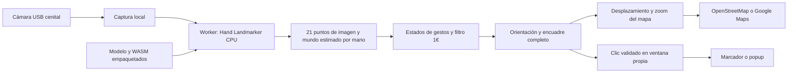

# Mapa Gestual MLR

Prototipo de escritorio para recorrer un mapa de La Reina con las manos, usando una cámara USB fija sobre una mesa. En esta etapa probamos la detección, la selección y el movimiento; la interfaz y la integración municipal se ajustarán después.

**Inicio:** 5 de octubre de 2026<br>
**Última actualización:** 9 de octubre de 2026<br>
**Equipo del proyecto:** Emilio Abarca · Emilia Armstrong · Victoria Aracena<br>
**Versión vigente:** 0.1.10<br>
**Estado:** 177/177 pruebas, build, runtime y paquetes Mac/Windows finales aprobados. Ensayo USB, métricas físicas, Google con key y envoltorio portable pendientes<br>
**Documentación:** preparada con asistencia técnica de Codex. No se atribuyen al equipo ensayos que todavía no se han realizado.

[Volver al README principal](../README.md) · [Revisar la bitácora](./Bitacora/README.md)

## Qué hace

- Detecta hasta dos manos con MediaPipe Hand Landmarker y procesa las imágenes en este equipo.
- Permite apuntar, abrir información, desplazar el mapa y acercar o alejar la vista.
- Muestra una sombra por cada mano detectada con datos frescos: azul al apuntar o reposar, violeta con uno o dos puños para desplazar y ámbar con dos OK para zoom. Durante pausa o bloqueo aparecen grises.
- Un OK válido selecciona tras 1,5 segundos con objetivo y aro anclados, incluso con otra mano presente. Dos OK válidos tienen prioridad para zoom; cada mano conserva su sombra fresca.
- Lleva todo el encuadre de cámara a todo el mapa; permite elegir cámara, reflejar o rotar la imagen.
- Mantiene una Vista cenital pequeña siempre visible arriba a la izquierda, con video, skeleton fresco y conteo de manos cuando la cámara está activa. Detenida, muestra Cámara detenida y limpia los datos anteriores; no pide permisos ni activa la cámara al arrancar.
- Reúne métricas, exportación y Marcar falso clic en Diagnóstico de seguimiento, una sección desplegable de Ajustes.
- Ofrece brillo, contraste y compensación de exposición sólo si la cámara declara esas capacidades; solicita modos automáticos continuos cuando están disponibles.
- Incluye un recorrido de tres puntos ficticios numerados y el límite oficial de La Reina procedente de SUBDERE, DPA 2023.
- Mantiene controles de mouse y teclado para configurar, pausar y recuperar la interacción.
- Usa OpenStreetMap sin clave para las primeras pruebas. Google Maps se puede configurar con una API key propia.

Los puntos de prueba son **datos ficticios**. No corresponden a reportes municipales ni conectan con sistemas de la Municipalidad de La Reina. OpenStreetMap y Google Maps son proveedores distintos; seleccionar uno no convierte los datos del otro en información municipal.

## Software propio

La aplicación tiene su propia ventana de escritorio, cámara, motor de gestos y controles. Electron incorpora un renderer Chromium para dibujar la interfaz y el mapa; el programa no controla Google Maps en Chrome ni automatiza un navegador externo.



La interfaz se sirve dentro de la aplicación desde `http://127.0.0.1:47831`. Los mapas requieren Internet. La inferencia se ejecuta con modelo y runtime locales. Una prueba aislada comprobó que CSP bloquea el intento de telemetría del worker al cerrar el task; esto no significa que la aplicación completa, que carga mapas, esté desconectada.

## Abrir el programa empaquetado

La versión **0.1.10 aprobó 177 pruebas, build y runtime** sobre la fuente final `b6184aa9f0ba62cfa6b0e1b39cd7615c4ea0e797`. Los paquetes Mac/Windows finales están verificados y la `.app` abrió sin iniciar cámara. Windows comprobó el contenido de `win-unpacked`; el envoltorio portable se verifica por separado. La **0.1.9** conserva sus 145 pruebas y paquetes verificados como historia. La [guía de entrega](./Documentos/04-entrega-y-verificacion.md) identifica la versión y el estado de cada archivo.

Como evidencia histórica, la `.app` Mac **0.1.3** aprobó el smoke del paquete y su apertura real, Ajustes y ayuda se revisaron en la aplicación. Windows **0.1.3** aprobó pruebas, build, runtime, construcción del portable y smoke del contenido empaquetado. La [guía de entrega](./Documentos/04-entrega-y-verificacion.md) identifica archivos, hashes y resultados por plataforma.

**macOS Apple Silicon:** descomprimir el ZIP para obtener `Mapa Gestual MLR.app` y abrirla. Elegir la cámara USB y conceder el acceso a cámara cuando macOS lo solicite. Esta versión de desarrollo no tiene firma ni notarización. Si Gatekeeper bloquea su apertura, usar el menú contextual de la aplicación → **Abrir** y seguir la indicación de macOS; no desactivar la protección global del equipo.

**Windows x64:** abrir el `.exe` portable de la versión indicada en la entrega. No necesita instalar Node ni abrir una terminal. El `.exe` es para Windows; en Mac se utiliza la `.app`. La [CI Windows 0.1.10](https://github.com/eeminionn/labTecnologiasEmergentes/actions/runs/38006516067) aprobó 177 pruebas, build, runtime, portable y smoke `win-unpacked` para la misma fuente; el [reporte final](./Documentos/verificacion-paquete-windows-0.1.10.json) y los hashes de la entrega identifican el ejecutable descargado. El arranque mediante el envoltorio portable y la cámara USB/driver físicos siguen pendientes.

La carpeta de artefactos se genera en `release/`. Registrar el nombre, hash y plataforma de cada entrega junto con los resultados de verificación. Construir un archivo no demuestra por sí solo que la detección funcione con la cámara de la instalación.

## Gestos

| Acción | Cómo se realiza |
|:---|:---|
| Apuntar | Mover la punta del índice dentro del encuadre. La sombra sigue el índice 8 también en reposo y con palma abierta. |
| Clic | Mantener **un OK válido 1,5 segundos** ejecuta el clic sin soltar, incluso con la otra mano abierta, neutra o en puño. El actor conserva objetivo y reloj cuando cambia un acompañante. Dos OK pasan a zoom. La preparación es opcional; no cuenta dentro del mantenimiento. |
| Desplazar | **Sin OK válido**, formar uno o dos puños. Pan utiliza sus medias de nudillos, sin zoom. La mano libre no contribuye; sus entradas/salidas no reinician el actor. OK + puño selecciona por la mano en OK. |
| Zoom | Formar **OK con ambas manos** y mantener durante `180 ms`. Separar sus índices 8 acerca y juntarlos aleja. Moverlas juntas sin cambiar separación no desplaza el mapa. |

**Pausa:** pulsar Espacio. La pérdida de foco detiene la interacción. Esc cancela la acción en curso.

La versión 0.1.1 eliminó el desplazamiento con una palma abierta por una observación de movimientos accidentales. En 0.1.9 pan admitió al menos un puño; 0.1.10 conserva ese gesto cuando no hay OK y cambia la prioridad y continuidad de los actores.

La **0.1.10** separa acción y acompañante con esta prioridad: **dos OK válidos hacen zoom; un OK válido selecciona; sin OK, uno o dos puños desplazan**. Un OK puede mantener el clic de **1500 ms** aunque la otra mano esté abierta, en reposo o cerrada en puño: OK + puño selecciona, no desplaza. Pan utiliza sólo los nudillos de los puños y zoom la separación entre índices 8. No se combinan acciones ni se hereda progreso al entrar en zoom.

Se valida a los **participantes de la acción**. Una mano ajena inválida o neutra no debe bloquear a un actor válido. Si el acompañante entra, sale o cambia de identidad sin participar, el actor conserva su objetivo, reloj y continuidad; no se reinicia el hold ni la base de pan por el simple cambio del conteo. La pérdida, invalidez o discontinuidad del actor, foco, pausa y calidad global siguen siendo guardas de seguridad. El segundo OK válido sí activa la prioridad de zoom y termina la selección individual. La adquisición de navegación y el rearme se resuelven por participantes: cambiar un acompañante ajeno no reinicia la acción; cambiar el conjunto real de puños o pasar a zoom adquiere una base nueva durante **180 ms**, sin salto ni tiempo heredado.

El feedback pertenece al actor: el aro y halo de selección permanecen anclados en su objetivo aunque haya dos manos detectadas, mientras el acompañante conserva su sombra fresca independiente. Sólo participantes de pan se muestran violetas y los dos OK de zoom, ámbar; la mano libre permanece azul. Se mantienen preview pequeño permanente, controles de cámara explícitos y diagnóstico en Ajustes. Modelo, pesos, SDK e inferencia no cambian.

El rearme se conserva **por mano**. Si cambia el actor de A a B, B puede iniciar un mantenimiento nuevo de **1500 ms**, sin heredar tiempo, objetivo ni bloqueo de A. Cada mano conserva rearme de **120 ms** y cooldown de **400 ms**. Tras zoom o reaparición de una mano que perdió tracking se exige apertura válida antes de seleccionar, para evitar un clic al salir del zoom. El renderer dirige hover, aro y clic por **`selectionHandId`**, no por posición `0` del array ni por conteo; invertir el orden del resultado no cambia al actor.

La guarda de geometría se aplica también al **puño participante de pan**. Si A pierde geometría válida y luego vuelve en OK, debe abrir para rearmarse, con o sin acompañante. B válido conserva su propia capacidad de seleccionar; no hereda el bloqueo de A. Si A recupera un puño válido, puede readquirir pan durante **180 ms** sin exigir apertura, tomando base nueva y sin salto.

La ayuda de cierre sigue siendo opcional. Si el acompañante ya está en puño, una intención privada de la mano libre puede conservarse sin mostrar `click-preparing` ni interrumpir pan. Sólo OK validado tiene prioridad para selección y comienza los **1500 ms** completos. No todos los cierres muestran preparación pública: se debe comprobar objetivo válido retenido al primer OK y ausencia de clic previo, además del mantenimiento posterior.

OK utiliza una única geometría **XYZ consistente**: `worldLandmarks` válidos de la misma mano, o XYZ normalizado con aspecto corregido cuando world no existe. La razón pulgar 4–índice 8 / palma entra en `0,28` y sale en `0,40`, acompañada de evidencia positiva semiextendida en al menos dos de los otros tres dedos y de cierre del índice o oposición compacta del pulgar. No exige dedos perfectamente rectos ni un círculo perfecto; una superposición XY con separación Z no sustituye la proximidad 3D. World es una estimación monocular, no una medición de contacto físico. Los umbrales experimentales del módulo se detallan en el protocolo. La geometría y el rearme por participante se comprobaron sintéticamente, en runtime y en paquetes finales; la validación física sigue pendiente. La comprobación física sigue pendiente.

La **0.1.5 corrige el reconocimiento de puños** cuando el skeleton está presente pero la postura no habilita pan. Una vista frontal puede acortar las longitudes proyectadas de dedos recogidos hasta casi cero. La corrección interpreta la flexión y compactación del puño en geometría XYZ consistente, preferentemente con `worldLandmarks` estimados por la misma inferencia. Si faltan, utiliza XYZ normalizado con aspecto corregido; si llegan explícitamente inválidos, esa mano no participa en clic ni navegación y conserva el puntero fresco. Un acompañante neutro inválido no veta al actor válido en 0.1.10. Mantiene las coordenadas de imagen para cursor, movimiento y zoom. Tolera un DIP recto sólo con evidencia adicional de cierre fuerte; el pulgar puede permanecer recto si está compacto/aducido. No incorpora otro modelo ni demuestra por sí sola precisión física: la comprobación cenital/frontal sigue el [protocolo](./Documentos/03-protocolo-validacion.md).

La corrección **0.1.8** responde a un bloqueo informado durante uso físico y reproducido con landmarks sintéticos: una deformación aislada de MCP podía abortar la ayuda previa y dejar `clickBlocked` activo, aunque OK válido sí servía para zoom. La asistencia de cierre es **opcional**. Un OK válido tiene prioridad: si su copia sigue fresca, de menos de **1200 ms**, y el movimiento robusto de palma no supera **0,055**, conserva el objetivo e inicia un mantenimiento nuevo de **1500 ms** antes de aplicar las condiciones estrictas de preparación. OK directo sigue permitido.

Cuando una intención latente o preparación vence o se aborta antes de un hold, se descarta suavemente. Se limpian copia, historial del cursor y anclaje visual; `resetSelection` obliga al renderer a borrar el objetivo antiguo y volver al índice actual. El descarte no activa un bloqueo persistente ni reutiliza tiempo. Las cancelaciones de un **hold activo**, pérdida/discontinuidad/identidad del actor, geometría inválida del actor, foco, pausa y calidad mantienen el bloqueo de seguridad y exigen apertura válida de **120 ms**. El clic sigue siendo automático al completar OK de **1500 ms**, uno por mantenimiento, sin confirmar al soltar.

La palma se mide respecto de una base fija mediante el **máximo entre la mediana de los desplazamientos de las cinco referencias 0/5/9/13/17 y el desplazamiento de su centroide**. Una MCP aislada deformada no representa por sí sola traslación de toda la mano; una traslación rígida acumulada sigue limitada. El índice 8, las referencias de nudillos, la separación entre pan y zoom, el asentamiento inicial de pinza de **300 ms**, modelo, SDK, pesos y umbrales del task se conservan. Esta medida es una hipótesis geométrica, no una garantía de precisión física.

El diagnóstico usa la métrica existente de **Ajustes → Diagnóstico de seguimiento**: «Abre la pinza para habilitar la selección» (`release-required`) o «Postura no válida para seleccionar» (`invalid-geometry`). La presencia de una segunda mano no es un motivo de bloqueo; dos OK muestran el estado de zoom. El diagnóstico del runtime nuevo está comprobado; los motivos se asocian al actor. Mientras se navega, «Zoom» o «Desplazando» tiene prioridad. Al abrir Ajustes se conserva el último motivo de control, aunque el diálogo impida acciones. La exportación añade estado y conteos de razones, sin frames de cámara ni landmarks; no calcula una tasa de falsos positivos.

El seguimiento heredado de 0.1.6 usa índice 8 en reposo, abierta, apuntado, OK y zoom; al reconocer puño cambia a la media de MCP 5, 9, 13 y 17, sin muñeca. La transición converge durante `300 ms` incluso quieto. Son puntos estimados por el modelo, no una promesa de observar cada nudillo. Objetivo, aro y halo permanecen anclados durante selección; cancelar o liberar regresa suavemente al índice. Dos OK no heredan el offset del clic individual. El hover indica un único candidato visible.

El aro azul avanza de `0` a `1` durante los 1,5 segundos y confirma en verde al ejecutar el clic. Un OK sostenido produce **un solo clic hasta volver a abrir durante `120 ms`**; mantenerlo cerrado o soltar después no repite. Abrir antes del umbral cancela. Si se pierde o invalida el actor, se cancela la selección pendiente. Un acompañante neutro no interrumpe; un segundo OK válido da prioridad a zoom, sin reutilizar el tiempo de clic.

Cada mano conserva su sombra independiente, incluida la palma abierta, los dos puños y los dos OK. Azul indica apuntado/reposo; violeta corresponde al modo de desplazamiento adquirido con uno o dos puños y ámbar al modo de zoom adquirido con dos OK, incluso cuando las manos están quietas. Sólo los puños participantes adquiridos quedan violetas; la mano libre continúa azul. Durante adquisición de navegación no se muestra aro ni hover de clic. El color identifica la postura adquirida; pequeños temblores no habilitan otro modo ni producen eventos cruzados. Gris indica que las acciones están bloqueadas. El aro y ripple pertenecen al actor de selección válido; el conteo de dos detecciones no los oculta por sí solo.

Los tres puntos muestran números **1, 2 y 3**. Su dibujo nominal mide `40 px` y el siguiente punto activo, `56 px`, con un pulso suave. El área exterior fija de `56 × 56 px` mantiene el objetivo estable durante OK. Un clic nativo sobre el activo avanza una sola vez: **1→2→3**. Tras el tercero no queda ningún pulso; **Reiniciar recorrido**, en Ajustes, vuelve al punto 1. El botón del popup no vuelve a avanzar la secuencia e Inicio conserva el progreso. La [fuente del límite y el recorrido](./Documentos/07-limite-la-reina.md) documenta la geometría oficial y separa esos datos de los marcadores ficticios.

Los **1,5 segundos** son la preferencia actual del usuario; sustituyen los 3 segundos de 0.1.2 y 0.1.3. El [referente Meta Quest](./Documentos/05-meta-quest-y-seleccion.md) orienta estabilización, hover y cancelación; no establece ese tiempo ni los tamaños de marcador como valores Meta. Los tiempos y umbrales no representan una tasa de falsos positivos demostrada. El motor evalúa cercanía XYZ estimada, no contacto físico verificable.

El panel Vista cenital mide aproximadamente **200 px de ancho**, o **160 px** en pantallas pequeñas. Permanece visible y no tiene botón de cierre ni casilla para ocultarlo. Iniciar/Detener cámara conserva el control explícito del usuario. El skeleton usa sólo resultados frescos; detener o perder la cámara limpia el dibujo y el conteo anterior.

## Preparar la mesa

1. Fijar la cámara USB sobre la zona de trabajo, con iluminación difusa y fondo mate.
2. Abrir Ajustes y elegir la cámara. Revisar la orientación y el reflejo con el diagnóstico.
3. Usar todo el encuadre como zona de interacción: comprobar las cuatro esquinas, los bordes y el centro antes de probar clics.
4. Revisar los controles que ofrece la cámara. Ajustar luz y enfoque reales; probar brillo, contraste o compensación de exposición sólo si están disponibles y comprobar el resultado.
5. Probar los marcadores ficticios y pausar antes de cambiar cámara, orientación o montaje.

La versión 0.1.3 transforma coordenadas normalizadas mediante orientación y límites `0..1`: **todo el frame corresponde a todo el mapa**. No usa homografía ni conserva esquinas guardadas de versiones anteriores. Tras mover la cámara o cambiar resolución/orientación, repetir la comprobación del encuadre. Mantener los brazos cómodos y permitir descansos.

Una imagen casi totalmente negra o blanca impide acciones inmediatamente. Tras volver a una imagen no severa se exigen `600 ms` continuos de recuperación. Las sombras frescas siguen visibles en gris durante el bloqueo; no se completa un clic pendiente ni se reutiliza su tiempo. Este control de calidad no garantiza landmarks correctos ni pocos falsos positivos. La [investigación de cámara y contraste](./Documentos/06-camara-y-contraste.md) describe umbrales, controles y pruebas pendientes.

## Google Maps

No se incluye una API key de Google. Sin una clave configurada, las pruebas usan OpenStreetMap.

Para habilitar el proveedor Google, crear una key propia con **Maps JavaScript API** habilitada y facturación configurada. Restringirla a esa API y al referrer `http://127.0.0.1:47831/*`. Guardarla en Ajustes y verificar que el mapa carga correctamente. Las políticas, restricciones y precios del proveedor deben revisarse antes del uso municipal. [Configuración oficial de Google](https://developers.google.com/maps/documentation/javascript/get-api-key).

La key se guarda en `localStorage` de esta aplicación. Es una credencial cliente visible y recuperable del equipo o renderer; no se convierte en un secreto por estar dentro de una `.app` o `.exe`. No guardarla en Git ni compartir capturas donde aparezca. [Guía de seguridad de Google](https://developers.google.com/maps/api-security-best-practices).

La atribución del mapa permanece visible. OpenStreetMap requiere atribución y uso moderado de sus tiles; su servicio comunitario no garantiza disponibilidad ni permite descargar regiones para funcionamiento offline. [Política de tiles OSM](https://operations.osmfoundation.org/policies/tiles/).

## Abrir en local

Desde esta carpeta, con Node y npm disponibles:

```bash
npm ci
npm start
```

`npm start` prepara los assets, construye la interfaz y abre la ventana Electron. El modelo y el WASM se incluyen en el build. Las descargas necesarias para preparar los assets requieren conexión; la distribución empaquetada no necesita instalar estas herramientas.

## Revisar antes de entregar

```bash
npm test
npm run build
npm run test:app
```

### Verificación vigente: versión 0.1.10

La suite **0.1.10 aprobó 177/177 pruebas**: 117 de motor de gestos, 14 de geometría OK, 4 de participantes anónimos, 12 de selección, 3 de calibración histórica, 4 de mapeo, 15 de calidad/cámara y 8 de secuencia/contorno. **Build y runtime Electron aprobados** sobre `b6184aa9f0ba62cfa6b0e1b39cd7615c4ea0e797`. Las tres regresiones de rearme comprueban que A pierde geometría y requiere apertura antes de seleccionar, tenga o no acompañante; B válido no se bloquea y A en puño readquiere pan durante **180 ms** sin apertura ni salto. El runtime ejecutó cuatro clics `isTrusted` con intervalos **1540,5 / 1500,3 / 1534,3 / 1541,0 ms**, conservando actor/objetivo/aro con acompañante cambiante y con puño permanente. Son landmarks sintéticos y eventos de la app, no rendimiento físico medido.

Los **paquetes finales Mac y Windows 0.1.10 están aprobados**: [reporte Mac](./Documentos/verificacion-paquete-mac-0.1.10.json) y [reporte Windows](./Documentos/verificacion-paquete-windows-0.1.10.json), ambos `ok:true` con cuatro clics nativos. Intervalos Mac **1503,7 / 1500,6 / 1500,5 / 1541,0 ms**; Windows **1526,5 / 1516,7 / 1524,2 / 1509,2 ms**. Acompañante cambiante, reorden y salida conservan actor/objetivo/aro; el botón mantiene compañero puño desde el inicio y actor secundario. Ambos reportes aprueban **24 checks de navegación** y todos los grupos Feedback. La [CI Windows 38006516067](https://github.com/eeminionn/labTecnologiasEmergentes/actions/runs/38006516067) terminó con éxito para la misma fuente, incluido portable y smoke de `win-unpacked`; el envoltorio NSIS no se ejecutó como tal. La `.app` final abrió sin iniciar cámara. La [entrega](./Documentos/04-entrega-y-verificacion.md) registra archivos, tamaños, hashes y capturas finales. Las **145/145 pruebas y paquetes Mac/Windows 0.1.9** permanecen históricos; esta evidencia nueva sigue siendo sintética y no mide gestos físicos.

### Evidencia histórica: versión 0.1.9

La **0.1.9** amplía el desplazamiento a **al menos un puño cerrado**. Pan usa sólo los puños: uno desplaza desde su media MCP 5/9/13/17 y dos desde el punto medio de ambas referencias de nudillos. Si la otra mano está abierta, apuntando, en reposo o en OK, conserva su sombra fresca pero no contribuye al movimiento; puño + palma u OK produce sólo pan, sin clic ni zoom. Todas las manos presentes deben conservar datos válidos; una mano extra inválida bloquea acciones. La postura se adquiere durante **180 ms**. Cambiar entre uno y dos puños participantes, o cambiar su identidad, exige otros **180 ms** y una nueva base, sin salto ni arrastre de un ancla anterior. Cambiar el número o identidad de **cualquier mano observada**, incluso la libre, también exige reestabilizar tracking y adquirir de nuevo durante **180 ms**; pan no requiere abrir para esa readquisición. Zoom continúa exclusivamente con **dos OK**, por separación entre índices 8; selección sólo con un OK y exactamente una mano detectada. Mezclas sin puño ni dos OK no navegan. Una palma abierta o un OK individual no desplazan el mapa.

La suite **0.1.9 aprobó 145/145 pruebas**: 103 de gestos, 12 de selección, 3 de helper/calibración histórica, 4 de mapeo, 15 de calidad/cámara y 8 de secuencia. **Build y runtime Mac/Windows aprobados**. Los **23 checks `navigationFeedback`** incluyen pan1/pan2, mano libre azul sin aportar movimiento, cambios uno↔dos sin salto, adquisición sin aro/hover, delta físico independiente y bloqueo ante conteo/datos inválidos. Los **nueve `fistViewsFeedback`** verifican pan con uno y dos puños en tres vistas sintéticas; aprueban también seis checks de recuperación y cuatro clics nativos `isTrusted`, junto con el recorrido. Clic continúa en **1500 ms**, zoom sólo con dos OK y selección/recuperación 0.1.8 se conservan.

El código comprobado es `cb7d88071af0388d146d3719ae5c77744d3a8661`. El [paquete Mac 0.1.9](./Documentos/verificacion-paquete-mac-0.1.9.json) está aprobado: 23 checks de navegación, nueve de vistas de puño, seis de recuperación y cuatro clics nativos con intervalos **1539,0 / 1539,8 / 1533,8 / 1533,0 ms** desde OK válido. La `.app` abrió, se revisó la ayuda de un puño y se observó cámara activa con cero manos; esa observación no es un ensayo físico de gestos. La [CI Windows 37466845521](https://github.com/eeminionn/labTecnologiasEmergentes/actions/runs/37466845521) terminó con éxito para esa misma revisión: 145 pruebas, build, runtime, construcción del portable, smoke de `release/win-unpacked/Mapa Gestual MLR.exe` y publicación del artefacto aprobados. El [reporte Windows 0.1.9](./Documentos/verificacion-paquete-windows-0.1.9.json) confirma 23 checks de navegación, nueve de vistas de puño, seis de recuperación y cuatro clics nativos con intervalos **1529,0 / 1512,2 / 1514,4 / 1500,0 ms** desde OK válido, sin clic temprano ni repetición y con recorrido completo. Verifica el contenido empaquetado; no se ejecutó el envoltorio portable como tal. Los checks usan landmarks sintéticos con motor real y eventos nativos dentro de la app; no acreditan ensayo USB, latencia física ni tasa de falsos positivos. Las 132 pruebas y paquetes 0.1.8 quedan históricos.

### Evidencia histórica: versión 0.1.8

La suite **0.1.8 aprobó 132/132 pruebas**: 90 de gestos, 12 de selección, 3 de helper/calibración histórica, 4 de mapeo, 15 de calidad/cámara y 8 de secuencia. El build y runtime Mac están aprobados. El smoke nativo registra cuatro clics `isTrusted` tras al menos **1500 ms**, destino conservado, aro, ningún clic temprano ni repetición y recorrido completo. El punto fuerza `deformedPalm=true` con **MCP 5 desplazado +0,03 al primer OK**; el botón conserva `stationaryThumb=true`. Los seis checks `selectionRecoveryFeedback` aprobaron, incluida la prioridad de etiqueta «Zoom».

El código histórico comprobado es `323bc002a998babd9cc1d30825e68fc8383c7dee`. El [paquete Mac 0.1.8](./Documentos/verificacion-paquete-mac-0.1.8.json) está aprobado: cuatro clics nativos con intervalos de **1538,9 / 1500,8 / 1500,9 / 1534,3 ms** desde OK válido, incluidos MCP 5 deformado y pulgar quieto, destino conservado y seis checks de recuperación. La [CI Windows 37464967238](https://github.com/eeminionn/labTecnologiasEmergentes/actions/runs/37464967238) terminó con éxito: 132 pruebas, build, runtime, portable y smoke de `release/win-unpacked/Mapa Gestual MLR.exe`. El [reporte Windows 0.1.8](./Documentos/verificacion-paquete-windows-0.1.8.json) confirma cuatro clics nativos con intervalos **1533,1 / 1509,3 / 1528,0 / 1532,4 ms**, MCP 5 deformado, pulgar quieto y seis checks de recuperación. El envoltorio portable no se ejecutó como tal. Estos checks usan landmarks sintéticos con el motor real y eventos nativos dentro de la app; no validan cámara USB, falsos positivos ni latencia física. Una auditoría independiente aprobó **167 casos adicionales**, separados de la suite del repositorio; no son 167 usuarios. Esta evidencia no certifica el pan de una mano ni los paquetes 0.1.9.

### Evidencia histórica: versión 0.1.7

Las pruebas sintéticas de 0.1.7 no incluían la deformación aislada de MCP que podía dejar bloqueada la asistencia. El reporte físico posterior motivó 0.1.8; la aprobación de aquellos smoke no acreditó selección física del usuario.


La suite **0.1.7 aprobó 125/125 pruebas**: 83 de gestos, 12 de selección, 3 de helper/calibración histórica, 4 de mapeo, 15 de calidad/cámara y 8 de secuencia. El build y los runtime Mac/Windows están aprobados: cuatro clics nativos `isTrusted`, objetivo conservado durante cierre gradual, ningún clic antes de OK ni antes de completar **1500 ms**, sin repetición y recorrido completo. El botón de popup incluye cierre con pulgar quieto. Son entradas sintéticas con el motor real, no un ensayo físico de gestos.

El código comprobado es `249d6d31d3715b6bbee750a2e3c374735e5ee168`. El [paquete Mac 0.1.7](./Documentos/verificacion-paquete-mac-0.1.7.json) está aprobado: los cuatro mantenimientos registran cierre gradual en 15 pasos, preparación observada, cero acción previa a OK y destino conservado. El botón verifica `stationaryThumb=true`. También aprueban 13 checks de seguimiento, seis de world/vistas de puño, nueve de navegación, siete de preview, ocho de punteros y ocho de calidad. Las duraciones desde el primer OK válido son **1541,2 / 1541,6 / 1540,9 / 1532,6 ms**, sin clic temprano ni repetición.

La [CI Windows 37421399632](https://github.com/eeminionn/labTecnologiasEmergentes/actions/runs/37421399632) terminó con éxito para `249d6d31d3715b6bbee750a2e3c374735e5ee168`: dependencias, 125 pruebas, build, runtime, construcción del portable, smoke de `release/win-unpacked/Mapa Gestual MLR.exe` y publicación del artefacto aprobados. El [reporte Windows 0.1.7](./Documentos/verificacion-paquete-windows-0.1.7.json) confirma intervalos de **1506,6 / 1508,4 / 1506,5 / 1510,4 ms** desde el primer OK válido. Esa ejecución verifica el contenido empaquetado; no ejecutó el envoltorio portable como tal. La `.app` Mac final abrió y su ayuda nueva se revisó; se observó Cámara activa y una mano. Esa observación no mide precisión física. Cámara USB cenital/frontal, métricas físicas, Google con key y arranque del envoltorio portable Windows siguen pendientes. La evidencia 0.1.6 se conserva como historia.

### Evidencia histórica: versión 0.1.6

La suite **0.1.6 aprobó 113/113 pruebas**: 74 de gestos, 3 de calibración histórica, 9 de selección, 4 de mapeo, 15 de calidad/cámara y 8 de secuencia. Los build, runtime y paquetes Mac/Windows están aprobados. Los **13 checks `indexTrackingFeedback`** verifican referencias de apuntado/palma abierta/reposo/OK/puño y mano del modelo real con 21 puntos, cambios sin salto, convergencia quieta a nudillos/índice y tres fallbacks: índice, nudillos y geometría desconocida con landmark 8.

También aprueban seis checks de fuente/vistas de puño, nueve de navegación, siete de preview, ocho de punteros y ocho de calidad. La selección registra cuatro clics nativos `isTrusted` de al menos `1500 ms`, objetivo/aro anclados, sin temprano/repetición, botón sin doble avance y recorrido completo. Las posturas de esos checks son sintéticas; el PNG positivo verifica la inferencia real, sin acreditar puños físicos ni una tasa de falsos positivos.

El código comprobado es `0c79d38b4aa65486553011495d9695acc6dec9b7`. Los reportes [Mac 0.1.6](./Documentos/verificacion-paquete-mac-0.1.6.json) y [Windows 0.1.6](./Documentos/verificacion-paquete-windows-0.1.6.json) confirman el smoke del contenido empaquetado y 13 checks de seguimiento con coordenadas esperadas calculadas directamente del índice 8 y la media MCP. La [CI Windows 37418725259](https://github.com/eeminionn/labTecnologiasEmergentes/actions/runs/37418725259) terminó con éxito: 113 pruebas, build, runtime, portable y smoke de `release/win-unpacked/Mapa Gestual MLR.exe`. El envoltorio portable no se ejecutó como tal. Google con key, cámara USB cenital/frontal y métricas físicas siguen pendientes; la [entrega](./Documentos/04-entrega-y-verificacion.md) identifica archivos y alcance.

La `.app` Mac 0.1.6 abrió correctamente; la ayuda de índice/nudillos se verificó en la interfaz nativa y se observó la cámara activa. Esa revisión de UI no es un benchmark físico de gestos, skeleton, falsos positivos o latencia.

### Evidencia histórica: versión 0.1.5

La suite **0.1.5 aprobó 104/104 pruebas**: 65 de gestos, 3 de calibración histórica, 9 de selección, 4 de mapeo, 15 de calidad/cámara y 8 de secuencia. El build Vite, runtime Mac/Windows y smoke del contenido de ambos paquetes están aprobados. El PNG positivo procesado por el modelo real entrega **21 `worldLandmarks`**; el clasificador integrado utiliza esa fuente. Los **seis checks `fistViewsFeedback`** aprueban carga y uso de world, `cenital-dorso`, `frontal-nudillos`, `frontal-palma` y `mixedOrientationsPan`: las vistas de puño son XYZ sintético, no puños capturados por cámara. El motor real adquiere pan sin zoom; mover coordenadas de imagen con un mundo local fijo por mano desplaza el mapa sin usar world como posición global.

También aprueban nueve checks de navegación exclusiva, siete de preview, ocho de punteros y ocho de calidad, además de cuatro clics nativos `isTrusted` de al menos `1500 ms`, sin temprano/repetición, con anclaje/aro y recorrido completo. El botón del popup no duplica el avance; el límite carga una entidad. Estas comprobaciones no miden recall, falsos positivos ni latencia física.

El código comprobado es `a2d778582443e0eea81cf386d5e6219815b99eb8`. Los reportes [Mac 0.1.5](./Documentos/verificacion-paquete-mac-0.1.5.json) y [Windows 0.1.5](./Documentos/verificacion-paquete-windows-0.1.5.json) confirman el smoke del contenido empaquetado. La [CI Windows 37417286255](https://github.com/eeminionn/labTecnologiasEmergentes/actions/runs/37417286255) terminó con éxito: 104 pruebas, build, runtime, portable y smoke de `release/win-unpacked/Mapa Gestual MLR.exe`. El envoltorio portable no se ejecutó como tal. Cámara USB cenital/frontal, métricas físicas y Google con key real siguen pendientes; la [entrega](./Documentos/04-entrega-y-verificacion.md) identifica archivos y alcance por plataforma.

La `.app` Mac 0.1.5 se abrió y se verificó la cámara activa. La revisión detallada de Ayuda, Ajustes y skeleton de 0.1.4 queda histórica; esta corrección conserva esa interfaz. No se presenta la apertura ni el panel activo como benchmark físico de puños, precisión o latencia.

### Evidencia histórica: versión 0.1.4

La versión **0.1.4** aprobó **94/94 pruebas**: 55 de gestos, 3 de calibración histórica, 9 de selección, 4 de mapeo, 15 de calidad/cámara y 8 de secuencia.

El runtime Mac aprobó **nueve checks de navegación** con el `GestureEngine` real y entradas sintéticas: dos puños sólo pan, dos OK sólo zoom, mezcla sin navegación y nueva adquisición al cambiar de postura. Aprobaron **siete checks de preview** —detenido, activo, pausado, tamaño compacto, dibujo, limpieza y ausencia de casilla—, además de ocho de punteros y ocho de calidad.

Registró **cuatro clics nativos** (`trustedClicks=4`) en punto 1, botón de popup, punto 2 y punto 3, cada uno tras al menos `1500 ms`, sin clic temprano ni repetición. El objetivo y el aro permanecieron anclados; el recorrido terminó en orden y el botón no duplicó el avance.

El código comprobado es `fe733f504f64a27cf577bf18a2c91ebd426b9ba2`. Los paquetes **Mac y Windows 0.1.4 están verificados**: [reporte Mac](./Documentos/verificacion-paquete-mac-0.1.4.json) y [reporte Windows](./Documentos/verificacion-paquete-windows-0.1.4.json). La [CI Windows 37415440930](https://github.com/eeminionn/labTecnologiasEmergentes/actions/runs/37415440930) terminó con éxito: 94 pruebas, build, runtime, portable y smoke de `release/win-unpacked/Mapa Gestual MLR.exe`. El envoltorio portable no se ejecutó como tal. Los smoke usan entradas sintéticas; el ensayo USB cenital y Google con key real siguen pendientes.

La inspección nativa Mac confirmó la ayuda de 1,5 segundos, dos puños para pan, dos OK para zoom y Ajustes sin casilla de preview. También se inspeccionó el preview con una cámara física y sus landmarks, sin guardar imágenes personales. Esa revisión visual no es un ensayo USB cenital ni un benchmark de gestos, falsos positivos o latencia física.

### Evidencia histórica: versión 0.1.3

La suite compartida de **0.1.3 aprobó 86/86 casos automatizados**. Incluye clic automático y anclaje de 3 segundos, punteros de ambas manos, navegación y colores con histéresis, alcance de bordes, mapeo completo, calidad de imagen, controles de cámara y recorrido.

El smoke de desarrollo aprobó **cuatro clics nativos** (`trustedClicks=4`): punto 1, botón de su popup, punto 2 y punto 3. Cada mantenimiento completó al menos 3 segundos, sin clic temprano ni repetición, con objetivo y aro anclados. El recorrido finalizó en orden; el botón no duplicó el avance. También aprobaron dos sombras independientes, colores pan/zoom, alcance de bordes y punteros grises sin acciones durante bloqueo de imagen.

El código verificado es `f5716f0b134ef15d97f2a727990122b3dbf18e54`. El [reporte Mac 0.1.3](./Documentos/verificacion-paquete-mac-0.1.3.json) registra el smoke del paquete aprobado, con cuatro clics nativos y todos los checks de puntero, navegación y calidad correctos. Los ocho checks de calidad incluyen controles ocultos sin capacidades y visibles/habilitados cuando se anuncia una capacidad válida dentro de Ajustes. La apertura real, Ajustes y ayuda de la `.app` también se revisaron; no equivale a probar una USB física.

La [CI Windows 0.1.3](https://github.com/eeminionn/labTecnologiasEmergentes/actions/runs/37414071782) terminó correctamente para el mismo commit: `npm ci`, 86 pruebas, build, runtime, portable y smoke del contenido empaquetado aprobados. El [reporte Windows 0.1.3](./Documentos/verificacion-paquete-windows-0.1.3.json) conserva el resultado de `win-unpacked`; no verifica el arranque del envoltorio portable. Ambas plataformas tienen paquetes verificados; la cámara física, el soporte real del driver y Google Maps con key propia siguen pendientes.

El PNG positivo tiene transparencia y se compone sobre gris `#777` **únicamente en el smoke**, antes de enviarlo al worker de producción. Las cámaras y la entrada real no reciben ese preprocesamiento. Estas comprobaciones usan fixtures/gestos sintéticos y un fondo de mapa de prueba: no validan precisión cenital física, disponibilidad de cartografía ni el SDK Google Maps con key real.

### Evidencia histórica: versión 0.1.2

La versión **0.1.2 aprobó 49/49 casos automatizados: 37 de gestos, 3 de calibración y 9 de selección**. Incluyen clic automático a los 3 segundos, no repetición, objetivo anclado, selección de candidatos, navegación con dos OK y cancelación segura.

El smoke de desarrollo y el de la `.app` Mac empaquetada aprobaron el ciclo completo sobre un punto azul y el botón de su popup: **dos eventos nativos** (`trustedClicks=2`), objetivo fijo, aro intermedio visible, ningún clic temprano y ninguna repetición. Los mantenimientos registrados fueron `3018,2 ms` y `3018,6 ms` con reloj real. Son pruebas con entradas sintéticas en el modo OpenStreetMap de prueba, no mediciones de cámara USB o latencia física. El [reporte Mac 0.1.2](./Documentos/verificacion-paquete-mac-0.1.2.json) conserva la evidencia.

El código verificado corresponde a `eb23ff4de28d6a1cea8fe12de576dce7737bec85`. La [CI Windows 0.1.2](https://github.com/eeminionn/labTecnologiasEmergentes/actions/runs/37267138909) aprobó **49 pruebas, build, runtime, construcción del portable y smoke del contenido empaquetado**. Registró dos clics nativos, objetivo fijo, aro intermedio y ausencia de clic temprano/repetición; los mantenimientos fueron `3040,1 ms` y `3021 ms`. El [reporte Windows 0.1.2](./Documentos/verificacion-paquete-windows-0.1.2.json) conserva la evidencia. El envoltorio portable, cámara física y Google con key siguen pendientes. La [captura de selección](./Documentos/seleccion-3s-0.1.2.png) muestra el feedback de esta versión.

### Evidencia histórica: versión 0.1.1

La versión **0.1.1** aprobó **37/37 casos automatizados: 34 del motor de gestos y 3 de calibración**, además del build Vite y el ZIP Mac arm64. La cobertura incluye la eliminación de pan con palma, navegación con dos OK, cancelación sin clic residual, saltos anómalos de landmarks de la pinza y separación filtrada cercana a cero.

`test:app` y el smoke de la `.app` empaquetada aprobaron carga WASM, una mano con 21 puntos en el fixture positivo, cero manos en frame vacío, CSP y controles de zoom, popup y selección. Los cinco checks de `pointerFeedback` (`oneHand`, `twoHands`, `twoDetectedOneEligible`, `noHands`, `clearedRipple`) devolvieron `true`. Los tres de `navigationFeedback` (`panWorks`, `combinedZoomWorks`, `hiddenDuringNavigation`) también aprobaron: comprueban desplazamiento, zoom combinado y ocultación del feedback durante navegación. El [reporte Mac 0.1.1](./Documentos/verificacion-paquete-mac-0.1.1.json) conserva el resultado `ok:true`.

La [CI Windows 0.1.1](https://github.com/eeminionn/labTecnologiasEmergentes/actions/runs/37264864301), commit `451509904cb8406eba84de961d5c4b9f69a46fb4`, aprobó **37/37 pruebas**, build, smoke de runtime, construcción del `.exe` portable y smoke del contenido empaquetado. Este último arrancó `release/win-unpacked/Mapa Gestual MLR.exe`; el [reporte Windows 0.1.1](./Documentos/verificacion-paquete-windows-0.1.1.json) conserva los resultados. No se probó el arranque mediante el envoltorio portable ni una cámara Windows física. Estas comprobaciones automatizadas no miden una tasa de falsos clics ni latencia de cámara cenital.

### Evidencia histórica: versión 0.1.0

La versión 0.1.0 aprobó **26/26 casos automatizados: 23 del motor de gestos y 3 de calibración**. El smoke de Electron `44.5.1` en Apple M5 con macOS `26.6.2` confirmó cero manos en un frame vacío, una mano con 21 puntos en un PNG oficial y funcionamiento de zoom, popup y botón de selección. Confirmó también una violación CSP al intentar la conexión de telemetría desde el worker. Una comprobación aislada del cierre real del task registró el POST bloqueado por `connect-src` en modo `enforce`, sin solicitudes externas del worker observadas en ese ensayo.

El build ZIP de Mac arm64 terminó correctamente. La `.app` final abrió correctamente y su smoke empaquetado devolvió `ok:true`, con carga del WASM, frame vacío, fixture positivo y controles de UI aprobados. El [reporte del paquete Mac](./Documentos/verificacion-paquete-mac.json) conserva esos resultados.

En Windows CI aprobaron build, **26/26 tests**, smoke de runtime y smoke de la aplicación empaquetada. La [ejecución 37263075039](https://github.com/eeminionn/labTecnologiasEmergentes/actions/runs/37263075039) corresponde al commit `d2a4e1948611012c24356dde2d2acbec927224f8`. El smoke del paquete ejecutó `release/win-unpacked/Mapa Gestual MLR.exe`; el `.exe` portable se generó, pero su envoltorio no fue ejecutado en esa comprobación.

Estas son comprobaciones de integración; no miden precisión cenital, latencia con cámara USB ni detección de dos manos reales. Los fixtures son imágenes de prueba y no corresponden al montaje municipal.

Los reportes anteriores identifican sus respectivas versiones. Los resultados de una versión anterior no certifican las reglas ni los paquetes 0.1.10.

Estas pruebas no sustituyen el ensayo con cámara USB cenital. Google Maps todavía no está probado con una key del usuario. Consultar el [protocolo de validación](./Documentos/03-protocolo-validacion.md) para medir falsos clics, estabilidad y latencia en condiciones reales.

## Generar las distribuciones

```bash
npm run dist:mac
npm run dist:win
```

`dist:mac` genera el ZIP de la `.app` arm64. `dist:win` genera el `.exe` portable x64. La ruta recomendada para Windows es el flujo de CI en Windows; un intento de compilación cruzada depende de las herramientas del host y no constituye una prueba de ejecución.

## Material del prototipo

| Documento | Qué muestra |
|:---|:---|
| [Bitácora](./Bitacora/README.md) | Punto de partida, alcance, decisiones y verificación pendiente. |
| [Investigación de visión](./Documentos/01-investigacion-vision.md) | Comparación de modelos, elección inicial y ruta de mejora. |
| [Gestos y UX](./Documentos/02-gestos-y-ux.md) | Referentes de interacción, diseño y requisitos de mapas. |
| [Protocolo de validación](./Documentos/03-protocolo-validacion.md) | Configuración implementada, métricas y criterios para un piloto. |
| [Entrega y verificación](./Documentos/04-entrega-y-verificacion.md) | Archivos, hashes, resultados disponibles y límites de las pruebas. |
| [Meta Quest y selección](./Documentos/05-meta-quest-y-seleccion.md) | Referentes oficiales para estabilización, hover y cancelación; el tiempo de clic se define en la app. |
| [Cámara y contraste](./Documentos/06-camara-y-contraste.md) | Calidad de imagen, recuperación y controles disponibles según la cámara. |
| [Límite de La Reina y recorrido](./Documentos/07-limite-la-reina.md) | Geometría SUBDERE DPA 2023 y secuencia de los tres puntos ficticios. |

## Configuración técnica inicial

MediaPipe Tasks Vision `1.0.1`, Hand Landmarker full, modo video, hasta dos manos y delegate CPU en worker local. Umbrales iniciales de detección, presencia y tracking: `0,70`.

El modelo Hand Landmarker full, SDK, pesos e inferencia CPU se conservan. La versión 0.1.10 cambia arbitraje y continuidad por actor y evalúa OK mediante XYZ consistente: entrada `0,28`, salida `0,40`, dos dedos restantes con evidencia semiextendida y cierre/oposición positivos. Ya no exige dos dedos perfectamente extendidos. Clic de `1500 ms`, un evento por mantenimiento y navegación separada. El filtro 1€ y seguimiento por índice 8 o nudillos se conservan; la suite de 177 casos, build, runtime y paquetes Mac/Windows están aprobados; validación física pendiente. Consultar los umbrales experimentales del protocolo vigente.

El diagnóstico muestra tiempos de inferencia y captura→resultado del worker. **No incluye toda la demora física de cámara USB ni de presentación de pantalla.** Exportar la sesión permite conservar un resumen agregado de hasta 10.000 muestras recientes. El botón **Marcar falso clic** suma una anotación manual; no detecta errores ni calcula una tasa de falsos positivos automáticamente. Para medir esa tasa se requiere tiempo negativo e intención anotados.

---

Documentación técnica del prototipo, preparada con asistencia de Codex, 2026.

[Volver al README principal](../README.md)
