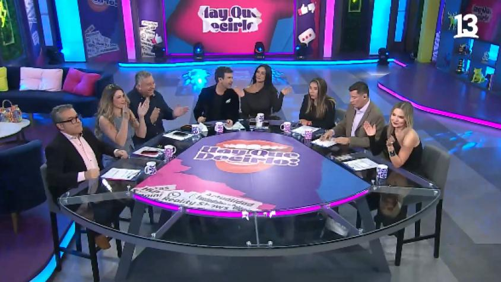
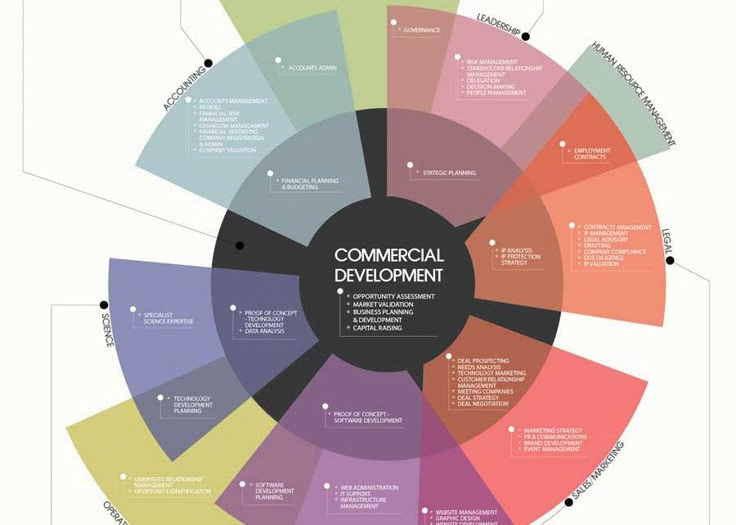
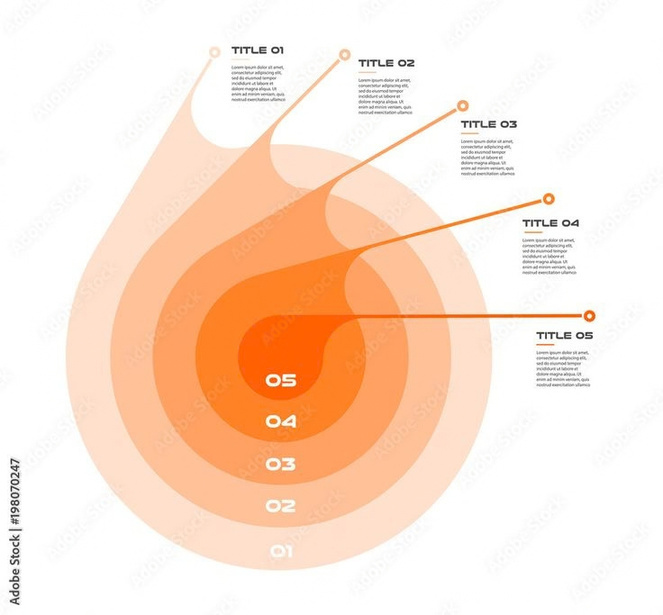
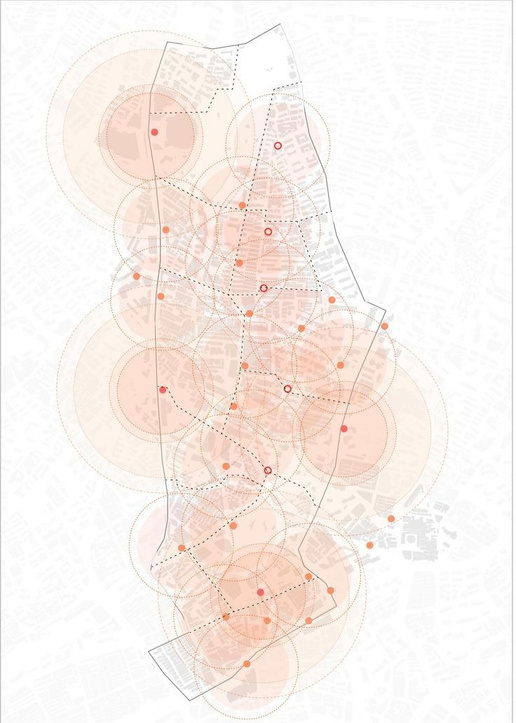
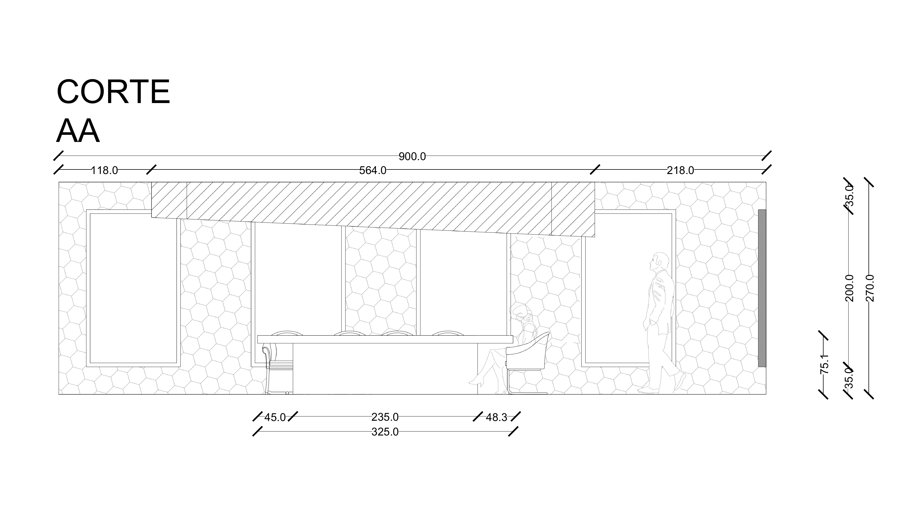
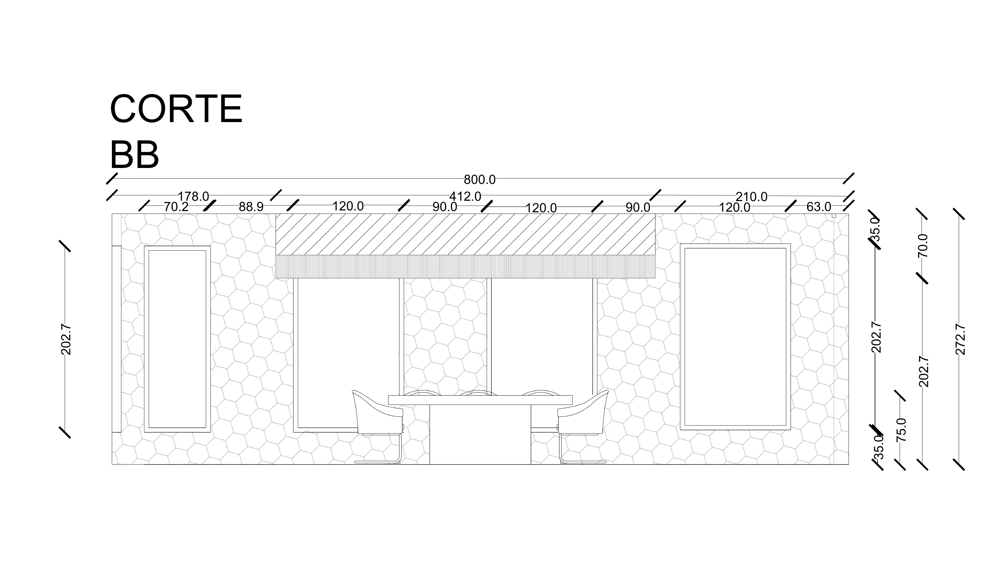
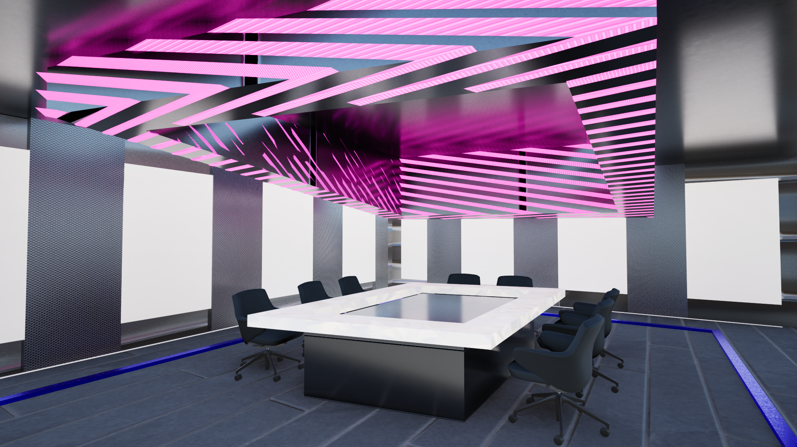
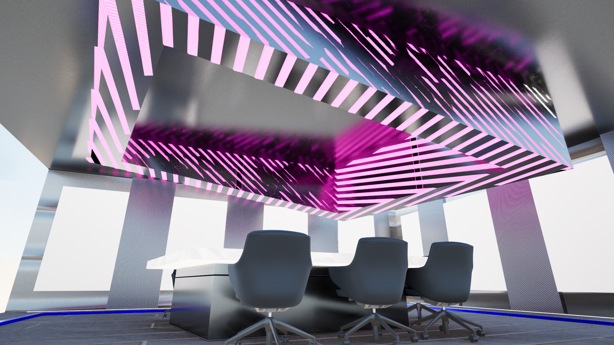
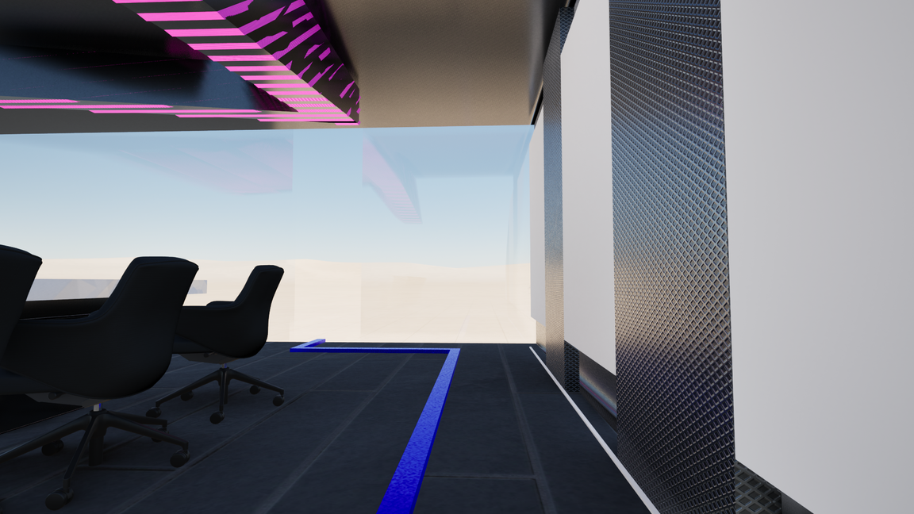
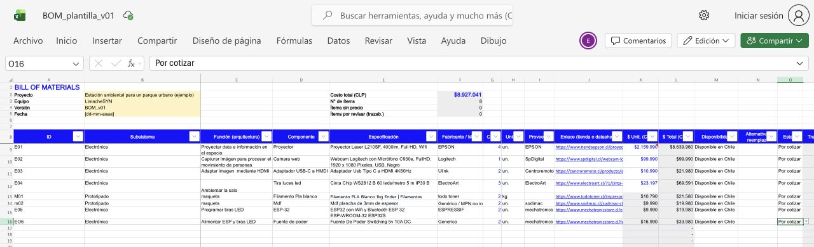

# Propuesta espacial del proyecto

**Última actualización:** 10 de octubre de 2026 
**Equipo:** Emilio Abarca · Emilia Armstrong · Victoria Aracena

[Volver al README principal](../README.md)

Ordenar la información municipal fue nuestro punto de partida, pero también nos preguntamos cómo se presenta durante las reuniones. Propusimos transformar la sala del Concejo Municipal en un espacio compartido para relacionar los datos con los lugares, las personas y las consecuencias de cada decisión. Este avance recoge la propuesta espacial de nuestra presentación.

## Reconfiguración y referentes de mesa

Buscamos organizar los puestos alrededor de un centro común. La mesa curva del programa *¡Hay que decirlo!* nos sirvió como referente para pensar en el contacto visual, el diálogo y una superficie compartida. Frente a la distribución en U que describe la presentación, nuestra intención es acercar a los participantes y dar menos protagonismo a la cabecera.

<table>
  <tr>
    <td align="center"></td>
    <td align="center"></td>
  </tr>
  <tr>
    <td>Mesa curva que orienta los puestos hacia un centro común.</td>
    <td>Vista de la cercanía entre los participantes y la superficie compartida.</td>
  </tr>
  <tr>
    <td colspan="2"><strong>Figura 1.</strong> Referente de distribución de la mesa. <strong>Fuente:</strong> imágenes de <em>¡Hay que decirlo!</em> incluidas en la presentación del equipo, diapositiva 10.</td>
  </tr>
</table>

El croquis y la vista conceptual exploran esa idea de reunión. Son pasos de la búsqueda: la mesa circular de estas imágenes y la geometría de los planos posteriores muestran distintas formas de resolver el espacio.

<table>
  <tr>
    <td align="center"></td>
  </tr>
  <tr>
    <td><strong>Figura 2.</strong> Croquis para explorar el contacto visual, la conversación y el trabajo alrededor de una mesa. <strong>Fuente:</strong> presentación del equipo, diapositiva 11.</td>
  </tr>
</table>

<table>
  <tr>
    <td align="center"></td>
  </tr>
  <tr>
    <td><strong>Figura 3.</strong> Vista conceptual de una mesa que reúne el mapa y la información territorial en una superficie común. <strong>Fuente:</strong> presentación del equipo, diapositiva 12.</td>
  </tr>
</table>

## Información clara para la reunión

La mesa de información interactiva conecta esta propuesta con el [prototipo del mapa gestual](../mapaGestualMLR/). También buscamos una gráfica fácil de leer, con lenguaje claro, colores e íconos que ayuden a comprender los temas municipales. Estas imágenes son referentes de visualización, no resultados de datos de La Reina.

<table>
  <tr>
    <td align="center"></td>
    <td align="center"></td>
  </tr>
  <tr>
    <td>Diagrama radial que agrupa categorías y las distingue por color.</td>
    <td>Diagrama de niveles concéntricos para mostrar relaciones y jerarquías.</td>
  </tr>
  <tr>
    <td colspan="2" align="center"></td>
  </tr>
  <tr>
    <td colspan="2">Mapa con zonas circulares superpuestas para vincular la información con el territorio.</td>
  </tr>
  <tr>
    <td colspan="2"><strong>Figura 4.</strong> Referentes para la visualización de información. <strong>Fuente:</strong> imágenes incluidas en la presentación del equipo, diapositiva 17.</td>
  </tr>
</table>

## Dos experiencias coordinadas

Planteamos dos experiencias que pueden funcionar por separado y comunicarse durante una misma sesión. El núcleo central presenta una síntesis de mapas, presupuestos e indicadores; las paredes forman un entorno inmersivo y reactivo que aporta el contexto territorial, social y temporal. Para el centro, la presentación propone una pirámide escalonada y un esquema de respaldo con un iPad, un computador, dos proyectores e iluminación LED.

<table>
  <tr>
    <td align="center"></td>
  </tr>
  <tr>
    <td><strong>Figura 5.</strong> Sistema de respaldo propuesto para el núcleo central: entrada desde el iPad y salida mediante proyectores e iluminación. <strong>Fuente:</strong> presentación del equipo, diapositiva 18.</td>
  </tr>
</table>

Para las paredes, el esquema incorpora una cámara conectada al computador, proyectores e iluminación LED. La idea es acompañar lo que se discute en el centro con información del territorio alrededor de la sala. Estos esquemas describen el montaje propuesto; todavía tenemos que probar su integración con el software.

<table>
  <tr>
    <td align="center"></td>
  </tr>
  <tr>
    <td><strong>Figura 6.</strong> Sistema de respaldo propuesto para las paredes, con cámara, computador, proyectores e iluminación. <strong>Fuente:</strong> presentación del equipo, diapositiva 19.</td>
  </tr>
</table>

## Ambiente, planta y cortes

Para el ambiente reinterpretamos la estética cyberpunk con superficies metálicas, iluminación fucsia y azul y geometrías en el cielo. La mesa central y los paneles del perímetro organizan la información compartida. La planta y los cortes nos permiten revisar la distribución, los puestos y el recorrido antes de construir el montaje.

<table>
  <tr>
    <td align="center"></td>
  </tr>
  <tr>
    <td><strong>Figura 7.</strong> Referente de ambiente para explorar materiales, iluminación de color y una atmósfera tecnológica. <strong>Fuente:</strong> imagen incluida en la presentación del equipo, diapositiva 33.</td>
  </tr>
</table>

<table>
  <tr>
    <td align="center"></td>
  </tr>
  <tr>
    <td><strong>Figura 8.</strong> Planta de la sala: distribución de la mesa, los puestos, el acceso y el recorrido. Abrir la imagen para revisar las cotas. <strong>Fuente:</strong> presentación del equipo, diapositiva 34.</td>
  </tr>
</table>

<table>
  <tr>
    <td align="center"></td>
  </tr>
  <tr>
    <td><strong>Figura 9.</strong> Corte AA para revisar la relación entre la mesa, las personas y los elementos superiores de la sala. <strong>Fuente:</strong> presentación del equipo, diapositiva 35.</td>
  </tr>
</table>

<table>
  <tr>
    <td align="center"></td>
  </tr>
  <tr>
    <td><strong>Figura 10.</strong> Corte BB para revisar la relación entre los puestos y los paneles del perímetro. <strong>Fuente:</strong> presentación del equipo, diapositiva 36.</td>
  </tr>
</table>

## Vistas de la propuesta

Los renders muestran cómo se relacionan la mesa, los asientos, los paneles, el cielo y la iluminación. Nos sirven para conversar sobre el ambiente y la distribución; representan la propuesta de sala, que aún no está construida.

<table>
  <tr>
    <td align="center"></td>
  </tr>
  <tr>
    <td><strong>Figura 11.</strong> Vista general de la sala propuesta, con mesa central, paneles y elementos del cielo. <strong>Fuente:</strong> presentación del equipo, diapositiva 37.</td>
  </tr>
</table>

<table>
  <tr>
    <td align="center"></td>
    <td align="center"></td>
  </tr>
  <tr>
    <td>Vista desde los asientos hacia las geometrías del cielo.</td>
    <td>Relación entre la mesa central y la iluminación azul del piso.</td>
  </tr>
  <tr>
    <td align="center"></td>
    <td align="center"></td>
  </tr>
  <tr>
    <td>Superficie de la mesa y su relación con los elementos superiores.</td>
    <td>Vista amplia del centro de la sala y del recorrido alrededor.</td>
  </tr>
  <tr>
    <td colspan="2"><strong>Figura 12.</strong> Vistas del cielo y de la mesa desde distintos ángulos. <strong>Fuente:</strong> presentación del equipo, diapositiva 38.</td>
  </tr>
</table>

<table>
  <tr>
    <td align="center"></td>
    <td align="center"></td>
  </tr>
  <tr>
    <td>Paneles laterales y su relación con los elementos del perímetro.</td>
    <td>Vista junto a los asientos, las pantallas y el recorrido iluminado.</td>
  </tr>
  <tr>
    <td align="center"></td>
    <td align="center"></td>
  </tr>
  <tr>
    <td>Recorrido entre los puestos y las superficies de información.</td>
    <td>Vista desde una esquina para revisar la sala en conjunto.</td>
  </tr>
  <tr>
    <td colspan="2"><strong>Figura 13.</strong> Vistas de los paneles, los asientos y la circulación. <strong>Fuente:</strong> presentación del equipo, diapositiva 39.</td>
  </tr>
</table>

## BOM inicial de compras

Armamos un BOM inicial, una primera lista de materiales y compras para ordenar lo que necesitamos para el montaje. La planilla todavía está en elaboración y la seguiremos ajustando mientras definimos los componentes del proyecto.

<table>
  <tr>
    <td align="center"></td>
  </tr>
  <tr>
    <td><strong>Figura 14.</strong> Vista general del BOM inicial, aún pendiente de completar y ajustar. <strong>Fuente:</strong> captura de la planilla del equipo en Excel, 10 de octubre de 2026. <a href="https://uddcl-my.sharepoint.com/:x:/g/personal/e_abarcar_udd_cl/IQAc8mpdWqylSIe4nzp1_H6QAfAAKdRIH4mL303e424sOVI">Abrir la planilla de compras</a>.</td>
  </tr>
</table>
