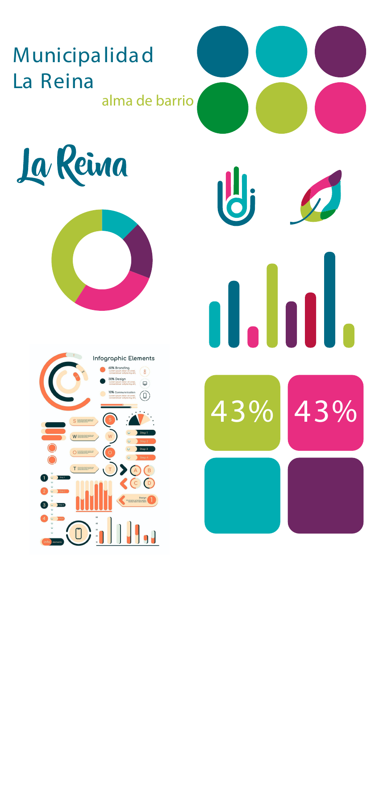
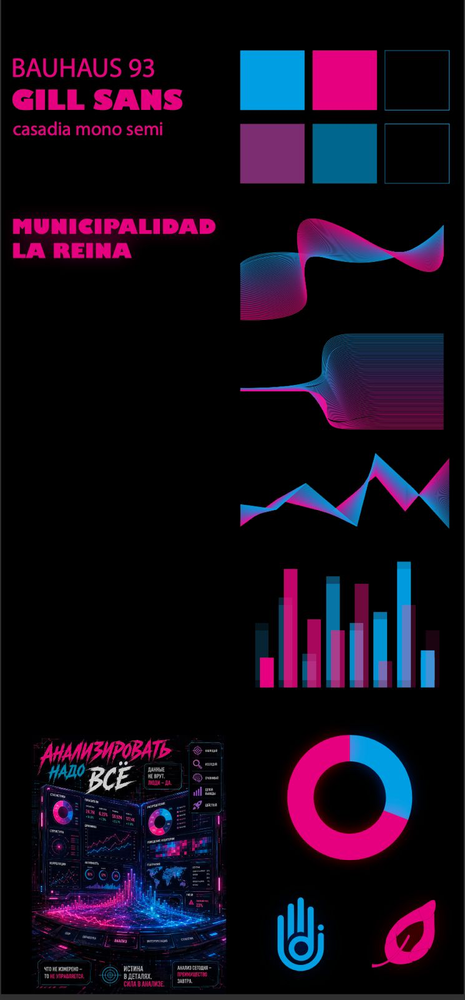
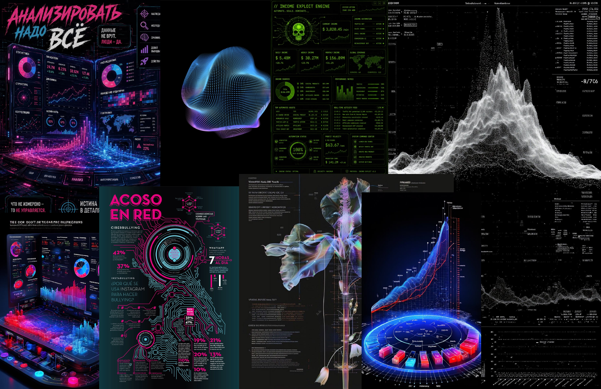
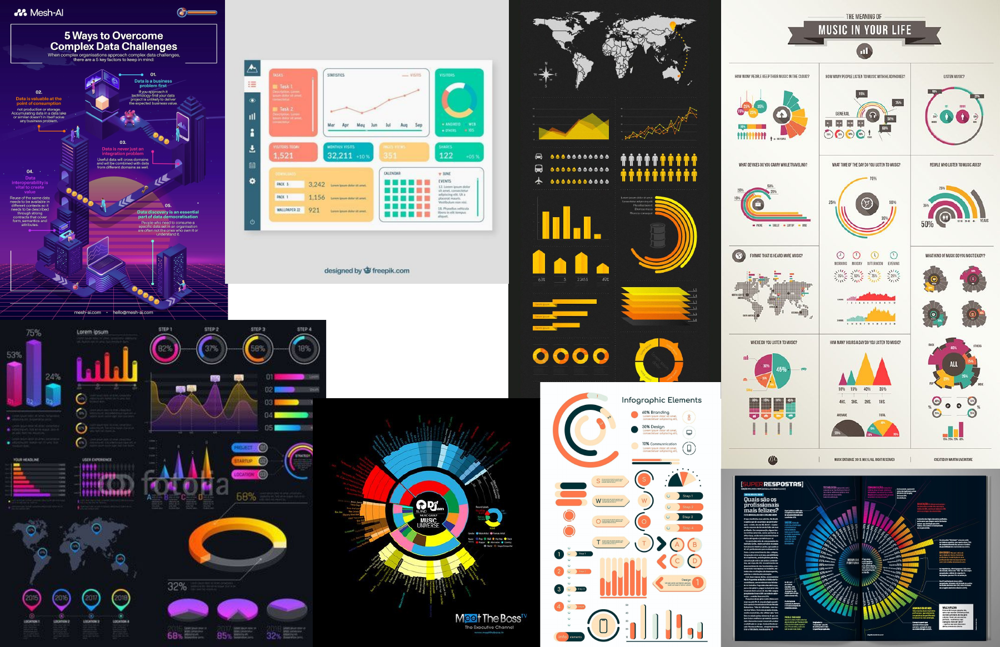
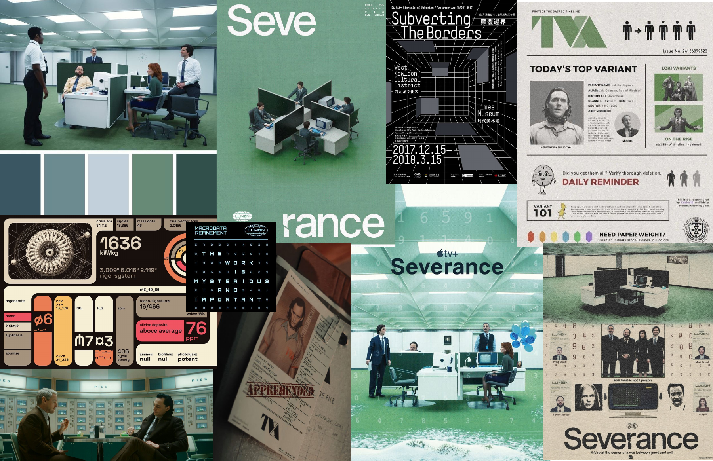
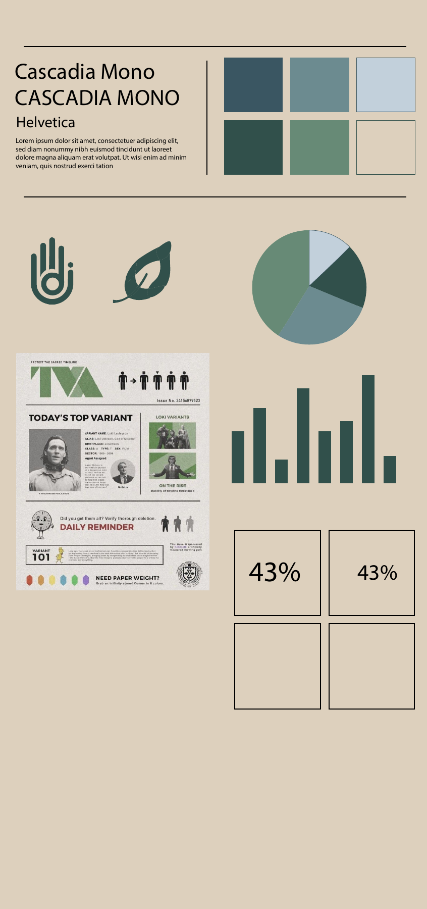

# Propuesta gráfica del proyecto

**Última actualización:** 10 de octubre de 2026 
**Equipo:** Emilio Abarca · Emilia Armstrong · Victoria Aracena 
**Estado:** Concepto inicial en desarrollo

[Volver al README principal](../README.md)

Estamos explorando la identidad gráfica del proyecto. Queremos mantener la paleta original de La Reina y darle una presencia más futurista, cercana al estilo cyberpunk. Todavía estamos desarrollando el concepto y revisando cómo expresar la identidad del proyecto con claridad.

## Paleta y concepto inicial

Tomamos los colores de La Reina como punto de partida y probamos fondos oscuros, líneas luminosas, degradados y formas que recuerdan a la visualización de datos. La lámina cyberpunk es un primer ensayo de esa dirección; aún tenemos que resolver cómo integrar la paleta en el conjunto.

<table>
  <tr>
    <td align="center"></td>
    <td align="center"></td>
  </tr>
  <tr>
    <td>Ensayo de paleta e identidad de La Reina aplicado a iconos, gráficos y tarjetas.</td>
    <td>Concepto inicial de una presencia más tecnológica, con fondo oscuro y recursos luminosos.</td>
  </tr>
  <tr>
    <td colspan="2"><strong>Figura 1.</strong> Pruebas de paleta y lenguaje gráfico. <strong>Fuente:</strong> documento del equipo <em>La Reina gráfica</em>, páginas 6 y 4; la segunda imagen corresponde a la lámina enviada para este avance. Abrir las imágenes para verlas en grande.</td>
  </tr>
</table>

## Tipografía en evaluación

También estamos evaluando cambiar la tipografía por una que represente mejor el mensaje y la identidad del proyecto. En las láminas aparecen pruebas con Bauhaus 93, Gill Sans, Cascadia Mono y Helvetica. La elección sigue abierta: queremos revisar cómo funcionan tanto en títulos como en textos y datos.

## Referentes y primeras pruebas

Reunimos referentes de interfaces futuristas, infografías y composiciones editoriales para explorar distintas maneras de organizar la información. Los gráficos y porcentajes de las láminas son ejemplos para probar la gráfica. Este material registra la búsqueda y las alternativas que estamos considerando.

<table>
  <tr>
    <td align="center"></td>
  </tr>
  <tr>
    <td><strong>Figura 2.</strong> Referentes cyberpunk para explorar fondos oscuros, iluminación de color y formas de visualizar información. <strong>Fuente:</strong> imágenes reunidas en <em>La Reina gráfica</em>, página 3.</td>
  </tr>
</table>

<table>
  <tr>
    <td align="center"></td>
  </tr>
  <tr>
    <td><strong>Figura 3.</strong> Referentes de infografías para comparar jerarquías, colores y maneras de relacionar los datos. <strong>Fuente:</strong> imágenes reunidas en <em>La Reina gráfica</em>, página 5.</td>
  </tr>
</table>

<table>
  <tr>
    <td align="center"></td>
  </tr>
  <tr>
    <td><strong>Figura 4.</strong> Referentes de otra exploración, con tonos apagados y composiciones editoriales de <em>Severance</em> y TVA. <strong>Fuente:</strong> imágenes reunidas en <em>La Reina gráfica</em>, página 1.</td>
  </tr>
</table>

<table>
  <tr>
    <td align="center"></td>
  </tr>
  <tr>
    <td><strong>Figura 5.</strong> Prueba de una alternativa con tonos atenuados, tipografías, iconos y tarjetas de información. <strong>Fuente:</strong> <em>La Reina gráfica</em>, página 2.</td>
  </tr>
</table>
